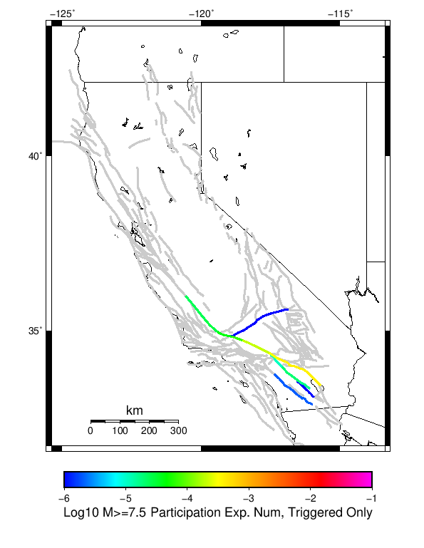

# 2009 Bombay Beach M4.8 Results

|   | 2009 Bombay Beach M4.8 |
|-----|-----|
| Num Simulations | 1000000 |
| Start Time | 2019/01/01 00:00:00 UTC |
| Start Time Epoch Milliseconds | 1546300800000 |
| Duration | 10 Years |
| Includes Spontaneous? | false |
| Historical Ruptures | *(none)* |

## Table Of Contents

* [Magnitude Number Distribution](#magnitude-number-distribution)
* [Hazard Change Over Time](#hazard-change-over-time)
  * [M&ge;5.0 Hazard Change Over Time](#mge50-hazard-change-over-time)
  * [M&ge;6.0 Hazard Change Over Time](#mge60-hazard-change-over-time)
  * [M&ge;7.0 Hazard Change Over Time](#mge70-hazard-change-over-time)
  * [M&ge;8.0 Hazard Change Over Time](#mge80-hazard-change-over-time)
* [Section Participation](#section-participation)
  * [Section Participation Plots](#section-participation-plots)
  * [Supra-Seismogenic Parent Sections Table](#supra-seismogenic-parent-sections-table)
  * [M≥6.5 Parent Sections Table](#m65-parent-sections-table)
  * [M≥7 Parent Sections Table](#m7-parent-sections-table)
  * [M≥7.5 Parent Sections Table](#m75-parent-sections-table)
  * [M≥8 Parent Sections Table](#m8-parent-sections-table)
* [Gridded Nucleation](#gridded-nucleation)
* [JSON Input File](#json-input-file)

## Magnitude Number Distribution
*[(top)](#table-of-contents)*

**Legend**
* **Mean** (thick black line): mean expected number across all 1000000 catalogs
* **2.5%,97.5%** (thin black lines): expected number percentiles across all 1000000 catalogs
* **Median** (thin blue line): median expected number across all 1000000 catalogs
* **Mode** (thin cyan line): modal expected number across all 1000000 catalogs
* **10 yr Probability** (thin red line): 10 year probability calculated as the fraction of catalogs with at least 1 occurrence
* **95% Conf** (light red shaded region): binomial 95% confidence bounds on probability
* **Primary** (thin green line): mean expected number from primary triggered aftershocks only (no secondary, tertiary, etc...) across all 1000000 catalogs


| Mag | Mean | 2.5 %ile | 97.5 %ile | Median | Mode | 10 yr Probability | Primary Aftershocks Mean |
|-----|-----|-----|-----|-----|-----|-----|-----|
| **M&ge;5** | 0.108 | 0.000 | 1.000 | 0.000 | 0.000 | 0.044 | 0.031 |
| **M&ge;5.1** | 0.084 | 0.000 | 1.000 | 0.000 | 0.000 | 0.035 | 0.024 |
| **M&ge;5.2** | 0.065 | 0.000 | 1.000 | 0.000 | 0.000 | 0.028 | 0.019 |
| **M&ge;5.3** | 0.050 | 0.000 | 0.000 | 0.000 | 0.000 | 0.022 | 0.015 |
| **M&ge;5.4** | 0.039 | 0.000 | 0.000 | 0.000 | 0.000 | 0.018 | 0.011 |
| **M&ge;5.5** | 0.030 | 0.000 | 0.000 | 0.000 | 0.000 | 0.014 | 8.57E-3 |
| **M&ge;5.6** | 0.022 | 0.000 | 0.000 | 0.000 | 0.000 | 0.011 | 6.34E-3 |
| **M&ge;5.7** | 0.016 | 0.000 | 0.000 | 0.000 | 0.000 | 8.04E-3 | 4.61E-3 |
| **M&ge;5.8** | 0.011 | 0.000 | 0.000 | 0.000 | 0.000 | 5.96E-3 | 3.25E-3 |
| **M&ge;5.9** | 7.53E-3 | 0.000 | 0.000 | 0.000 | 0.000 | 4.21E-3 | 2.15E-3 |
| **M&ge;6** | 6.19E-3 | 0.000 | 0.000 | 0.000 | 0.000 | 3.92E-3 | 1.98E-3 |
| **M&ge;6.1** | 5.13E-3 | 0.000 | 0.000 | 0.000 | 0.000 | 3.69E-3 | 1.85E-3 |
| **M&ge;6.2** | 4.72E-3 | 0.000 | 0.000 | 0.000 | 0.000 | 3.64E-3 | 1.84E-3 |
| **M&ge;6.3** | 4.45E-3 | 0.000 | 0.000 | 0.000 | 0.000 | 3.59E-3 | 1.82E-3 |
| **M&ge;6.4** | 4.31E-3 | 0.000 | 0.000 | 0.000 | 0.000 | 3.55E-3 | 1.80E-3 |
| **M&ge;6.5** | 4.24E-3 | 0.000 | 0.000 | 0.000 | 0.000 | 3.53E-3 | 1.79E-3 |
| **M&ge;6.6** | 3.89E-3 | 0.000 | 0.000 | 0.000 | 0.000 | 3.48E-3 | 1.76E-3 |
| **M&ge;6.7** | 3.80E-3 | 0.000 | 0.000 | 0.000 | 0.000 | 3.45E-3 | 1.74E-3 |
| **M&ge;6.8** | 3.66E-3 | 0.000 | 0.000 | 0.000 | 0.000 | 3.43E-3 | 1.74E-3 |
| **M&ge;6.9** | 3.64E-3 | 0.000 | 0.000 | 0.000 | 0.000 | 3.42E-3 | 1.73E-3 |
| **M&ge;7** | 8.91E-4 | 0.000 | 0.000 | 0.000 | 0.000 | 7.33E-4 | 3.61E-4 |
| **M&ge;7.1** | 7.90E-4 | 0.000 | 0.000 | 0.000 | 0.000 | 7.09E-4 | 3.55E-4 |
| **M&ge;7.2** | 7.68E-4 | 0.000 | 0.000 | 0.000 | 0.000 | 7.05E-4 | 3.55E-4 |
| **M&ge;7.3** | 7.41E-4 | 0.000 | 0.000 | 0.000 | 0.000 | 6.94E-4 | 3.50E-4 |
| **M&ge;7.4** | 4.25E-4 | 0.000 | 0.000 | 0.000 | 0.000 | 4.05E-4 | 2.04E-4 |
| **M&ge;7.5** | 4.19E-4 | 0.000 | 0.000 | 0.000 | 0.000 | 4.00E-4 | 2.04E-4 |
| **M&ge;7.6** | 3.10E-4 | 0.000 | 0.000 | 0.000 | 0.000 | 2.95E-4 | 1.51E-4 |
| **M&ge;7.7** | 2.11E-4 | 0.000 | 0.000 | 0.000 | 0.000 | 2.06E-4 | 9.60E-5 |
| **M&ge;7.8** | 2.02E-4 | 0.000 | 0.000 | 0.000 | 0.000 | 2.01E-4 | 9.60E-5 |
| **M&ge;7.9** | 6.30E-5 | 0.000 | 0.000 | 0.000 | 0.000 | 6.30E-5 | 3.40E-5 |
| **M&ge;8** | 2.40E-5 | 0.000 | 0.000 | 0.000 | 0.000 | 2.40E-5 | 1.40E-5 |
| **M&ge;8.1** | 2.10E-5 | 0.000 | 0.000 | 0.000 | 0.000 | 2.10E-5 | 1.20E-5 |
| **M&ge;8.2** | 0.000 | 0.000 | 0.000 | 0.000 | 0.000 | 0.000 | 0.000 |
| **M&ge;8.3** | 0.000 | 0.000 | 0.000 | 0.000 | 0.000 | 0.000 | 0.000 |
| **M&ge;8.4** | 0.000 | 0.000 | 0.000 | 0.000 | 0.000 | 0.000 | 0.000 |
| **M&ge;8.5** | 0.000 | 0.000 | 0.000 | 0.000 | 0.000 | 0.000 | 0.000 |
| **M&ge;8.6** | 0.000 | 0.000 | 0.000 | 0.000 | 0.000 | 0.000 | 0.000 |
| **M&ge;8.7** | 0.000 | 0.000 | 0.000 | 0.000 | 0.000 | 0.000 | 0.000 |
| **M&ge;8.8** | 0.000 | 0.000 | 0.000 | 0.000 | 0.000 | 0.000 | 0.000 |
| **M&ge;8.9** | 0.000 | 0.000 | 0.000 | 0.000 | 0.000 | 0.000 | 0.000 |
| **M&ge;9** | 0.000 | 0.000 | 0.000 | 0.000 | 0.000 | 0.000 | 0.000 |

## Hazard Change Over Time
*[(top)](#table-of-contents)*

These plots show how the probability of ruptures of various magnitudes within 100km of any scenario rupture changes over time

### M&ge;5.0 Hazard Change Over Time
*[(top)](#table-of-contents)*


| Forecast Duration | UCERF3-ETAS [95% Conf] | UCERF3-ETAS Triggered Only | UCERF3-TD | UCERF3-TI |
|-----|-----|-----|-----|-----|
| 1 Hour | 7.11E-3 [6.95E-3 - 7.28E-3] | 7.02E-3 | 8.84E-5 | 8.75E-5 |
| 1 Day | 0.020 [0.019 - 0.020] | 0.018 | 2.12E-3 | 2.10E-3 |
| 1 Week | 0.038 [0.038 - 0.039] | 0.024 | 0.015 | 0.015 |
| 1 Month | 0.089 [0.089 - 0.089] | 0.029 | 0.062 | 0.061 |
| 1 Year | 0.556 [0.556 - 0.557] | 0.037 | 0.540 | 0.536 |
| 10 Years | 1.000 [1.000 - 1.000] | 0.043 | 1.000 | 1.000 |
| 30 Years | 1.000 [1.000 - 1.000] \* | \* | 1.000 | 1.000 |
| 100 Years | 1.000 [1.000 - 1.000] \* | \* | 1.000 | 1.000 |

\* *forecast duration is longer than simulation length, only ETAS ruptures from the first 10 years are included*
### M&ge;6.0 Hazard Change Over Time
*[(top)](#table-of-contents)*


| Forecast Duration | UCERF3-ETAS [95% Conf] | UCERF3-ETAS Triggered Only | UCERF3-TD | UCERF3-TI |
|-----|-----|-----|-----|-----|
| 1 Hour | 4.63E-4 [4.23E-4 - 5.07E-4] | 4.51E-4 | 1.18E-5 | 1.09E-5 |
| 1 Day | 1.54E-3 [1.47E-3 - 1.61E-3] | 1.26E-3 | 2.84E-4 | 2.61E-4 |
| 1 Week | 3.83E-3 [3.74E-3 - 3.91E-3] | 1.85E-3 | 1.98E-3 | 1.83E-3 |
| 1 Month | 0.011 [0.011 - 0.011] | 2.29E-3 | 8.48E-3 | 7.81E-3 |
| 1 Year | 0.102 [0.101 - 0.102] | 3.11E-3 | 0.099 | 0.091 |
| 10 Years | 0.653 [0.653 - 0.653] | 3.87E-3 | 0.652 | 0.615 |
| 30 Years | 0.957 [0.957 - 0.957] \* | \* | 0.957 | 0.943 |
| 100 Years | 1.000 [1.000 - 1.000] \* | \* | 1.000 | 1.000 |

\* *forecast duration is longer than simulation length, only ETAS ruptures from the first 10 years are included*
### M&ge;7.0 Hazard Change Over Time
*[(top)](#table-of-contents)*


| Forecast Duration | UCERF3-ETAS [95% Conf] | UCERF3-ETAS Triggered Only | UCERF3-TD | UCERF3-TI |
|-----|-----|-----|-----|-----|
| 1 Hour | 8.40E-5 [6.77E-5 - 1.04E-4] | 8.10E-5 | 2.98E-6 | 2.25E-6 |
| 1 Day | 3.07E-4 [2.79E-4 - 3.40E-4] | 2.36E-4 | 7.14E-5 | 5.39E-5 |
| 1 Week | 8.47E-4 [8.12E-4 - 8.86E-4] | 3.47E-4 | 5.00E-4 | 3.77E-4 |
| 1 Month | 2.57E-3 [2.53E-3 - 2.61E-3] | 4.31E-4 | 2.14E-3 | 1.62E-3 |
| 1 Year | 0.026 [0.026 - 0.026] | 5.79E-4 | 0.026 | 0.020 |
| 10 Years | 0.227 [0.227 - 0.227] | 7.26E-4 | 0.226 | 0.179 |
| 30 Years | 0.522 [0.522 - 0.522] \* | \* | 0.521 | 0.446 |
| 100 Years | 0.879 [0.879 - 0.879] \* | \* | 0.879 | 0.860 |

\* *forecast duration is longer than simulation length, only ETAS ruptures from the first 10 years are included*
### M&ge;8.0 Hazard Change Over Time
*[(top)](#table-of-contents)*


| Forecast Duration | UCERF3-ETAS [95% Conf] | UCERF3-ETAS Triggered Only | UCERF3-TD | UCERF3-TI |
|-----|-----|-----|-----|-----|
| 1 Hour | 3.14E-6 [9.12E-7 - 9.70E-6] | 3.00E-6 | 1.37E-7 | 1.27E-7 |
| 1 Day | 1.13E-5 [7.01E-6 - 1.97E-5] | 8.00E-6 | 3.29E-6 | 3.05E-6 |
| 1 Week | 3.40E-5 [2.88E-5 - 4.34E-5] | 1.10E-5 | 2.30E-5 | 2.14E-5 |
| 1 Month | 1.11E-4 [1.05E-4 - 1.20E-4] | 1.20E-5 | 9.87E-5 | 9.15E-5 |
| 1 Year | 1.22E-3 [1.21E-3 - 1.23E-3] | 1.90E-5 | 1.20E-3 | 1.11E-3 |
| 10 Years | 0.011 [0.011 - 0.011] | 2.40E-5 | 0.011 | 0.011 |
| 30 Years | 0.027 [0.027 - 0.027] \* | \* | 0.027 | 0.033 |
| 100 Years | 0.043 [0.043 - 0.043] \* | \* | 0.043 | 0.105 |

\* *forecast duration is longer than simulation length, only ETAS ruptures from the first 10 years are included*
## Section Participation
*[(top)](#table-of-contents)*

### Section Participation Plots
*[(top)](#table-of-contents)*

| Min Mag | Triggered Ruptures (no spontaneous) | Triggered Ruptures (primary aftershocks only) |
|-----|-----|-----|
| **All Supra. Seis.** |  |  |
| **M&ge;6.5** |  |  |
| **M&ge;7** |  |  |
| **M&ge;7.5** |  |  |
| **M&ge;8** |  |  |

### Supra-Seismogenic Parent Sections Table
*[(top)](#table-of-contents)*

*First 10 of 69 with matching ruptures shown*

| Parent Name | Triggered Mean Count | Triggered 10 Year Prob | Triggered Primary Mean Count |
|-----|-----|-----|-----|
| San Andreas (Coachella) rev | 0.003382 | 0.003377 | 0.00172 |
| San Andreas (San Gorgonio Pass-Garnet HIll) | 6.94E-4 | 6.94E-4 | 3.49E-4 |
| San Andreas (San Bernardino S) | 3.99E-4 | 3.98E-4 | 2.04E-4 |
| San Andreas (San Bernardino N) | 3.08E-4 | 3.05E-4 | 1.51E-4 |
| San Andreas (Mojave S) | 2.08E-4 | 2.07E-4 | 9.6E-5 |
| Cucamonga | 1.79E-4 | 1.79E-4 | 0.0 |
| Cleghorn | 1.26E-4 | 1.25E-4 | 0.0 |
| San Jacinto (San Bernardino) | 1.0E-4 | 9.8E-5 | 1.0E-6 |
| San Andreas (Mojave N) | 7.0E-5 | 6.9E-5 | 3.4E-5 |
| San Jacinto (Stepovers Combined) | 5.8E-5 | 5.7E-5 | 1.0E-6 |

### M≥6.5 Parent Sections Table
*[(top)](#table-of-contents)*

*First 10 of 68 with matching ruptures shown*

| Parent Name | Triggered Mean Count | Triggered 10 Year Prob | Triggered Primary Mean Count |
|-----|-----|-----|-----|
| San Andreas (Coachella) rev | 0.003382 | 0.003377 | 0.00172 |
| San Andreas (San Gorgonio Pass-Garnet HIll) | 6.94E-4 | 6.94E-4 | 3.49E-4 |
| San Andreas (San Bernardino S) | 3.99E-4 | 3.98E-4 | 2.04E-4 |
| San Andreas (San Bernardino N) | 3.08E-4 | 3.05E-4 | 1.51E-4 |
| San Andreas (Mojave S) | 2.08E-4 | 2.07E-4 | 9.6E-5 |
| Cucamonga | 1.79E-4 | 1.79E-4 | 0.0 |
| Cleghorn | 1.26E-4 | 1.25E-4 | 0.0 |
| San Jacinto (San Bernardino) | 1.0E-4 | 9.8E-5 | 1.0E-6 |
| San Andreas (Mojave N) | 7.0E-5 | 6.9E-5 | 3.4E-5 |
| San Jacinto (Stepovers Combined) | 5.8E-5 | 5.7E-5 | 1.0E-6 |

### M≥7 Parent Sections Table
*[(top)](#table-of-contents)*

*First 10 of 37 with matching ruptures shown*

| Parent Name | Triggered Mean Count | Triggered 10 Year Prob | Triggered Primary Mean Count |
|-----|-----|-----|-----|
| San Andreas (San Gorgonio Pass-Garnet HIll) | 6.92E-4 | 6.92E-4 | 3.48E-4 |
| San Andreas (Coachella) rev | 6.83E-4 | 6.83E-4 | 3.48E-4 |
| San Andreas (San Bernardino S) | 3.98E-4 | 3.97E-4 | 2.03E-4 |
| San Andreas (San Bernardino N) | 3.01E-4 | 2.99E-4 | 1.5E-4 |
| San Andreas (Mojave S) | 2.08E-4 | 2.07E-4 | 9.6E-5 |
| San Jacinto (San Bernardino) | 9.4E-5 | 9.3E-5 | 1.0E-6 |
| San Andreas (Mojave N) | 6.9E-5 | 6.8E-5 | 3.4E-5 |
| San Andreas (Big Bend) | 4.2E-5 | 4.2E-5 | 2.0E-5 |
| San Jacinto (Stepovers Combined) | 4.2E-5 | 4.2E-5 | 1.0E-6 |
| San Jacinto (San Jacinto Valley) rev | 3.1E-5 | 3.1E-5 | 0.0 |

### M≥7.5 Parent Sections Table
*[(top)](#table-of-contents)*

*First 10 of 23 with matching ruptures shown*

| Parent Name | Triggered Mean Count | Triggered 10 Year Prob | Triggered Primary Mean Count |
|-----|-----|-----|-----|
| San Andreas (San Bernardino S) | 3.91E-4 | 3.9E-4 | 2.02E-4 |
| San Andreas (Coachella) rev | 3.89E-4 | 3.89E-4 | 2.02E-4 |
| San Andreas (San Gorgonio Pass-Garnet HIll) | 3.89E-4 | 3.89E-4 | 2.02E-4 |
| San Andreas (San Bernardino N) | 2.94E-4 | 2.92E-4 | 1.5E-4 |
| San Andreas (Mojave S) | 2.04E-4 | 2.03E-4 | 9.6E-5 |
| San Andreas (Mojave N) | 6.9E-5 | 6.8E-5 | 3.4E-5 |
| San Andreas (Big Bend) | 4.1E-5 | 4.1E-5 | 2.0E-5 |
| San Andreas (Carrizo) rev | 2.8E-5 | 2.8E-5 | 1.4E-5 |
| San Andreas (Cholame) rev | 2.5E-5 | 2.5E-5 | 1.2E-5 |
| San Andreas (Parkfield) | 2.4E-5 | 2.4E-5 | 1.2E-5 |

### M≥8 Parent Sections Table
*[(top)](#table-of-contents)*

| Parent Name | Triggered Mean Count | Triggered 10 Year Prob | Triggered Primary Mean Count |
|-----|-----|-----|-----|
| San Andreas (Big Bend) | 2.4E-5 | 2.4E-5 | 1.4E-5 |
| San Andreas (Carrizo) rev | 2.4E-5 | 2.4E-5 | 1.4E-5 |
| San Andreas (Coachella) rev | 2.4E-5 | 2.4E-5 | 1.4E-5 |
| San Andreas (Mojave N) | 2.4E-5 | 2.4E-5 | 1.4E-5 |
| San Andreas (Mojave S) | 2.4E-5 | 2.4E-5 | 1.4E-5 |
| San Andreas (San Bernardino N) | 2.4E-5 | 2.4E-5 | 1.4E-5 |
| San Andreas (San Bernardino S) | 2.4E-5 | 2.4E-5 | 1.4E-5 |
| San Andreas (San Gorgonio Pass-Garnet HIll) | 2.4E-5 | 2.4E-5 | 1.4E-5 |
| San Andreas (Cholame) rev | 2.1E-5 | 2.1E-5 | 1.2E-5 |
| San Andreas (Parkfield) | 2.1E-5 | 2.1E-5 | 1.2E-5 |
## Gridded Nucleation
*[(top)](#table-of-contents)*

| Min Mag | Triggered Ruptures (no spontaneous) | Triggered Ruptures (primary aftershocks only) |
|-----|-----|-----|
| **M&ge;5** |  |  |
| **M&ge;6** |  |  |
| **M&ge;7** |  |  |

## JSON Input File
*[(top)](#table-of-contents)*

```
{
  "numSimulations": 1000000,
  "duration": 10.0,
  "startYear": 2019,
  "includeSpontaneous": false,
  "randomSeed": 987654321,
  "binaryOutput": true,
  "binaryOutputFilters": [
    {
      "prefix": "results_complete",
      "descendantsOnly": false
    },
    {
      "prefix": "results_m5_preserve_chain",
      "minMag": 5.0,
      "preserveChainBelowMag": true,
      "descendantsOnly": false
    }
  ],
  "forceRecalc": false,
  "reuseERFs": false,
  "simulationName": "2009 Bombay Beach M4.8",
  "numRetries": 3,
  "outputDir": "${ETAS_SIM_DIR}/2019_04_25-2009BombayBeachM48-u2mapped-noSpont-10yr",
  "triggerRuptures": [
    {
      "mag": 4.8,
      "latitude": 33.3172,
      "longitude": -115.72800000000001,
      "depth": 5.96
    }
  ],
  "cacheDir": "${ETAS_LAUNCHER}/inputs/cache_u2_mapped_fm3p1",
  "fssFile": "${ETAS_LAUNCHER}/inputs/ucerf2_mapped_fm3p1.zip",
  "probModel": "FULL_TD",
  "applySubSeisForSupraNucl": true,
  "totRateScaleFactor": 1.14,
  "gridSeisCorr": true,
  "timeIndependentERF": false,
  "griddedOnly": false,
  "imposeGR": false,
  "includeIndirectTriggering": true,
  "gridSeisDiscr": 0.1,
  "catalogCompletenessModel": "RELAXED"
}
```

