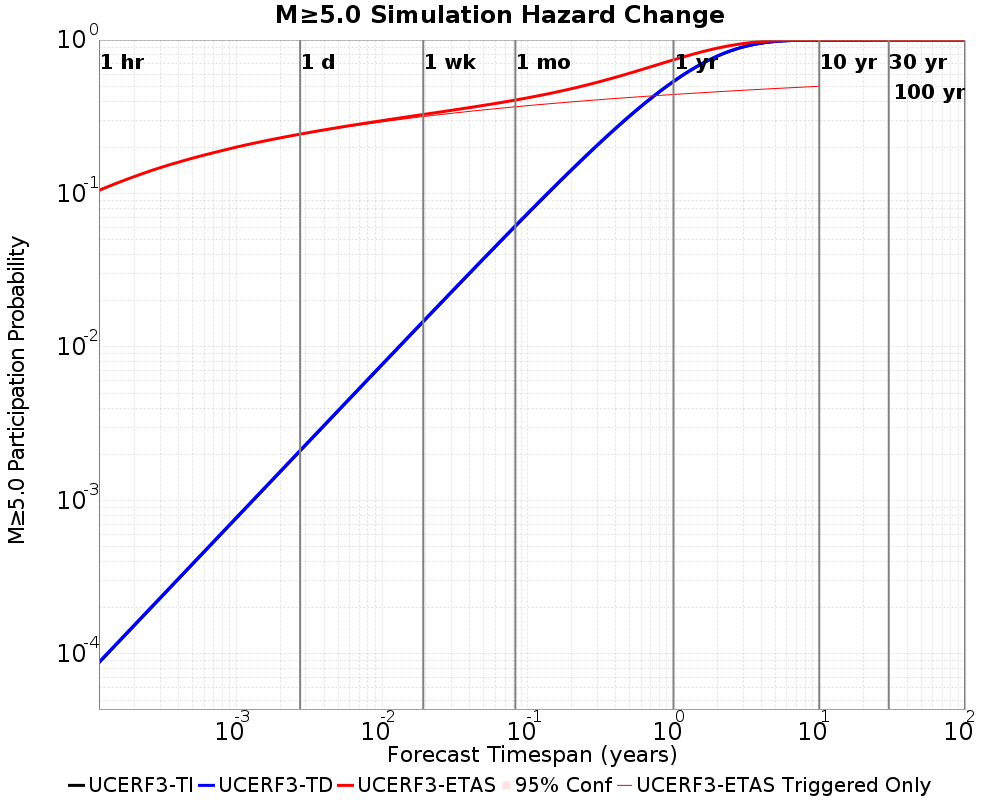
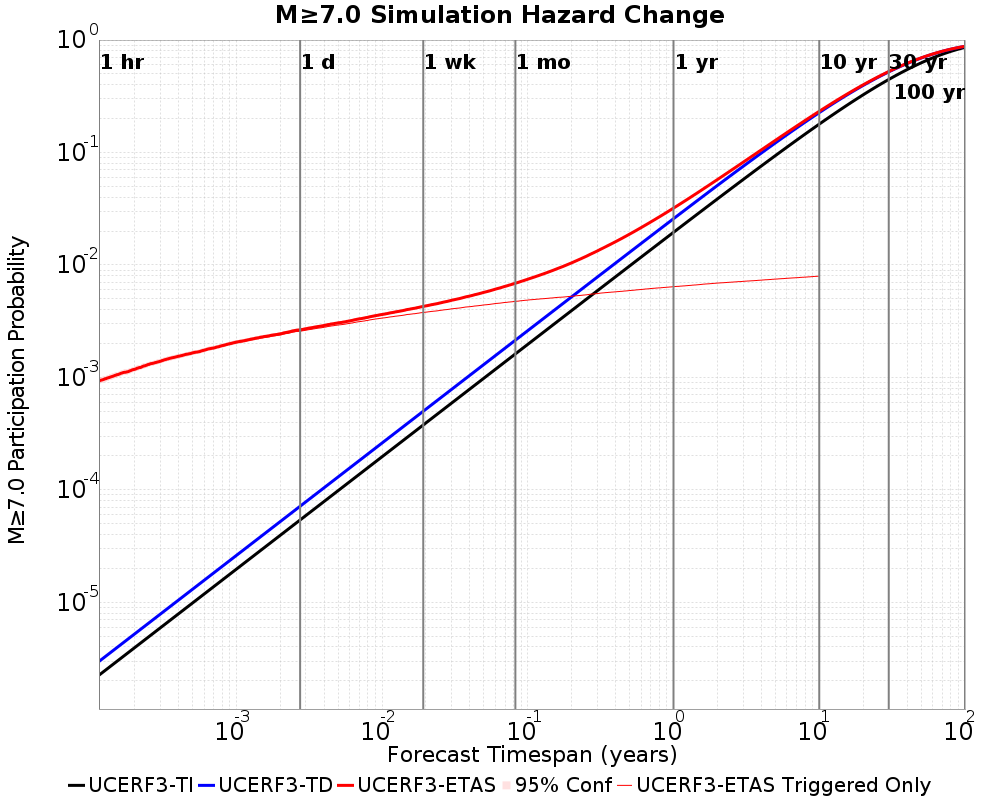
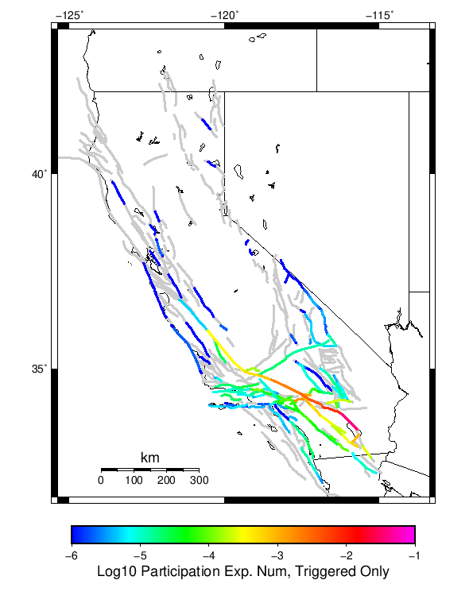
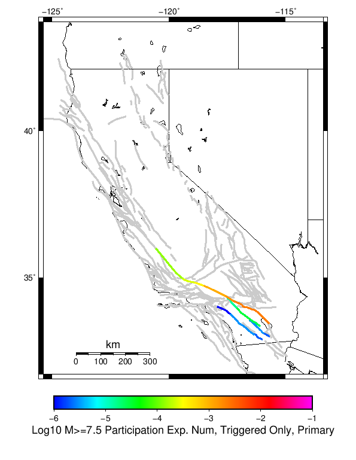
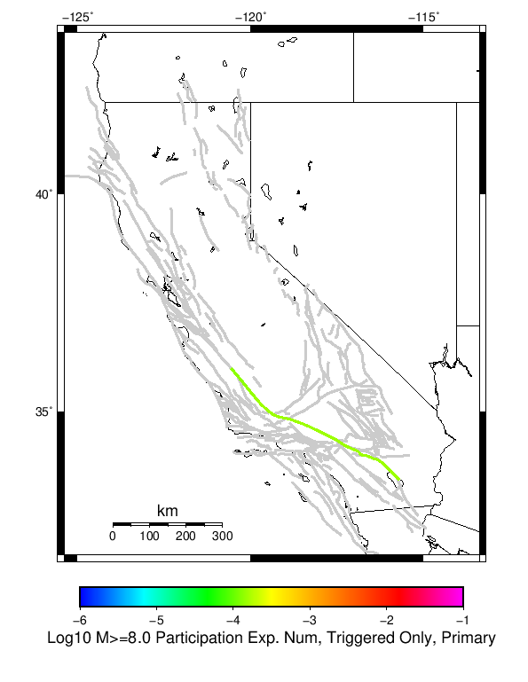
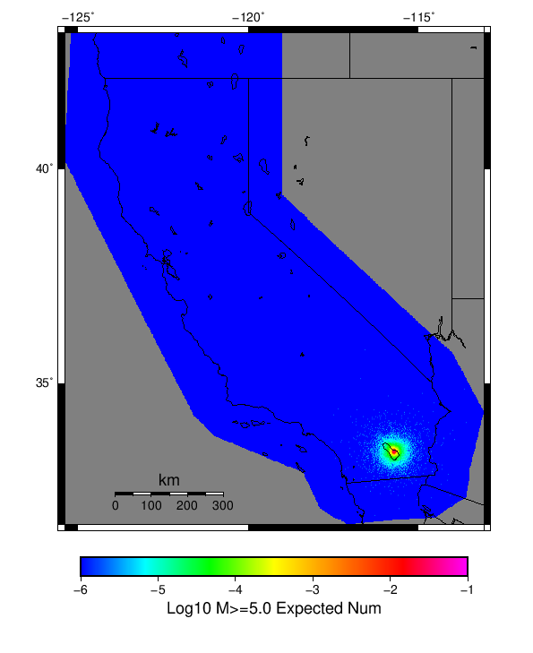
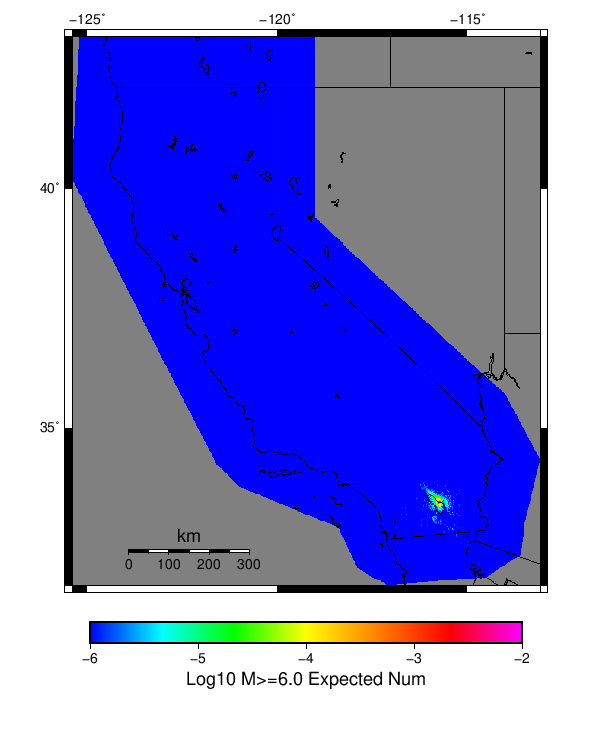

# 2009 Bombay Beach M6 Results

|   | 2009 Bombay Beach M6 |
|-----|-----|
| Num Simulations | 1000000 |
| Start Time | 2019/01/01 00:00:00 UTC |
| Start Time Epoch Milliseconds | 1546300800000 |
| Duration | 10 Years |
| Includes Spontaneous? | false |
| Historical Ruptures | *(none)* |

## Table Of Contents

* [Magnitude Number Distribution](#magnitude-number-distribution)
* [Hazard Change Over Time](#hazard-change-over-time)
  * [M&ge;5.0 Hazard Change Over Time](#mge50-hazard-change-over-time)
  * [M&ge;6.0 Hazard Change Over Time](#mge60-hazard-change-over-time)
  * [M&ge;7.0 Hazard Change Over Time](#mge70-hazard-change-over-time)
  * [M&ge;8.0 Hazard Change Over Time](#mge80-hazard-change-over-time)
* [Section Participation](#section-participation)
  * [Section Participation Plots](#section-participation-plots)
  * [Supra-Seismogenic Parent Sections Table](#supra-seismogenic-parent-sections-table)
  * [M≥6.5 Parent Sections Table](#m65-parent-sections-table)
  * [M≥7 Parent Sections Table](#m7-parent-sections-table)
  * [M≥7.5 Parent Sections Table](#m75-parent-sections-table)
  * [M≥8 Parent Sections Table](#m8-parent-sections-table)
* [Gridded Nucleation](#gridded-nucleation)
* [JSON Input File](#json-input-file)

## Magnitude Number Distribution
*[(top)](#table-of-contents)*

**Legend**
* **Mean** (thick black line): mean expected number across all 1000000 catalogs
* **2.5%,97.5%** (thin black lines): expected number percentiles across all 1000000 catalogs
* **Median** (thin blue line): median expected number across all 1000000 catalogs
* **Mode** (thin cyan line): modal expected number across all 1000000 catalogs
* **10 yr Probability** (thin red line): 10 year probability calculated as the fraction of catalogs with at least 1 occurrence
* **95% Conf** (light red shaded region): binomial 95% confidence bounds on probability
* **Primary** (thin green line): mean expected number from primary triggered aftershocks only (no secondary, tertiary, etc...) across all 1000000 catalogs


| Mag | Mean | 2.5 %ile | 97.5 %ile | Median | Mode | 10 yr Probability | Primary Aftershocks Mean |
|-----|-----|-----|-----|-----|-----|-----|-----|
| **M&ge;5** | 1.438 | 0.000 | 9.000 | 1.000 | 0.000 | 0.503 | 0.487 |
| **M&ge;5.1** | 1.120 | 0.000 | 7.000 | 0.000 | 0.000 | 0.426 | 0.378 |
| **M&ge;5.2** | 0.869 | 0.000 | 6.000 | 0.000 | 0.000 | 0.355 | 0.294 |
| **M&ge;5.3** | 0.668 | 0.000 | 5.000 | 0.000 | 0.000 | 0.291 | 0.225 |
| **M&ge;5.4** | 0.509 | 0.000 | 4.000 | 0.000 | 0.000 | 0.235 | 0.171 |
| **M&ge;5.5** | 0.382 | 0.000 | 3.000 | 0.000 | 0.000 | 0.186 | 0.128 |
| **M&ge;5.6** | 0.282 | 0.000 | 2.000 | 0.000 | 0.000 | 0.144 | 0.094 |
| **M&ge;5.7** | 0.203 | 0.000 | 2.000 | 0.000 | 0.000 | 0.108 | 0.067 |
| **M&ge;5.8** | 0.139 | 0.000 | 1.000 | 0.000 | 0.000 | 0.078 | 0.045 |
| **M&ge;5.9** | 0.089 | 0.000 | 1.000 | 0.000 | 0.000 | 0.052 | 0.028 |
| **M&ge;6** | 0.072 | 0.000 | 1.000 | 0.000 | 0.000 | 0.048 | 0.025 |
| **M&ge;6.1** | 0.059 | 0.000 | 1.000 | 0.000 | 0.000 | 0.044 | 0.023 |
| **M&ge;6.2** | 0.054 | 0.000 | 1.000 | 0.000 | 0.000 | 0.043 | 0.023 |
| **M&ge;6.3** | 0.052 | 0.000 | 1.000 | 0.000 | 0.000 | 0.043 | 0.022 |
| **M&ge;6.4** | 0.050 | 0.000 | 1.000 | 0.000 | 0.000 | 0.042 | 0.022 |
| **M&ge;6.5** | 0.049 | 0.000 | 1.000 | 0.000 | 0.000 | 0.042 | 0.022 |
| **M&ge;6.6** | 0.045 | 0.000 | 1.000 | 0.000 | 0.000 | 0.040 | 0.021 |
| **M&ge;6.7** | 0.044 | 0.000 | 1.000 | 0.000 | 0.000 | 0.040 | 0.021 |
| **M&ge;6.8** | 0.042 | 0.000 | 1.000 | 0.000 | 0.000 | 0.040 | 0.021 |
| **M&ge;6.9** | 0.042 | 0.000 | 1.000 | 0.000 | 0.000 | 0.039 | 0.021 |
| **M&ge;7** | 9.81E-3 | 0.000 | 0.000 | 0.000 | 0.000 | 8.07E-3 | 4.11E-3 |
| **M&ge;7.1** | 8.77E-3 | 0.000 | 0.000 | 0.000 | 0.000 | 7.79E-3 | 4.03E-3 |
| **M&ge;7.2** | 8.44E-3 | 0.000 | 0.000 | 0.000 | 0.000 | 7.69E-3 | 4.01E-3 |
| **M&ge;7.3** | 8.12E-3 | 0.000 | 0.000 | 0.000 | 0.000 | 7.59E-3 | 3.98E-3 |
| **M&ge;7.4** | 4.63E-3 | 0.000 | 0.000 | 0.000 | 0.000 | 4.37E-3 | 2.28E-3 |
| **M&ge;7.5** | 4.51E-3 | 0.000 | 0.000 | 0.000 | 0.000 | 4.30E-3 | 2.26E-3 |
| **M&ge;7.6** | 3.28E-3 | 0.000 | 0.000 | 0.000 | 0.000 | 3.14E-3 | 1.66E-3 |
| **M&ge;7.7** | 2.19E-3 | 0.000 | 0.000 | 0.000 | 0.000 | 2.14E-3 | 1.11E-3 |
| **M&ge;7.8** | 2.07E-3 | 0.000 | 0.000 | 0.000 | 0.000 | 2.06E-3 | 1.09E-3 |
| **M&ge;7.9** | 6.90E-4 | 0.000 | 0.000 | 0.000 | 0.000 | 6.90E-4 | 3.60E-4 |
| **M&ge;8** | 2.95E-4 | 0.000 | 0.000 | 0.000 | 0.000 | 2.95E-4 | 1.50E-4 |
| **M&ge;8.1** | 2.54E-4 | 0.000 | 0.000 | 0.000 | 0.000 | 2.54E-4 | 1.33E-4 |
| **M&ge;8.2** | 0.000 | 0.000 | 0.000 | 0.000 | 0.000 | 0.000 | 0.000 |
| **M&ge;8.3** | 0.000 | 0.000 | 0.000 | 0.000 | 0.000 | 0.000 | 0.000 |
| **M&ge;8.4** | 0.000 | 0.000 | 0.000 | 0.000 | 0.000 | 0.000 | 0.000 |
| **M&ge;8.5** | 0.000 | 0.000 | 0.000 | 0.000 | 0.000 | 0.000 | 0.000 |
| **M&ge;8.6** | 0.000 | 0.000 | 0.000 | 0.000 | 0.000 | 0.000 | 0.000 |
| **M&ge;8.7** | 0.000 | 0.000 | 0.000 | 0.000 | 0.000 | 0.000 | 0.000 |
| **M&ge;8.8** | 0.000 | 0.000 | 0.000 | 0.000 | 0.000 | 0.000 | 0.000 |
| **M&ge;8.9** | 0.000 | 0.000 | 0.000 | 0.000 | 0.000 | 0.000 | 0.000 |
| **M&ge;9** | 0.000 | 0.000 | 0.000 | 0.000 | 0.000 | 0.000 | 0.000 |

## Hazard Change Over Time
*[(top)](#table-of-contents)*

These plots show how the probability of ruptures of various magnitudes within 100km of any scenario rupture changes over time

### M&ge;5.0 Hazard Change Over Time
*[(top)](#table-of-contents)*



| Forecast Duration | UCERF3-ETAS [95% Conf] | UCERF3-ETAS Triggered Only | UCERF3-TD | UCERF3-TI |
|-----|-----|-----|-----|-----|
| 1 Hour | 0.105 [0.104 - 0.105] | 0.105 | 8.84E-5 | 8.75E-5 |
| 1 Day | 0.244 [0.243 - 0.245] | 0.242 | 2.12E-3 | 2.10E-3 |
| 1 Week | 0.327 [0.326 - 0.328] | 0.317 | 0.015 | 0.015 |
| 1 Month | 0.407 [0.406 - 0.407] | 0.367 | 0.062 | 0.061 |
| 1 Year | 0.743 [0.743 - 0.744] | 0.442 | 0.540 | 0.536 |
| 10 Years | 1.000 [1.000 - 1.000] | 0.500 | 1.000 | 1.000 |
| 30 Years | 1.000 [1.000 - 1.000] \* | \* | 1.000 | 1.000 |
| 100 Years | 1.000 [1.000 - 1.000] \* | \* | 1.000 | 1.000 |

\* *forecast duration is longer than simulation length, only ETAS ruptures from the first 10 years are included*
### M&ge;6.0 Hazard Change Over Time
*[(top)](#table-of-contents)*


| Forecast Duration | UCERF3-ETAS [95% Conf] | UCERF3-ETAS Triggered Only | UCERF3-TD | UCERF3-TI |
|-----|-----|-----|-----|-----|
| 1 Hour | 5.96E-3 [5.81E-3 - 6.11E-3] | 5.95E-3 | 1.18E-5 | 1.09E-5 |
| 1 Day | 0.016 [0.016 - 0.017] | 0.016 | 2.84E-4 | 2.61E-4 |
| 1 Week | 0.025 [0.025 - 0.025] | 0.023 | 1.98E-3 | 1.83E-3 |
| 1 Month | 0.037 [0.036 - 0.037] | 0.028 | 8.48E-3 | 7.81E-3 |
| 1 Year | 0.133 [0.133 - 0.133] | 0.038 | 0.099 | 0.091 |
| 10 Years | 0.668 [0.668 - 0.668] | 0.047 | 0.652 | 0.615 |
| 30 Years | 0.959 [0.959 - 0.959] \* | \* | 0.957 | 0.943 |
| 100 Years | 1.000 [1.000 - 1.000] \* | \* | 1.000 | 1.000 |

\* *forecast duration is longer than simulation length, only ETAS ruptures from the first 10 years are included*
### M&ge;7.0 Hazard Change Over Time
*[(top)](#table-of-contents)*



| Forecast Duration | UCERF3-ETAS [95% Conf] | UCERF3-ETAS Triggered Only | UCERF3-TD | UCERF3-TI |
|-----|-----|-----|-----|-----|
| 1 Hour | 9.33E-4 [8.75E-4 - 9.95E-4] | 9.30E-4 | 2.98E-6 | 2.25E-6 |
| 1 Day | 2.65E-3 [2.55E-3 - 2.75E-3] | 2.58E-3 | 7.14E-5 | 5.39E-5 |
| 1 Week | 4.28E-3 [4.16E-3 - 4.40E-3] | 3.78E-3 | 5.00E-4 | 3.77E-4 |
| 1 Month | 6.88E-3 [6.74E-3 - 7.01E-3] | 4.75E-3 | 2.14E-3 | 1.62E-3 |
| 1 Year | 0.032 [0.032 - 0.032] | 6.41E-3 | 0.026 | 0.020 |
| 10 Years | 0.232 [0.232 - 0.233] | 7.96E-3 | 0.226 | 0.179 |
| 30 Years | 0.525 [0.525 - 0.525] \* | \* | 0.521 | 0.446 |
| 100 Years | 0.880 [0.880 - 0.880] \* | \* | 0.879 | 0.860 |

\* *forecast duration is longer than simulation length, only ETAS ruptures from the first 10 years are included*
### M&ge;8.0 Hazard Change Over Time
*[(top)](#table-of-contents)*


| Forecast Duration | UCERF3-ETAS [95% Conf] | UCERF3-ETAS Triggered Only | UCERF3-TD | UCERF3-TI |
|-----|-----|-----|-----|-----|
| 1 Hour | 2.91E-5 [1.99E-5 - 4.24E-5] | 2.90E-5 | 1.37E-7 | 1.27E-7 |
| 1 Day | 1.09E-4 [9.05E-5 - 1.32E-4] | 1.06E-4 | 3.29E-6 | 3.05E-6 |
| 1 Week | 1.70E-4 [1.48E-4 - 1.96E-4] | 1.47E-4 | 2.30E-5 | 2.14E-5 |
| 1 Month | 2.81E-4 [2.56E-4 - 3.10E-4] | 1.82E-4 | 9.87E-5 | 9.15E-5 |
| 1 Year | 1.44E-3 [1.41E-3 - 1.47E-3] | 2.37E-4 | 1.20E-3 | 1.11E-3 |
| 10 Years | 0.011 [0.011 - 0.011] | 2.93E-4 | 0.011 | 0.011 |
| 30 Years | 0.027 [0.027 - 0.027] \* | \* | 0.027 | 0.033 |
| 100 Years | 0.043 [0.043 - 0.043] \* | \* | 0.043 | 0.105 |

\* *forecast duration is longer than simulation length, only ETAS ruptures from the first 10 years are included*
## Section Participation
*[(top)](#table-of-contents)*

### Section Participation Plots
*[(top)](#table-of-contents)*

| Min Mag | Triggered Ruptures (no spontaneous) | Triggered Ruptures (primary aftershocks only) |
|-----|-----|-----|
| **All Supra. Seis.** |  |  |
| **M&ge;6.5** |  |  |
| **M&ge;7** |  |  |
| **M&ge;7.5** |  |  |
| **M&ge;8** |  |  |

### Supra-Seismogenic Parent Sections Table
*[(top)](#table-of-contents)*

*First 10 of 116 with matching ruptures shown*

| Parent Name | Triggered Mean Count | Triggered 10 Year Prob | Triggered Primary Mean Count |
|-----|-----|-----|-----|
| San Andreas (Coachella) rev | 0.038783 | 0.038736 | 0.020819 |
| San Andreas (San Gorgonio Pass-Garnet HIll) | 0.007445 | 0.007437 | 0.003931 |
| San Andreas (San Bernardino S) | 0.004249 | 0.004231 | 0.002237 |
| San Andreas (San Bernardino N) | 0.003183 | 0.003157 | 0.00164 |
| San Andreas (Mojave S) | 0.002166 | 0.002157 | 0.001103 |
| Cucamonga | 0.001609 | 0.001609 | 2.0E-6 |
| Cleghorn | 0.001284 | 0.001279 | 0.0 |
| Elmore Ranch | 9.31E-4 | 9.31E-4 | 4.49E-4 |
| San Jacinto (San Bernardino) | 9.14E-4 | 9.05E-4 | 1.6E-5 |
| San Andreas (Mojave N) | 7.74E-4 | 7.74E-4 | 3.66E-4 |

### M≥6.5 Parent Sections Table
*[(top)](#table-of-contents)*

*First 10 of 109 with matching ruptures shown*

| Parent Name | Triggered Mean Count | Triggered 10 Year Prob | Triggered Primary Mean Count |
|-----|-----|-----|-----|
| San Andreas (Coachella) rev | 0.038783 | 0.038736 | 0.020819 |
| San Andreas (San Gorgonio Pass-Garnet HIll) | 0.007445 | 0.007437 | 0.003931 |
| San Andreas (San Bernardino S) | 0.004249 | 0.004231 | 0.002237 |
| San Andreas (San Bernardino N) | 0.003183 | 0.003157 | 0.00164 |
| San Andreas (Mojave S) | 0.002166 | 0.002157 | 0.001103 |
| Cucamonga | 0.001609 | 0.001609 | 2.0E-6 |
| Cleghorn | 0.001284 | 0.001279 | 0.0 |
| Elmore Ranch | 9.31E-4 | 9.31E-4 | 4.49E-4 |
| San Jacinto (San Bernardino) | 9.14E-4 | 9.05E-4 | 1.6E-5 |
| San Andreas (Mojave N) | 7.74E-4 | 7.74E-4 | 3.66E-4 |

### M≥7 Parent Sections Table
*[(top)](#table-of-contents)*

*First 10 of 65 with matching ruptures shown*

| Parent Name | Triggered Mean Count | Triggered 10 Year Prob | Triggered Primary Mean Count |
|-----|-----|-----|-----|
| San Andreas (San Gorgonio Pass-Garnet HIll) | 0.007439 | 0.007431 | 0.003931 |
| San Andreas (Coachella) rev | 0.007331 | 0.007331 | 0.003932 |
| San Andreas (San Bernardino S) | 0.004245 | 0.004228 | 0.002236 |
| San Andreas (San Bernardino N) | 0.003147 | 0.003125 | 0.001639 |
| San Andreas (Mojave S) | 0.002164 | 0.002156 | 0.001103 |
| San Jacinto (San Bernardino) | 8.74E-4 | 8.66E-4 | 1.6E-5 |
| San Andreas (Mojave N) | 7.61E-4 | 7.61E-4 | 3.66E-4 |
| San Andreas (Big Bend) | 5.08E-4 | 5.08E-4 | 2.35E-4 |
| San Jacinto (Stepovers Combined) | 4.81E-4 | 4.73E-4 | 3.4E-5 |
| San Andreas (Carrizo) rev | 3.62E-4 | 3.62E-4 | 1.52E-4 |

### M≥7.5 Parent Sections Table
*[(top)](#table-of-contents)*

*First 10 of 30 with matching ruptures shown*

| Parent Name | Triggered Mean Count | Triggered 10 Year Prob | Triggered Primary Mean Count |
|-----|-----|-----|-----|
| San Andreas (San Bernardino S) | 0.004157 | 0.004147 | 0.002226 |
| San Andreas (San Gorgonio Pass-Garnet HIll) | 0.004138 | 0.004135 | 0.002224 |
| San Andreas (Coachella) rev | 0.004121 | 0.004121 | 0.002223 |
| San Andreas (San Bernardino N) | 0.003083 | 0.003072 | 0.001638 |
| San Andreas (Mojave S) | 0.002122 | 0.002114 | 0.001102 |
| San Andreas (Mojave N) | 7.57E-4 | 7.57E-4 | 3.66E-4 |
| San Andreas (Big Bend) | 5.07E-4 | 5.07E-4 | 2.35E-4 |
| San Andreas (Carrizo) rev | 3.59E-4 | 3.59E-4 | 1.52E-4 |
| San Andreas (Cholame) rev | 3.22E-4 | 3.22E-4 | 1.41E-4 |
| San Andreas (Parkfield) | 2.98E-4 | 2.98E-4 | 1.34E-4 |

### M≥8 Parent Sections Table
*[(top)](#table-of-contents)*

| Parent Name | Triggered Mean Count | Triggered 10 Year Prob | Triggered Primary Mean Count |
|-----|-----|-----|-----|
| San Andreas (Big Bend) | 2.95E-4 | 2.95E-4 | 1.5E-4 |
| San Andreas (Carrizo) rev | 2.95E-4 | 2.95E-4 | 1.5E-4 |
| San Andreas (Mojave N) | 2.95E-4 | 2.95E-4 | 1.5E-4 |
| San Andreas (Mojave S) | 2.95E-4 | 2.95E-4 | 1.5E-4 |
| San Andreas (San Bernardino N) | 2.95E-4 | 2.95E-4 | 1.5E-4 |
| San Andreas (San Bernardino S) | 2.95E-4 | 2.95E-4 | 1.5E-4 |
| San Andreas (San Gorgonio Pass-Garnet HIll) | 2.93E-4 | 2.93E-4 | 1.5E-4 |
| San Andreas (Coachella) rev | 2.88E-4 | 2.88E-4 | 1.5E-4 |
| San Andreas (Cholame) rev | 2.73E-4 | 2.73E-4 | 1.41E-4 |
| San Andreas (Parkfield) | 2.6E-4 | 2.6E-4 | 1.34E-4 |
## Gridded Nucleation
*[(top)](#table-of-contents)*

| Min Mag | Triggered Ruptures (no spontaneous) | Triggered Ruptures (primary aftershocks only) |
|-----|-----|-----|
| **M&ge;5** |  |  |
| **M&ge;6** |  |  |
| **M&ge;7** |  |  |

## JSON Input File
*[(top)](#table-of-contents)*

```
{
  "numSimulations": 1000000,
  "duration": 10.0,
  "startYear": 2019,
  "includeSpontaneous": false,
  "randomSeed": 987654321,
  "binaryOutput": true,
  "binaryOutputFilters": [
    {
      "prefix": "results_complete",
      "descendantsOnly": false
    },
    {
      "prefix": "results_m5_preserve_chain",
      "minMag": 5.0,
      "preserveChainBelowMag": true,
      "descendantsOnly": false
    }
  ],
  "forceRecalc": false,
  "reuseERFs": false,
  "simulationName": "2009 Bombay Beach M6",
  "numRetries": 3,
  "outputDir": "${ETAS_SIM_DIR}/2019_04_25-2009BombayBeachM6-u2mapped-noSpont-10yr",
  "triggerRuptures": [
    {
      "mag": 6.0,
      "latitude": 33.3172,
      "longitude": -115.72800000000001,
      "depth": 5.96
    }
  ],
  "cacheDir": "${ETAS_LAUNCHER}/inputs/cache_u2_mapped_fm3p1",
  "fssFile": "${ETAS_LAUNCHER}/inputs/ucerf2_mapped_fm3p1.zip",
  "probModel": "FULL_TD",
  "applySubSeisForSupraNucl": true,
  "totRateScaleFactor": 1.14,
  "gridSeisCorr": true,
  "timeIndependentERF": false,
  "griddedOnly": false,
  "imposeGR": false,
  "includeIndirectTriggering": true,
  "gridSeisDiscr": 0.1,
  "catalogCompletenessModel": "RELAXED"
}
```

