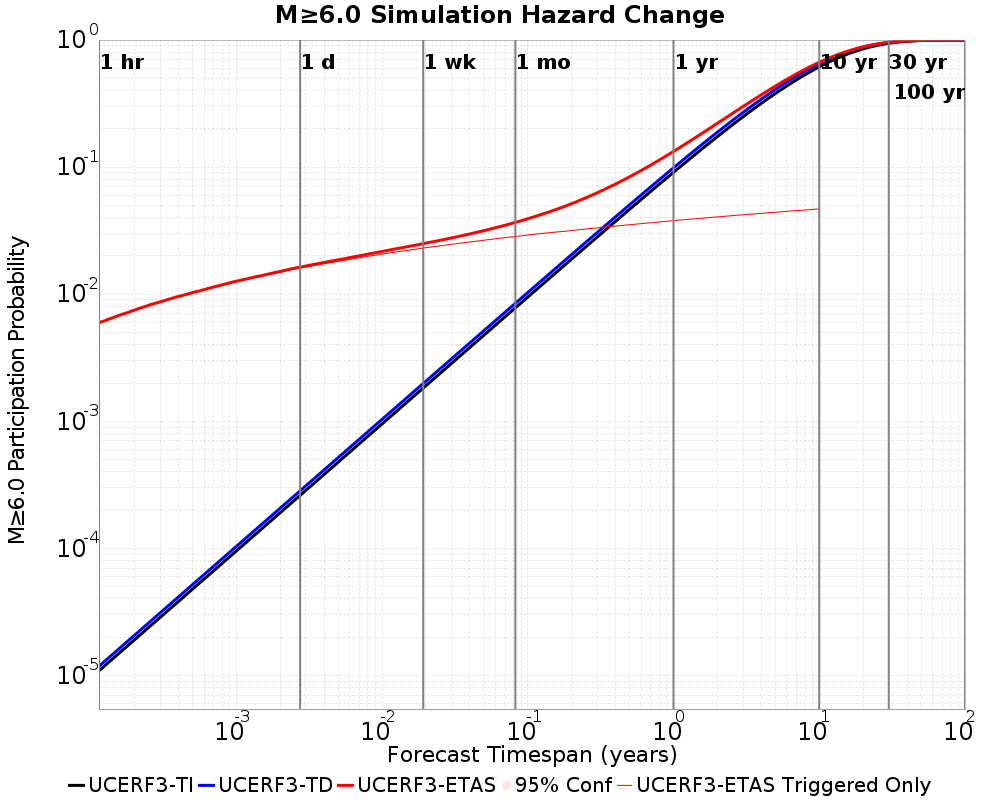
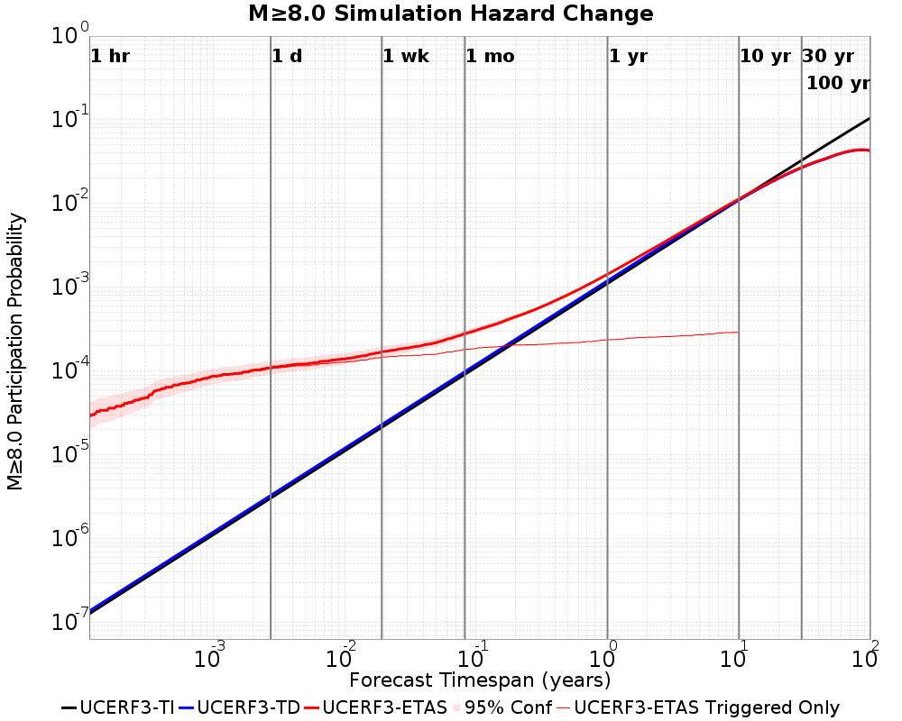
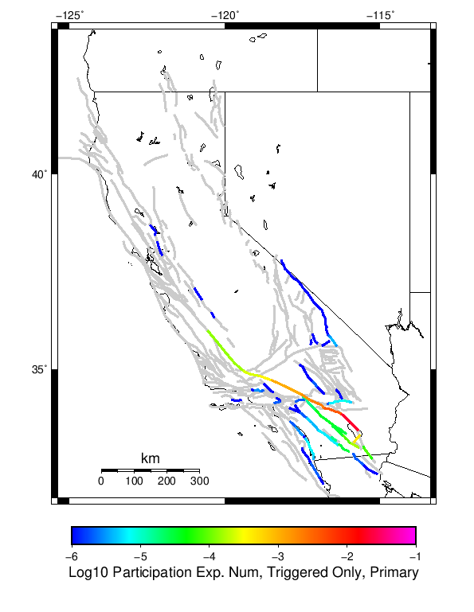
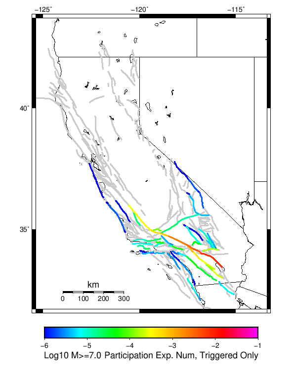
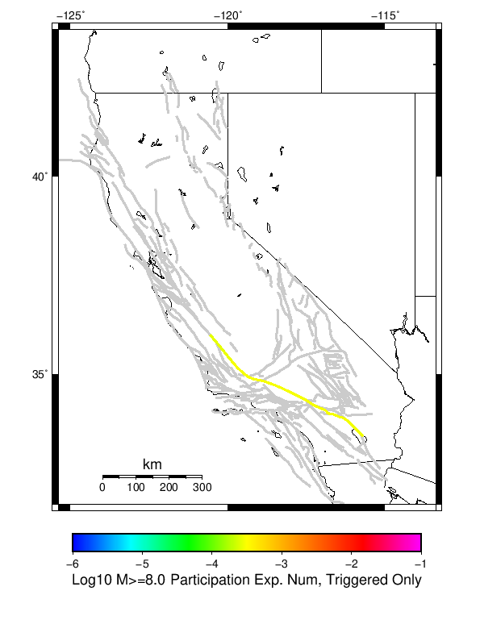

# 2009 Bombay Beach M6 Results

|   | 2009 Bombay Beach M6 |
|-----|-----|
| Num Simulations | 500000 |
| Start Time | 2019/01/01 00:00:00 UTC |
| Start Time Epoch Milliseconds | 1546300800000 |
| Duration | 10 Years |
| Includes Spontaneous? | false |
| Historical Ruptures | *(none)* |

## Table Of Contents

* [Magnitude Number Distribution](#magnitude-number-distribution)
* [Hazard Change Over Time](#hazard-change-over-time)
  * [M&ge;5.0 Hazard Change Over Time](#mge50-hazard-change-over-time)
  * [M&ge;6.0 Hazard Change Over Time](#mge60-hazard-change-over-time)
  * [M&ge;7.0 Hazard Change Over Time](#mge70-hazard-change-over-time)
  * [M&ge;8.0 Hazard Change Over Time](#mge80-hazard-change-over-time)
* [Section Participation](#section-participation)
  * [Section Participation Plots](#section-participation-plots)
  * [Supra-Seismogenic Parent Sections Table](#supra-seismogenic-parent-sections-table)
  * [M≥6.5 Parent Sections Table](#m65-parent-sections-table)
  * [M≥7 Parent Sections Table](#m7-parent-sections-table)
  * [M≥7.5 Parent Sections Table](#m75-parent-sections-table)
  * [M≥8 Parent Sections Table](#m8-parent-sections-table)
* [Gridded Nucleation](#gridded-nucleation)
* [JSON Input File](#json-input-file)

## Magnitude Number Distribution
*[(top)](#table-of-contents)*

**Legend**
* **Mean** (thick black line): mean expected number across all 500000 catalogs
* **2.5%,97.5%** (thin black lines): expected number percentiles across all 500000 catalogs
* **Median** (thin blue line): median expected number across all 500000 catalogs
* **Mode** (thin cyan line): modal expected number across all 500000 catalogs
* **10 yr Probability** (thin red line): 10 year probability calculated as the fraction of catalogs with at least 1 occurrence
* **95% Conf** (light red shaded region): binomial 95% confidence bounds on probability
* **Primary** (thin green line): mean expected number from primary triggered aftershocks only (no secondary, tertiary, etc...) across all 500000 catalogs


| Mag | Mean | 2.5 %ile | 97.5 %ile | Median | Mode | 10 yr Probability | Primary Aftershocks Mean |
|-----|-----|-----|-----|-----|-----|-----|-----|
| **M&ge;5** | 1.601 | 0.000 | 10.000 | 1.000 | 0.000 | 0.505 | 0.489 |
| **M&ge;5.1** | 1.250 | 0.000 | 8.000 | 0.000 | 0.000 | 0.429 | 0.382 |
| **M&ge;5.2** | 0.971 | 0.000 | 6.000 | 0.000 | 0.000 | 0.358 | 0.296 |
| **M&ge;5.3** | 0.748 | 0.000 | 5.000 | 0.000 | 0.000 | 0.294 | 0.228 |
| **M&ge;5.4** | 0.571 | 0.000 | 4.000 | 0.000 | 0.000 | 0.238 | 0.174 |
| **M&ge;5.5** | 0.431 | 0.000 | 3.000 | 0.000 | 0.000 | 0.190 | 0.131 |
| **M&ge;5.6** | 0.320 | 0.000 | 3.000 | 0.000 | 0.000 | 0.148 | 0.096 |
| **M&ge;5.7** | 0.232 | 0.000 | 2.000 | 0.000 | 0.000 | 0.112 | 0.069 |
| **M&ge;5.8** | 0.161 | 0.000 | 2.000 | 0.000 | 0.000 | 0.082 | 0.048 |
| **M&ge;5.9** | 0.105 | 0.000 | 1.000 | 0.000 | 0.000 | 0.057 | 0.031 |
| **M&ge;6** | 0.085 | 0.000 | 1.000 | 0.000 | 0.000 | 0.053 | 0.028 |
| **M&ge;6.1** | 0.070 | 0.000 | 1.000 | 0.000 | 0.000 | 0.049 | 0.025 |
| **M&ge;6.2** | 0.063 | 0.000 | 1.000 | 0.000 | 0.000 | 0.048 | 0.025 |
| **M&ge;6.3** | 0.060 | 0.000 | 1.000 | 0.000 | 0.000 | 0.047 | 0.025 |
| **M&ge;6.4** | 0.058 | 0.000 | 1.000 | 0.000 | 0.000 | 0.047 | 0.025 |
| **M&ge;6.5** | 0.057 | 0.000 | 1.000 | 0.000 | 0.000 | 0.046 | 0.025 |
| **M&ge;6.6** | 0.052 | 0.000 | 1.000 | 0.000 | 0.000 | 0.045 | 0.024 |
| **M&ge;6.7** | 0.050 | 0.000 | 1.000 | 0.000 | 0.000 | 0.045 | 0.024 |
| **M&ge;6.8** | 0.048 | 0.000 | 1.000 | 0.000 | 0.000 | 0.044 | 0.024 |
| **M&ge;6.9** | 0.048 | 0.000 | 1.000 | 0.000 | 0.000 | 0.044 | 0.024 |
| **M&ge;7** | 0.014 | 0.000 | 0.000 | 0.000 | 0.000 | 0.011 | 5.67E-3 |
| **M&ge;7.1** | 0.012 | 0.000 | 0.000 | 0.000 | 0.000 | 0.011 | 5.59E-3 |
| **M&ge;7.2** | 0.012 | 0.000 | 0.000 | 0.000 | 0.000 | 0.011 | 5.57E-3 |
| **M&ge;7.3** | 0.011 | 0.000 | 0.000 | 0.000 | 0.000 | 0.011 | 5.54E-3 |
| **M&ge;7.4** | 6.62E-3 | 0.000 | 0.000 | 0.000 | 0.000 | 6.24E-3 | 3.30E-3 |
| **M&ge;7.5** | 6.45E-3 | 0.000 | 0.000 | 0.000 | 0.000 | 6.15E-3 | 3.28E-3 |
| **M&ge;7.6** | 4.74E-3 | 0.000 | 0.000 | 0.000 | 0.000 | 4.54E-3 | 2.44E-3 |
| **M&ge;7.7** | 3.27E-3 | 0.000 | 0.000 | 0.000 | 0.000 | 3.18E-3 | 1.67E-3 |
| **M&ge;7.8** | 3.10E-3 | 0.000 | 0.000 | 0.000 | 0.000 | 3.09E-3 | 1.64E-3 |
| **M&ge;7.9** | 1.01E-3 | 0.000 | 0.000 | 0.000 | 0.000 | 1.01E-3 | 5.28E-4 |
| **M&ge;8** | 4.20E-4 | 0.000 | 0.000 | 0.000 | 0.000 | 4.20E-4 | 2.18E-4 |
| **M&ge;8.1** | 3.54E-4 | 0.000 | 0.000 | 0.000 | 0.000 | 3.54E-4 | 1.90E-4 |
| **M&ge;8.2** | 0.000 | 0.000 | 0.000 | 0.000 | 0.000 | 0.000 | 0.000 |
| **M&ge;8.3** | 0.000 | 0.000 | 0.000 | 0.000 | 0.000 | 0.000 | 0.000 |
| **M&ge;8.4** | 0.000 | 0.000 | 0.000 | 0.000 | 0.000 | 0.000 | 0.000 |
| **M&ge;8.5** | 0.000 | 0.000 | 0.000 | 0.000 | 0.000 | 0.000 | 0.000 |
| **M&ge;8.6** | 0.000 | 0.000 | 0.000 | 0.000 | 0.000 | 0.000 | 0.000 |
| **M&ge;8.7** | 0.000 | 0.000 | 0.000 | 0.000 | 0.000 | 0.000 | 0.000 |
| **M&ge;8.8** | 0.000 | 0.000 | 0.000 | 0.000 | 0.000 | 0.000 | 0.000 |
| **M&ge;8.9** | 0.000 | 0.000 | 0.000 | 0.000 | 0.000 | 0.000 | 0.000 |
| **M&ge;9** | 0.000 | 0.000 | 0.000 | 0.000 | 0.000 | 0.000 | 0.000 |

## Hazard Change Over Time
*[(top)](#table-of-contents)*

These plots show how the probability of ruptures of various magnitudes within 100km of any scenario rupture changes over time

### M&ge;5.0 Hazard Change Over Time
*[(top)](#table-of-contents)*


| Forecast Duration | UCERF3-ETAS [95% Conf] | UCERF3-ETAS Triggered Only | UCERF3-TD | UCERF3-TI |
|-----|-----|-----|-----|-----|
| 1 Hour | 0.105 [0.104 - 0.106] | 0.105 | 8.84E-5 | 8.75E-5 |
| 1 Day | 0.245 [0.244 - 0.246] | 0.243 | 2.12E-3 | 2.10E-3 |
| 1 Week | 0.329 [0.328 - 0.330] | 0.319 | 0.015 | 0.015 |
| 1 Month | 0.408 [0.407 - 0.409] | 0.369 | 0.062 | 0.061 |
| 1 Year | 0.744 [0.743 - 0.745] | 0.444 | 0.540 | 0.536 |
| 10 Years | 1.000 [1.000 - 1.000] | 0.502 | 1.000 | 1.000 |
| 30 Years | 1.000 [1.000 - 1.000] \* | \* | 1.000 | 1.000 |
| 100 Years | 1.000 [1.000 - 1.000] \* | \* | 1.000 | 1.000 |

\* *forecast duration is longer than simulation length, only ETAS ruptures from the first 10 years are included*
### M&ge;6.0 Hazard Change Over Time
*[(top)](#table-of-contents)*



| Forecast Duration | UCERF3-ETAS [95% Conf] | UCERF3-ETAS Triggered Only | UCERF3-TD | UCERF3-TI |
|-----|-----|-----|-----|-----|
| 1 Hour | 6.60E-3 [6.37E-3 - 6.82E-3] | 6.58E-3 | 1.18E-5 | 1.09E-5 |
| 1 Day | 0.018 [0.018 - 0.018] | 0.018 | 2.84E-4 | 2.61E-4 |
| 1 Week | 0.027 [0.027 - 0.028] | 0.026 | 1.98E-3 | 1.83E-3 |
| 1 Month | 0.040 [0.039 - 0.040] | 0.031 | 8.48E-3 | 7.81E-3 |
| 1 Year | 0.137 [0.136 - 0.137] | 0.042 | 0.099 | 0.091 |
| 10 Years | 0.670 [0.670 - 0.670] | 0.052 | 0.652 | 0.615 |
| 30 Years | 0.959 [0.959 - 0.959] \* | \* | 0.957 | 0.943 |
| 100 Years | 1.000 [1.000 - 1.000] \* | \* | 1.000 | 1.000 |

\* *forecast duration is longer than simulation length, only ETAS ruptures from the first 10 years are included*
### M&ge;7.0 Hazard Change Over Time
*[(top)](#table-of-contents)*


| Forecast Duration | UCERF3-ETAS [95% Conf] | UCERF3-ETAS Triggered Only | UCERF3-TD | UCERF3-TI |
|-----|-----|-----|-----|-----|
| 1 Hour | 1.27E-3 [1.18E-3 - 1.38E-3] | 1.27E-3 | 2.98E-6 | 2.25E-6 |
| 1 Day | 3.59E-3 [3.43E-3 - 3.76E-3] | 3.52E-3 | 7.14E-5 | 5.39E-5 |
| 1 Week | 5.67E-3 [5.47E-3 - 5.87E-3] | 5.17E-3 | 5.00E-4 | 3.77E-4 |
| 1 Month | 8.64E-3 [8.42E-3 - 8.87E-3] | 6.51E-3 | 2.14E-3 | 1.62E-3 |
| 1 Year | 0.034 [0.034 - 0.035] | 8.82E-3 | 0.026 | 0.020 |
| 10 Years | 0.235 [0.234 - 0.235] | 0.011 | 0.226 | 0.179 |
| 30 Years | 0.526 [0.526 - 0.527] \* | \* | 0.521 | 0.446 |
| 100 Years | 0.880 [0.880 - 0.880] \* | \* | 0.879 | 0.860 |

\* *forecast duration is longer than simulation length, only ETAS ruptures from the first 10 years are included*
### M&ge;8.0 Hazard Change Over Time
*[(top)](#table-of-contents)*



| Forecast Duration | UCERF3-ETAS [95% Conf] | UCERF3-ETAS Triggered Only | UCERF3-TD | UCERF3-TI |
|-----|-----|-----|-----|-----|
| 1 Hour | 4.41E-5 [2.84E-5 - 6.80E-5] | 4.40E-5 | 1.37E-7 | 1.27E-7 |
| 1 Day | 1.53E-4 [1.22E-4 - 1.92E-4] | 1.50E-4 | 3.29E-6 | 3.05E-6 |
| 1 Week | 2.31E-4 [1.94E-4 - 2.76E-4] | 2.08E-4 | 2.30E-5 | 2.14E-5 |
| 1 Month | 3.57E-4 [3.15E-4 - 4.06E-4] | 2.58E-4 | 9.87E-5 | 9.15E-5 |
| 1 Year | 1.54E-3 [1.49E-3 - 1.60E-3] | 3.42E-4 | 1.20E-3 | 1.11E-3 |
| 10 Years | 0.012 [0.011 - 0.012] | 4.18E-4 | 0.011 | 0.011 |
| 30 Years | 0.027 [0.027 - 0.027] \* | \* | 0.027 | 0.033 |
| 100 Years | 0.043 [0.043 - 0.043] \* | \* | 0.043 | 0.105 |

\* *forecast duration is longer than simulation length, only ETAS ruptures from the first 10 years are included*
## Section Participation
*[(top)](#table-of-contents)*

### Section Participation Plots
*[(top)](#table-of-contents)*

| Min Mag | Triggered Ruptures (no spontaneous) | Triggered Ruptures (primary aftershocks only) |
|-----|-----|-----|
| **All Supra. Seis.** |  |  |
| **M&ge;6.5** |  |  |
| **M&ge;7** |  |  |
| **M&ge;7.5** |  |  |
| **M&ge;8** |  |  |

### Supra-Seismogenic Parent Sections Table
*[(top)](#table-of-contents)*

*First 10 of 107 with matching ruptures shown*

| Parent Name | Triggered Mean Count | Triggered 10 Year Prob | Triggered Primary Mean Count |
|-----|-----|-----|-----|
| San Andreas (Coachella) rev | 0.043708 | 0.043648 | 0.02345 |
| San Andreas (San Gorgonio Pass-Garnet HIll) | 0.010422 | 0.010412 | 0.00549 |
| San Andreas (San Bernardino S) | 0.006124 | 0.006098 | 0.003256 |
| San Andreas (San Bernardino N) | 0.004624 | 0.004594 | 0.00242 |
| San Andreas (Mojave S) | 0.00323 | 0.003216 | 0.001666 |
| Cucamonga | 0.002394 | 0.002394 | 2.0E-6 |
| Cleghorn | 0.00194 | 0.001934 | 0.0 |
| San Jacinto (San Bernardino) | 0.001334 | 0.001324 | 1.4E-5 |
| San Andreas (Mojave N) | 0.001126 | 0.001126 | 5.4E-4 |
| Elmore Ranch | 8.9E-4 | 8.9E-4 | 4.4E-4 |

### M≥6.5 Parent Sections Table
*[(top)](#table-of-contents)*

*First 10 of 100 with matching ruptures shown*

| Parent Name | Triggered Mean Count | Triggered 10 Year Prob | Triggered Primary Mean Count |
|-----|-----|-----|-----|
| San Andreas (Coachella) rev | 0.043708 | 0.043648 | 0.02345 |
| San Andreas (San Gorgonio Pass-Garnet HIll) | 0.010422 | 0.010412 | 0.00549 |
| San Andreas (San Bernardino S) | 0.006124 | 0.006098 | 0.003256 |
| San Andreas (San Bernardino N) | 0.004624 | 0.004594 | 0.00242 |
| San Andreas (Mojave S) | 0.00323 | 0.003216 | 0.001666 |
| Cucamonga | 0.002394 | 0.002394 | 2.0E-6 |
| Cleghorn | 0.00194 | 0.001934 | 0.0 |
| San Jacinto (San Bernardino) | 0.001334 | 0.001324 | 1.4E-5 |
| San Andreas (Mojave N) | 0.001126 | 0.001126 | 5.4E-4 |
| Elmore Ranch | 8.9E-4 | 8.9E-4 | 4.4E-4 |

### M≥7 Parent Sections Table
*[(top)](#table-of-contents)*

*First 10 of 61 with matching ruptures shown*

| Parent Name | Triggered Mean Count | Triggered 10 Year Prob | Triggered Primary Mean Count |
|-----|-----|-----|-----|
| San Andreas (San Gorgonio Pass-Garnet HIll) | 0.010416 | 0.010406 | 0.00549 |
| San Andreas (Coachella) rev | 0.01026 | 0.01026 | 0.005488 |
| San Andreas (San Bernardino S) | 0.00612 | 0.006094 | 0.003256 |
| San Andreas (San Bernardino N) | 0.004578 | 0.004554 | 0.00242 |
| San Andreas (Mojave S) | 0.003228 | 0.003216 | 0.001666 |
| San Jacinto (San Bernardino) | 0.001274 | 0.001264 | 1.4E-5 |
| San Andreas (Mojave N) | 0.001104 | 0.001104 | 5.4E-4 |
| San Andreas (Big Bend) | 7.22E-4 | 7.22E-4 | 3.38E-4 |
| San Jacinto (Stepovers Combined) | 6.58E-4 | 6.42E-4 | 3.8E-5 |
| San Andreas (Carrizo) rev | 5.12E-4 | 5.12E-4 | 2.2E-4 |

### M≥7.5 Parent Sections Table
*[(top)](#table-of-contents)*

*First 10 of 30 with matching ruptures shown*

| Parent Name | Triggered Mean Count | Triggered 10 Year Prob | Triggered Primary Mean Count |
|-----|-----|-----|-----|
| San Andreas (San Bernardino S) | 0.005992 | 0.00598 | 0.003242 |
| San Andreas (San Gorgonio Pass-Garnet HIll) | 0.005974 | 0.00597 | 0.003242 |
| San Andreas (Coachella) rev | 0.00595 | 0.00595 | 0.00324 |
| San Andreas (San Bernardino N) | 0.004484 | 0.004472 | 0.002418 |
| San Andreas (Mojave S) | 0.003174 | 0.003162 | 0.001664 |
| San Andreas (Mojave N) | 0.0011 | 0.0011 | 5.4E-4 |
| San Andreas (Big Bend) | 7.2E-4 | 7.2E-4 | 3.38E-4 |
| San Andreas (Carrizo) rev | 5.08E-4 | 5.08E-4 | 2.2E-4 |
| San Andreas (Cholame) rev | 4.48E-4 | 4.48E-4 | 2.02E-4 |
| San Andreas (Parkfield) | 4.12E-4 | 4.12E-4 | 1.9E-4 |

### M≥8 Parent Sections Table
*[(top)](#table-of-contents)*

| Parent Name | Triggered Mean Count | Triggered 10 Year Prob | Triggered Primary Mean Count |
|-----|-----|-----|-----|
| San Andreas (Big Bend) | 4.2E-4 | 4.2E-4 | 2.18E-4 |
| San Andreas (Carrizo) rev | 4.2E-4 | 4.2E-4 | 2.18E-4 |
| San Andreas (Mojave N) | 4.2E-4 | 4.2E-4 | 2.18E-4 |
| San Andreas (Mojave S) | 4.2E-4 | 4.2E-4 | 2.18E-4 |
| San Andreas (San Bernardino N) | 4.2E-4 | 4.2E-4 | 2.18E-4 |
| San Andreas (San Bernardino S) | 4.2E-4 | 4.2E-4 | 2.18E-4 |
| San Andreas (San Gorgonio Pass-Garnet HIll) | 4.18E-4 | 4.18E-4 | 2.18E-4 |
| San Andreas (Coachella) rev | 4.12E-4 | 4.12E-4 | 2.18E-4 |
| San Andreas (Cholame) rev | 3.82E-4 | 3.82E-4 | 2.02E-4 |
| San Andreas (Parkfield) | 3.58E-4 | 3.58E-4 | 1.9E-4 |
## Gridded Nucleation
*[(top)](#table-of-contents)*

| Min Mag | Triggered Ruptures (no spontaneous) | Triggered Ruptures (primary aftershocks only) |
|-----|-----|-----|
| **M&ge;5** |  |  |
| **M&ge;6** |  |  |
| **M&ge;7** |  |  |

## JSON Input File
*[(top)](#table-of-contents)*

```
{
  "numSimulations": 500000,
  "duration": 10.0,
  "startYear": 2019,
  "includeSpontaneous": false,
  "randomSeed": 123456789,
  "binaryOutput": true,
  "binaryOutputFilters": [
    {
      "prefix": "results_complete",
      "descendantsOnly": false
    },
    {
      "prefix": "results_m5_preserve_chain",
      "minMag": 5.0,
      "preserveChainBelowMag": true,
      "descendantsOnly": false
    }
  ],
  "forceRecalc": false,
  "simulationName": "2009 Bombay Beach M6",
  "numRetries": 3,
  "outputDir": "${ETAS_SIM_DIR}/2019_01_11-2009BombayBeachM6-u2mapped-noSpont-10yr-8threads",
  "triggerRuptures": [
    {
      "mag": 6.0,
      "latitude": 33.3172,
      "longitude": -115.72800000000001,
      "depth": 5.96
    }
  ],
  "cacheDir": "${ETAS_LAUNCHER}/inputs/cache_u2_mapped_fm3p1",
  "fssFile": "${ETAS_LAUNCHER}/inputs/ucerf2_mapped_fm3p1.zip",
  "probModel": "FULL_TD",
  "applySubSeisForSupraNucl": true,
  "totRateScaleFactor": 1.14,
  "gridSeisCorr": true,
  "timeIndependentERF": false,
  "griddedOnly": false,
  "imposeGR": false,
  "includeIndirectTriggering": true,
  "gridSeisDiscr": 0.1,
  "catalogCompletenessModel": "RELAXED"
}
```

