# CyberShake-ETAS Simulations, ComCat M7.1 (ci38457511), ShakeMap Surfaces, FM2_1

CyberShake Study: Study 15.4 with 336 sites

## Table Of Contents
* [Mapping Information](#mapping-information)
* [Conditional Hypocenter Distributions](#conditional-hypocenter-distributions)
  * [Tank Canyon CHD](#tank-canyon-chd)
  * [Little Lake CHD](#little-lake-chd)
  * [Garlock (Central) CHD](#garlock-central-chd)
  * [Owl Lake CHD](#owl-lake-chd)
  * [Garlock (West) CHD](#garlock-west-chd)
* [Hazard Curves](#hazard-curves)
  * [SBSM Hazard Curves](#sbsm-hazard-curves)
    * [CyberShake SBSM Hazard Curves](#cybershake-sbsm-hazard-curves)
    * [CyberShake SBSM 5s Hazard Gain Table](#cybershake-sbsm-5s-hazard-gain-table)
    * [GMPE SBSM Hazard Curves](#gmpe-sbsm-hazard-curves)
    * [GMPE SBSM 5s Hazard Gain Table](#gmpe-sbsm-5s-hazard-gain-table)
  * [MRSD Hazard Curves](#mrsd-hazard-curves)
    * [CyberShake MRSD Hazard Curves](#cybershake-mrsd-hazard-curves)
    * [CyberShake MRSD 5s Hazard Gain Table](#cybershake-mrsd-5s-hazard-gain-table)
    * [GMPE MRSD Hazard Curves](#gmpe-mrsd-hazard-curves)
    * [GMPE MRSD 5s Hazard Gain Table](#gmpe-mrsd-5s-hazard-gain-table)
  * [STNI Hazard Curves](#stni-hazard-curves)
    * [CyberShake STNI Hazard Curves](#cybershake-stni-hazard-curves)
    * [CyberShake STNI 5s Hazard Gain Table](#cybershake-stni-5s-hazard-gain-table)
    * [GMPE STNI Hazard Curves](#gmpe-stni-hazard-curves)
    * [GMPE STNI 5s Hazard Gain Table](#gmpe-stni-5s-hazard-gain-table)
  * [PDU Hazard Curves](#pdu-hazard-curves)
    * [CyberShake PDU Hazard Curves](#cybershake-pdu-hazard-curves)
    * [CyberShake PDU 5s Hazard Gain Table](#cybershake-pdu-5s-hazard-gain-table)
    * [GMPE PDU Hazard Curves](#gmpe-pdu-hazard-curves)
    * [GMPE PDU 5s Hazard Gain Table](#gmpe-pdu-5s-hazard-gain-table)
* [Hazard Maps](#hazard-maps)
  * [5s One Day Hazard Maps](#5s-one-day-hazard-maps)
    * [One Day 5s Sa (g) with POE=1.0E-4, Maps](#one-day-5s-sa-g-with-poe10e-4-maps)
      * [One Day 5s Sa (g) with POE=1.0E-4, CyberShake Maps](#one-day-5s-sa-g-with-poe10e-4-cybershake-maps)
      * [One Day 5s Sa (g) with POE=1.0E-4, GMPE Maps](#one-day-5s-sa-g-with-poe10e-4-gmpe-maps)
    * [One Day 5s Sa (g) with POE=0.001, Maps](#one-day-5s-sa-g-with-poe0001-maps)
      * [One Day 5s Sa (g) with POE=0.001, CyberShake Maps](#one-day-5s-sa-g-with-poe0001-cybershake-maps)
      * [One Day 5s Sa (g) with POE=0.001, GMPE Maps](#one-day-5s-sa-g-with-poe0001-gmpe-maps)
    * [One Day 5s Sa (g) with POE=0.01, Maps](#one-day-5s-sa-g-with-poe001-maps)
      * [One Day 5s Sa (g) with POE=0.01, CyberShake Maps](#one-day-5s-sa-g-with-poe001-cybershake-maps)
      * [One Day 5s Sa (g) with POE=0.01, GMPE Maps](#one-day-5s-sa-g-with-poe001-gmpe-maps)
    * [One Day POE 0.01 (g) 5s SA, Maps](#one-day-poe-001-g-5s-sa-maps)
      * [One Day POE 0.01 (g) 5s SA, CyberShake Maps](#one-day-poe-001-g-5s-sa-cybershake-maps)
      * [One Day POE 0.01 (g) 5s SA, GMPE Maps](#one-day-poe-001-g-5s-sa-gmpe-maps)
    * [One Day POE 0.1 (g) 5s SA, Maps](#one-day-poe-01-g-5s-sa-maps)
      * [One Day POE 0.1 (g) 5s SA, CyberShake Maps](#one-day-poe-01-g-5s-sa-cybershake-maps)
      * [One Day POE 0.1 (g) 5s SA, GMPE Maps](#one-day-poe-01-g-5s-sa-gmpe-maps)
    * [One Day POE 0.2 (g) 5s SA, Maps](#one-day-poe-02-g-5s-sa-maps)
      * [One Day POE 0.2 (g) 5s SA, CyberShake Maps](#one-day-poe-02-g-5s-sa-cybershake-maps)
      * [One Day POE 0.2 (g) 5s SA, GMPE Maps](#one-day-poe-02-g-5s-sa-gmpe-maps)
    * [One Day POE 0.5 (g) 5s SA, Maps](#one-day-poe-05-g-5s-sa-maps)
      * [One Day POE 0.5 (g) 5s SA, CyberShake Maps](#one-day-poe-05-g-5s-sa-cybershake-maps)
      * [One Day POE 0.5 (g) 5s SA, GMPE Maps](#one-day-poe-05-g-5s-sa-gmpe-maps)
  * [5s One Day EATS Gains Table](#5s-one-day-eats-gains-table)
  * [5s One Week Hazard Maps](#5s-one-week-hazard-maps)
    * [One Week 5s Sa (g) with POE=1.0E-4, Maps](#one-week-5s-sa-g-with-poe10e-4-maps)
      * [One Week 5s Sa (g) with POE=1.0E-4, CyberShake Maps](#one-week-5s-sa-g-with-poe10e-4-cybershake-maps)
      * [One Week 5s Sa (g) with POE=1.0E-4, GMPE Maps](#one-week-5s-sa-g-with-poe10e-4-gmpe-maps)
    * [One Week 5s Sa (g) with POE=0.001, Maps](#one-week-5s-sa-g-with-poe0001-maps)
      * [One Week 5s Sa (g) with POE=0.001, CyberShake Maps](#one-week-5s-sa-g-with-poe0001-cybershake-maps)
      * [One Week 5s Sa (g) with POE=0.001, GMPE Maps](#one-week-5s-sa-g-with-poe0001-gmpe-maps)
    * [One Week 5s Sa (g) with POE=0.01, Maps](#one-week-5s-sa-g-with-poe001-maps)
      * [One Week 5s Sa (g) with POE=0.01, CyberShake Maps](#one-week-5s-sa-g-with-poe001-cybershake-maps)
      * [One Week 5s Sa (g) with POE=0.01, GMPE Maps](#one-week-5s-sa-g-with-poe001-gmpe-maps)
    * [One Week POE 0.01 (g) 5s SA, Maps](#one-week-poe-001-g-5s-sa-maps)
      * [One Week POE 0.01 (g) 5s SA, CyberShake Maps](#one-week-poe-001-g-5s-sa-cybershake-maps)
      * [One Week POE 0.01 (g) 5s SA, GMPE Maps](#one-week-poe-001-g-5s-sa-gmpe-maps)
    * [One Week POE 0.1 (g) 5s SA, Maps](#one-week-poe-01-g-5s-sa-maps)
      * [One Week POE 0.1 (g) 5s SA, CyberShake Maps](#one-week-poe-01-g-5s-sa-cybershake-maps)
      * [One Week POE 0.1 (g) 5s SA, GMPE Maps](#one-week-poe-01-g-5s-sa-gmpe-maps)
    * [One Week POE 0.2 (g) 5s SA, Maps](#one-week-poe-02-g-5s-sa-maps)
      * [One Week POE 0.2 (g) 5s SA, CyberShake Maps](#one-week-poe-02-g-5s-sa-cybershake-maps)
      * [One Week POE 0.2 (g) 5s SA, GMPE Maps](#one-week-poe-02-g-5s-sa-gmpe-maps)
    * [One Week POE 0.5 (g) 5s SA, Maps](#one-week-poe-05-g-5s-sa-maps)
      * [One Week POE 0.5 (g) 5s SA, CyberShake Maps](#one-week-poe-05-g-5s-sa-cybershake-maps)
      * [One Week POE 0.5 (g) 5s SA, GMPE Maps](#one-week-poe-05-g-5s-sa-gmpe-maps)
  * [5s One Week EATS Gains Table](#5s-one-week-eats-gains-table)
  * [5s One Year Hazard Maps](#5s-one-year-hazard-maps)
    * [One Year 5s Sa (g) with POE=1.0E-4, Maps](#one-year-5s-sa-g-with-poe10e-4-maps)
      * [One Year 5s Sa (g) with POE=1.0E-4, CyberShake Maps](#one-year-5s-sa-g-with-poe10e-4-cybershake-maps)
      * [One Year 5s Sa (g) with POE=1.0E-4, GMPE Maps](#one-year-5s-sa-g-with-poe10e-4-gmpe-maps)
    * [One Year 5s Sa (g) with POE=0.001, Maps](#one-year-5s-sa-g-with-poe0001-maps)
      * [One Year 5s Sa (g) with POE=0.001, CyberShake Maps](#one-year-5s-sa-g-with-poe0001-cybershake-maps)
      * [One Year 5s Sa (g) with POE=0.001, GMPE Maps](#one-year-5s-sa-g-with-poe0001-gmpe-maps)
    * [One Year 5s Sa (g) with POE=0.01, Maps](#one-year-5s-sa-g-with-poe001-maps)
      * [One Year 5s Sa (g) with POE=0.01, CyberShake Maps](#one-year-5s-sa-g-with-poe001-cybershake-maps)
      * [One Year 5s Sa (g) with POE=0.01, GMPE Maps](#one-year-5s-sa-g-with-poe001-gmpe-maps)
    * [One Year POE 0.01 (g) 5s SA, Maps](#one-year-poe-001-g-5s-sa-maps)
      * [One Year POE 0.01 (g) 5s SA, CyberShake Maps](#one-year-poe-001-g-5s-sa-cybershake-maps)
      * [One Year POE 0.01 (g) 5s SA, GMPE Maps](#one-year-poe-001-g-5s-sa-gmpe-maps)
    * [One Year POE 0.1 (g) 5s SA, Maps](#one-year-poe-01-g-5s-sa-maps)
      * [One Year POE 0.1 (g) 5s SA, CyberShake Maps](#one-year-poe-01-g-5s-sa-cybershake-maps)
      * [One Year POE 0.1 (g) 5s SA, GMPE Maps](#one-year-poe-01-g-5s-sa-gmpe-maps)
    * [One Year POE 0.2 (g) 5s SA, Maps](#one-year-poe-02-g-5s-sa-maps)
      * [One Year POE 0.2 (g) 5s SA, CyberShake Maps](#one-year-poe-02-g-5s-sa-cybershake-maps)
      * [One Year POE 0.2 (g) 5s SA, GMPE Maps](#one-year-poe-02-g-5s-sa-gmpe-maps)
    * [One Year POE 0.5 (g) 5s SA, Maps](#one-year-poe-05-g-5s-sa-maps)
      * [One Year POE 0.5 (g) 5s SA, CyberShake Maps](#one-year-poe-05-g-5s-sa-cybershake-maps)
      * [One Year POE 0.5 (g) 5s SA, GMPE Maps](#one-year-poe-05-g-5s-sa-gmpe-maps)
  * [5s One Year EATS Gains Table](#5s-one-year-eats-gains-table)
## Mapping Information

| Num Catalogs | 1000000 |
|-----|-----|
| Mapped Ruptures | 117229 |
| Mean variations per ruptures | 6.178591 |
| Median variations per ruptures | 6.0 |
| Min variations per ruptures | 1.0 |
| Max variations per ruptures | 21.0 |

## Conditional Hypocenter Distributions
*[(top)](#table-of-contents)*

### Tank Canyon CHD
*[(top)](#table-of-contents)*

| One Day | One Week | One Year |
|-----|-----|-----|
|  | 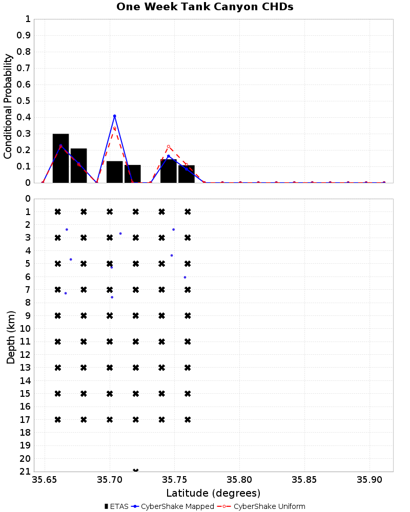 | 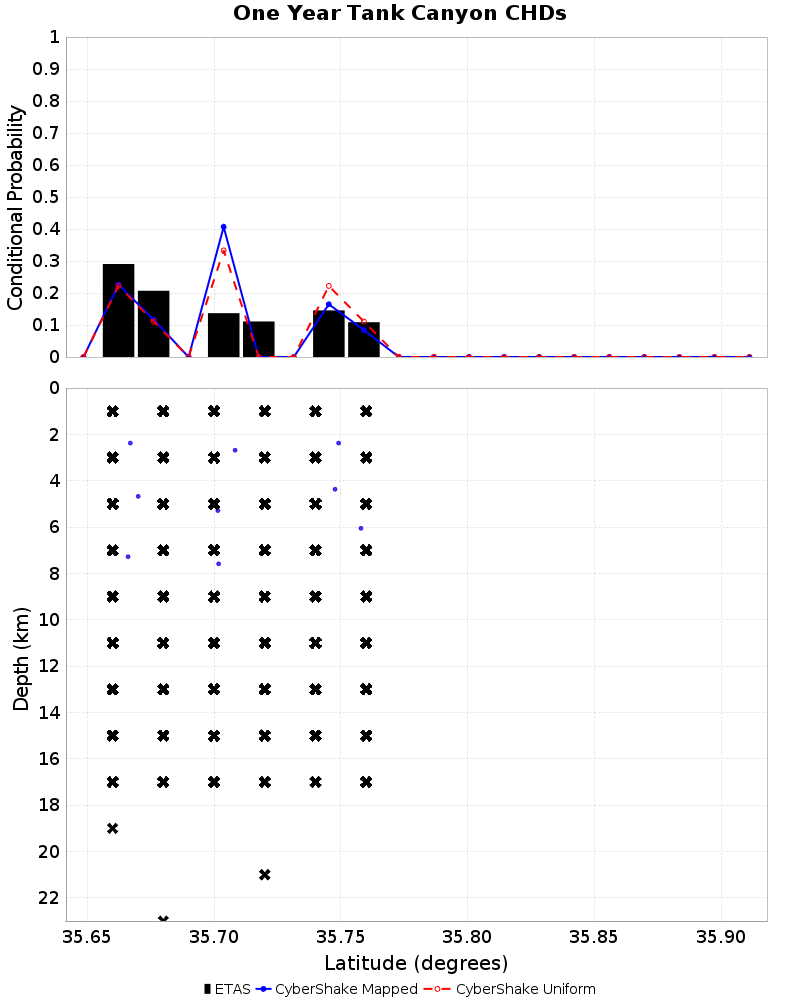 |

### Little Lake CHD
*[(top)](#table-of-contents)*

| One Day | One Week | One Year |
|-----|-----|-----|
| 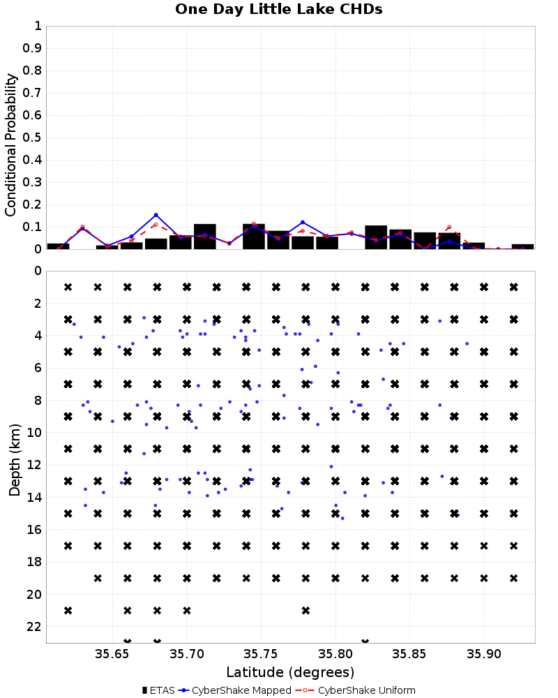 | 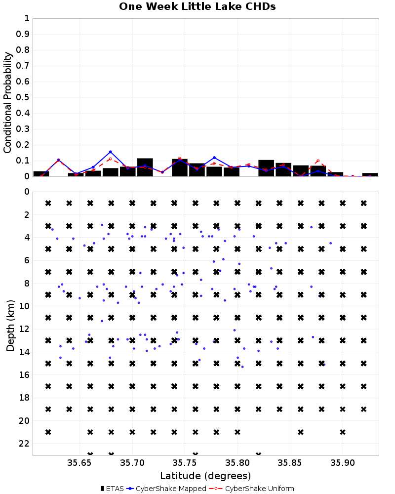 |  |

### Garlock (Central) CHD
*[(top)](#table-of-contents)*

| One Day | One Week | One Year |
|-----|-----|-----|
|  | 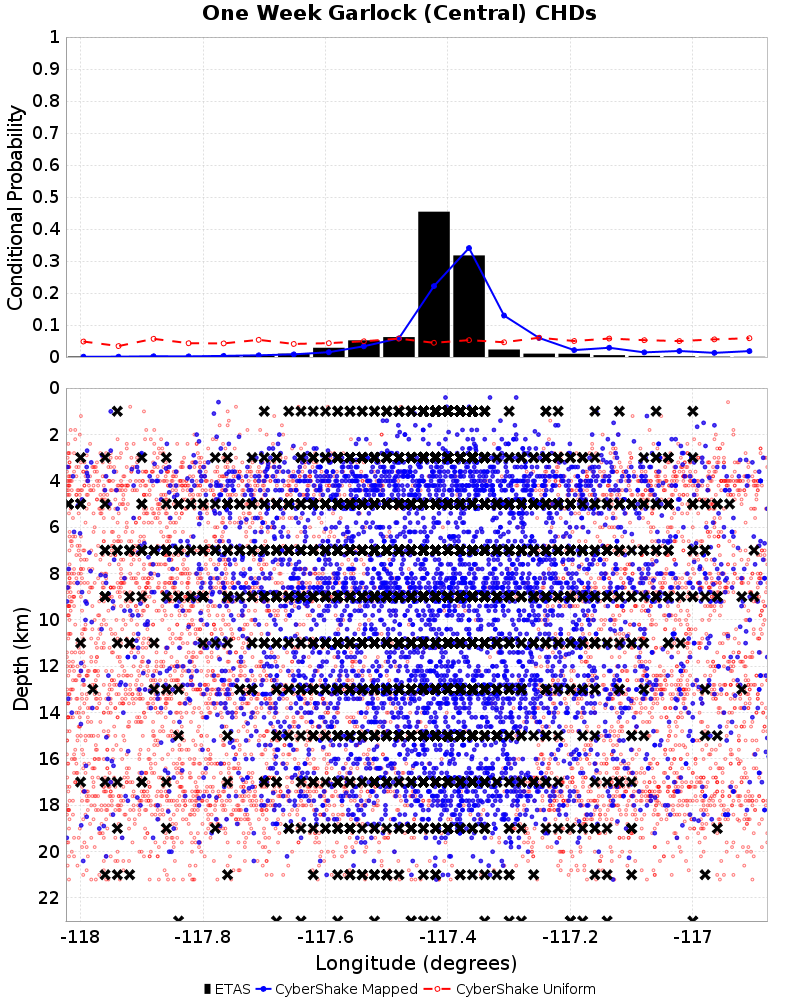 | 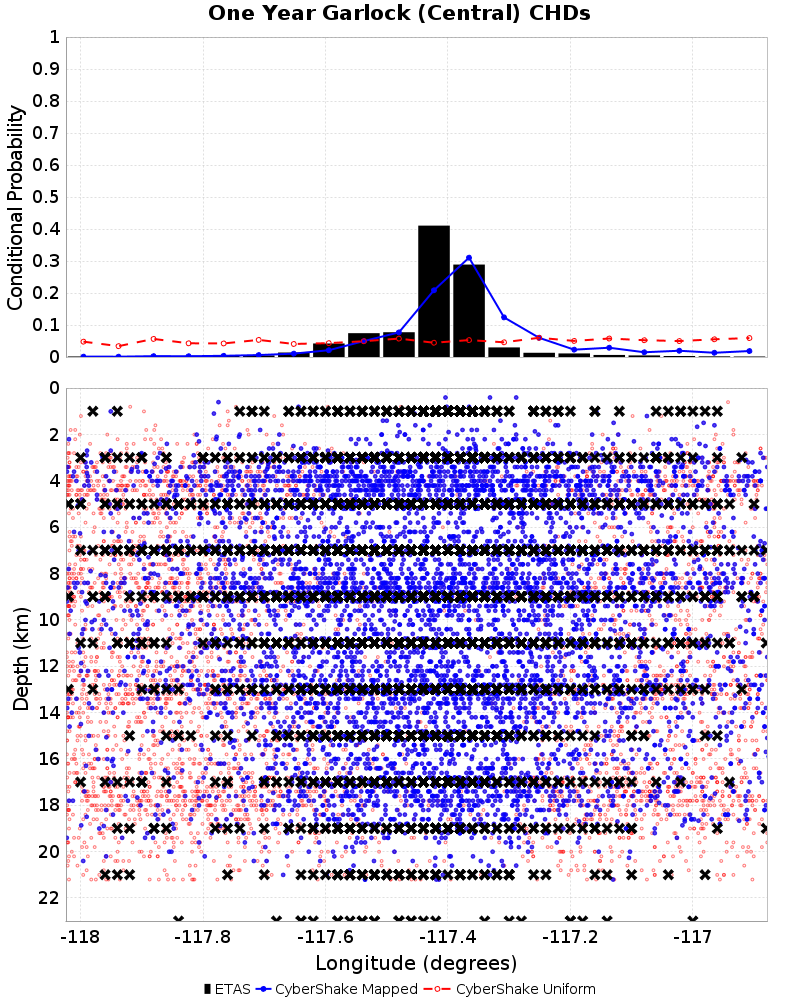 |

### Owl Lake CHD
*[(top)](#table-of-contents)*

| One Day | One Week | One Year |
|-----|-----|-----|
|  |  | 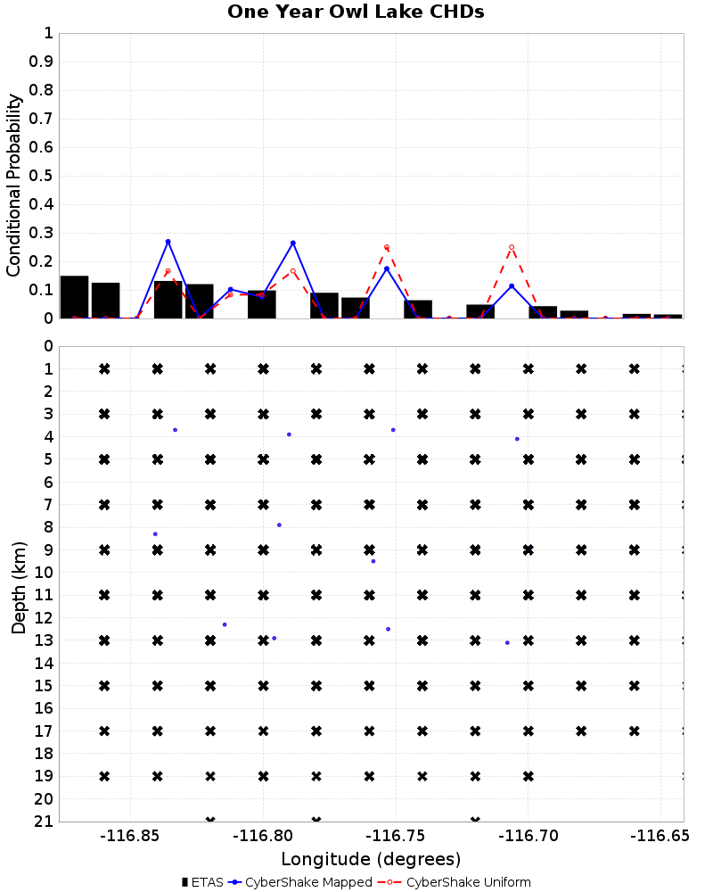 |

### Garlock (West) CHD
*[(top)](#table-of-contents)*

| One Day | One Week | One Year |
|-----|-----|-----|
| 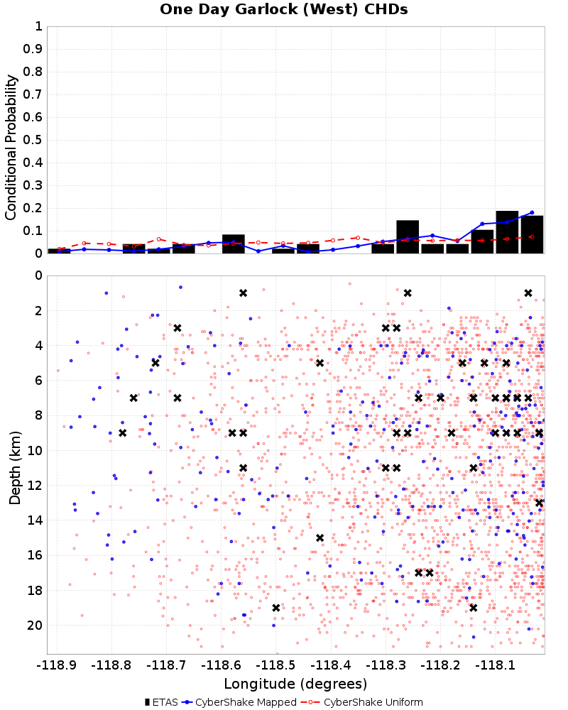 |  |  |

## Hazard Curves
*[(top)](#table-of-contents)*

### SBSM Hazard Curves
*[(top)](#table-of-contents)*

| Site Location Map |
|-----|
| 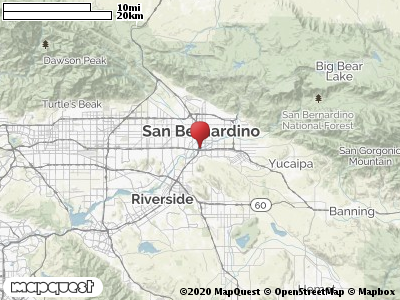 |

#### CyberShake SBSM Hazard Curves
*[(top)](#table-of-contents)*

| Time Span | 3s | 5s | 10s |
|-----|-----|-----|-----|
| One Day |  | 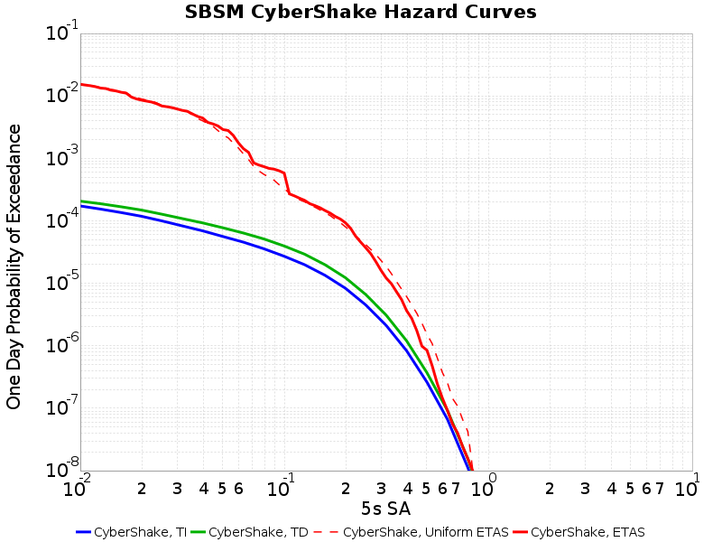 |  |
| One Week |  | 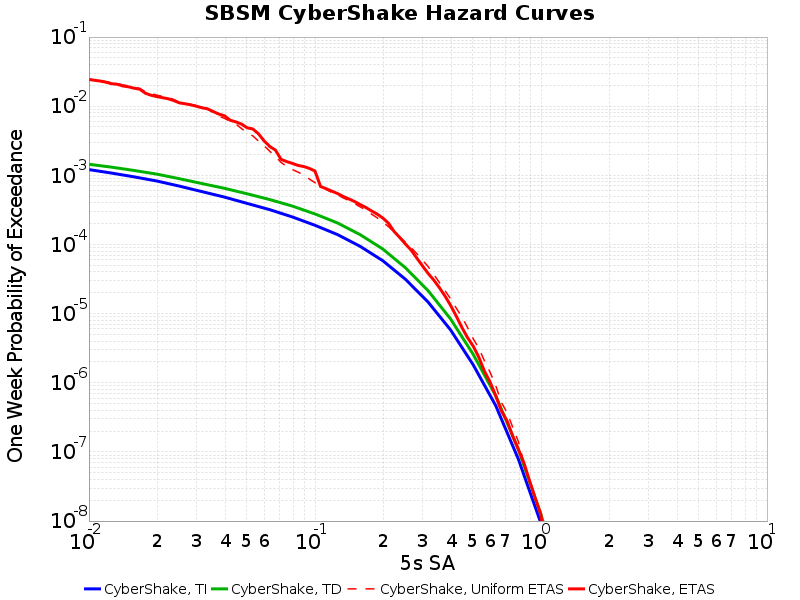 |  |
| One Year |  |  | 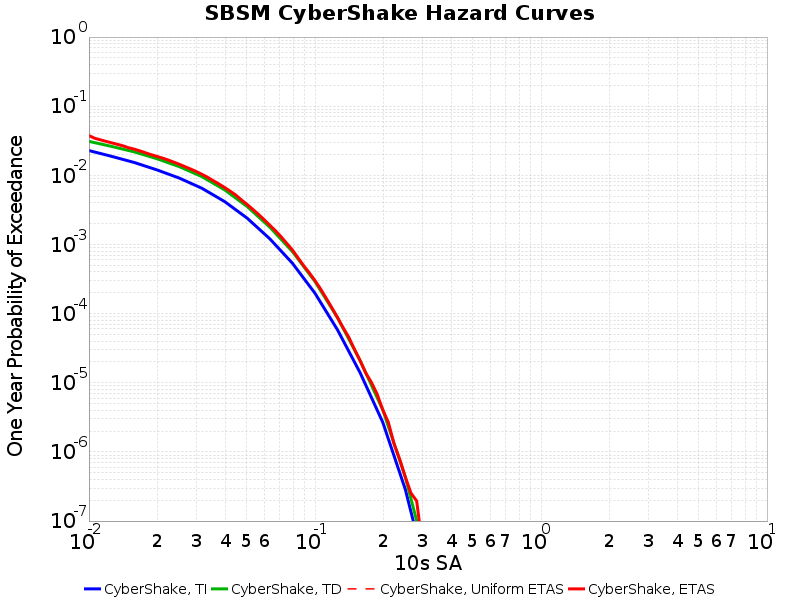 |

#### CyberShake SBSM 5s Hazard Gain Table
*[(top)](#table-of-contents)*

| Dividend | Divisor | One Day Min | One Day Max | One Week Min | One Week Max | One Year Min | One Year Max |
|-----|-----|-----|-----|-----|-----|-----|-----|
| CyberShake, TD | CyberShake, TI | 1.069 at 1.585 g | 1.476 at 0.200 g | 1.069 at 1.585 g | 1.476 at 0.200 g | 1.069 at 1.585 g | 1.475 at 0.200 g |
| CyberShake, Uniform ETAS | CyberShake, TD | 0.378 at 1.059 g | 74.825 at 0.010 g | 0.378 at 1.059 g | 17.080 at 0.010 g | 0.378 at 1.059 g | 11.364 at 1.496 g |
| CyberShake, ETAS | CyberShake, TD | 0.378 at 1.059 g | 74.165 at 0.010 g | 0.378 at 1.059 g | 16.846 at 0.010 g | 0.378 at 1.059 g | 11.364 at 1.496 g |
| CyberShake, ETAS | CyberShake, Uniform ETAS | 0.360 at 0.631 g | 1.789 at 0.100 g | 0.707 at 0.562 g | 1.476 at 0.100 g | 0.974 at 0.447 g | 1.047 at 0.053 g |

#### GMPE SBSM Hazard Curves
*[(top)](#table-of-contents)*

| Time Span | 3s | 5s | 10s |
|-----|-----|-----|-----|
| One Day | 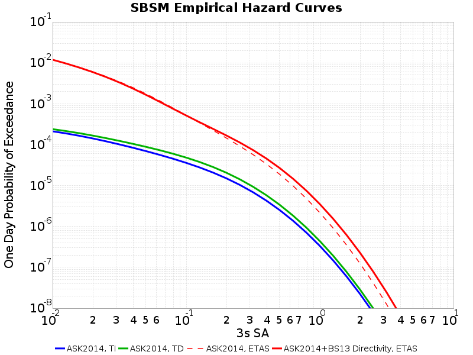 |  | 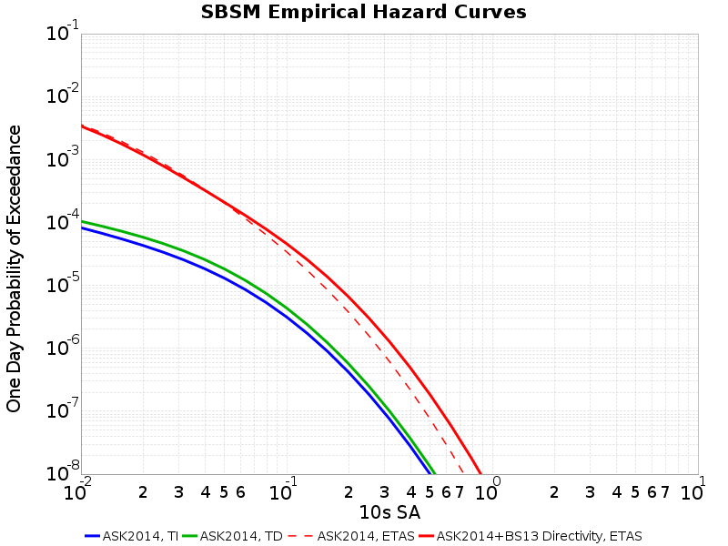 |
| One Week |  |  | 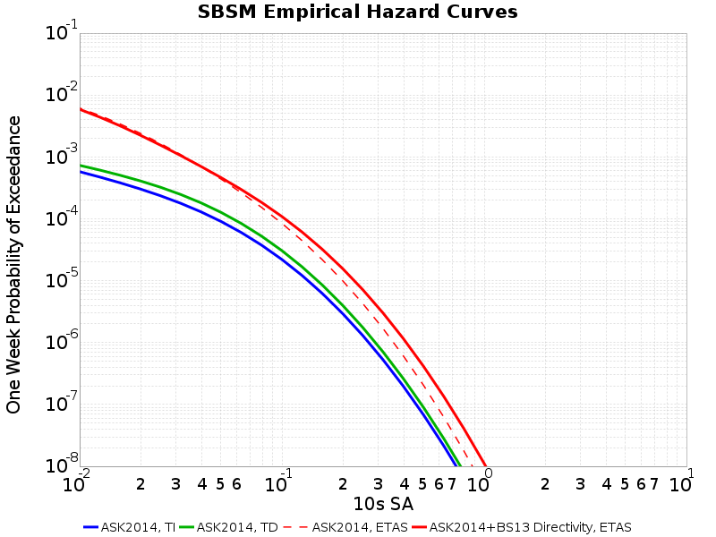 |
| One Year | 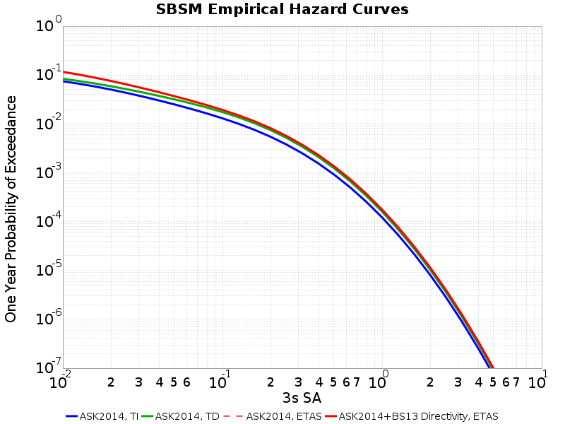 |  |  |

#### GMPE SBSM 5s Hazard Gain Table
*[(top)](#table-of-contents)*

| Dividend | Divisor | One Day Min | One Day Max | One Week Min | One Week Max | One Year Min | One Year Max |
|-----|-----|-----|-----|-----|-----|-----|-----|
| ASK2014, TD | ASK2014, TI | 1.175 at 0.010 g | 1.382 at 0.100 g | 1.175 at 0.010 g | 1.382 at 0.100 g | 1.169 at 0.010 g | 1.380 at 0.100 g |
| ASK2014, ETAS | ASK2014, TD | 3.038 at 7.943 g | 38.971 at 0.010 g | 1.531 at 10.000 g | 9.450 at 0.010 g | 1.029 at 10.000 g | 1.306 at 0.010 g |
| ASK2014+BS13 Directivity, ETAS | ASK2014, TD | 7.134 at 7.943 g | 38.165 at 0.010 g | 2.646 at 10.000 g | 9.280 at 0.010 g | 1.088 at 10.000 g | 1.301 at 0.010 g |
| ASK2014+BS13 Directivity, ETAS | ASK2014, ETAS | 0.923 at 0.032 g | 2.398 at 10.000 g | 0.942 at 0.032 g | 1.728 at 10.000 g | 0.992 at 0.025 g | 1.059 at 3.981 g |

### MRSD Hazard Curves
*[(top)](#table-of-contents)*

| Site Location Map |
|-----|
| 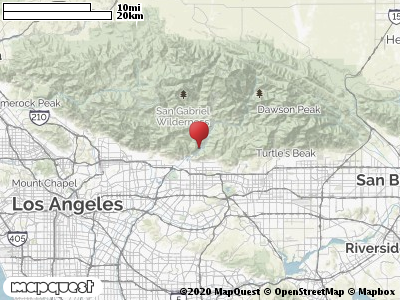 |

#### CyberShake MRSD Hazard Curves
*[(top)](#table-of-contents)*

| Time Span | 3s | 5s | 10s |
|-----|-----|-----|-----|
| One Day |  |  |  |
| One Week | 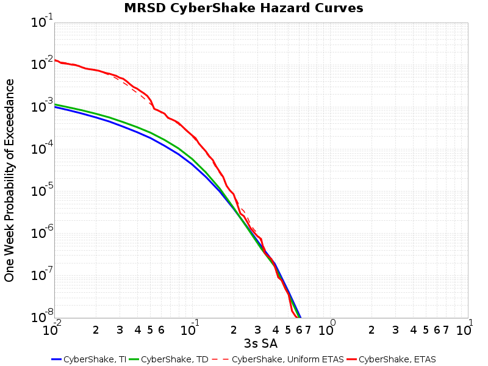 |  | 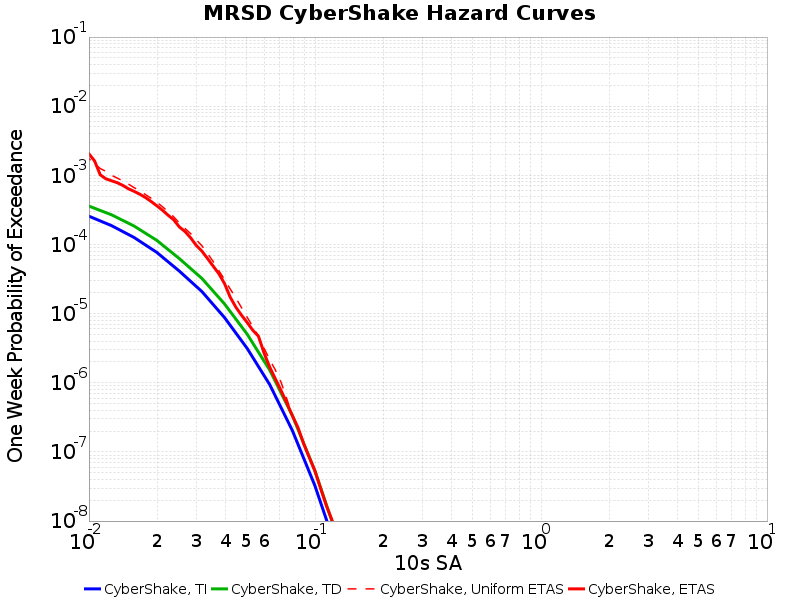 |
| One Year | 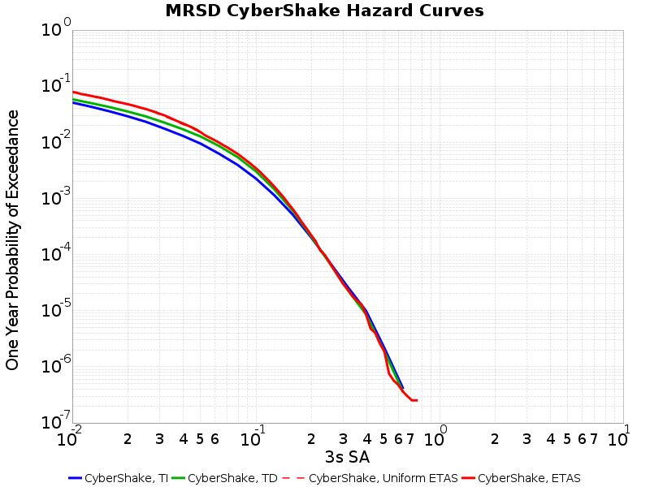 |  | 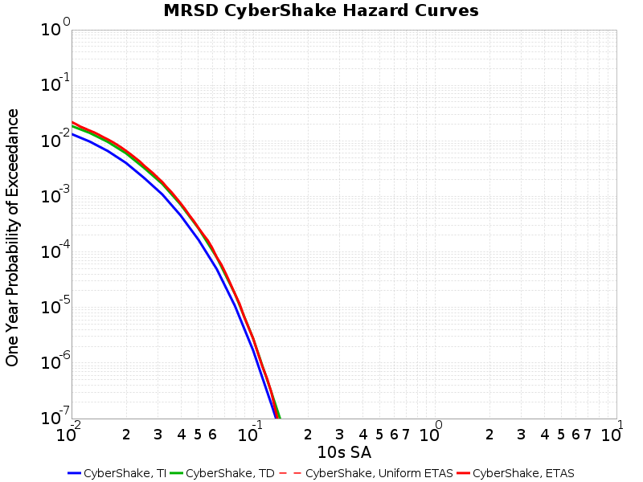 |

#### CyberShake MRSD 5s Hazard Gain Table
*[(top)](#table-of-contents)*

| Dividend | Divisor | One Day Min | One Day Max | One Week Min | One Week Max | One Year Min | One Year Max |
|-----|-----|-----|-----|-----|-----|-----|-----|
| CyberShake, TD | CyberShake, TI | 0.985 at 0.316 g | 1.511 at 0.079 g | 0.985 at 0.316 g | 1.511 at 0.079 g | 0.985 at 0.316 g | 1.511 at 0.079 g |
| CyberShake, Uniform ETAS | CyberShake, TD | 0.740 at 0.299 g | 47.874 at 0.011 g | 0.740 at 0.299 g | 11.322 at 0.011 g | 0.740 at 0.299 g | 1.371 at 0.011 g |
| CyberShake, ETAS | CyberShake, TD | 0.740 at 0.299 g | 52.389 at 0.015 g | 0.740 at 0.299 g | 12.188 at 0.015 g | 0.740 at 0.299 g | 1.390 at 0.016 g |
| CyberShake, ETAS | CyberShake, Uniform ETAS | 0.594 at 0.178 g | 2.855 at 0.158 g | 0.866 at 0.038 g | 1.860 at 0.158 g | 0.985 at 0.038 g | 1.051 at 0.158 g |

#### GMPE MRSD Hazard Curves
*[(top)](#table-of-contents)*

| Time Span | 3s | 5s | 10s |
|-----|-----|-----|-----|
| One Day | 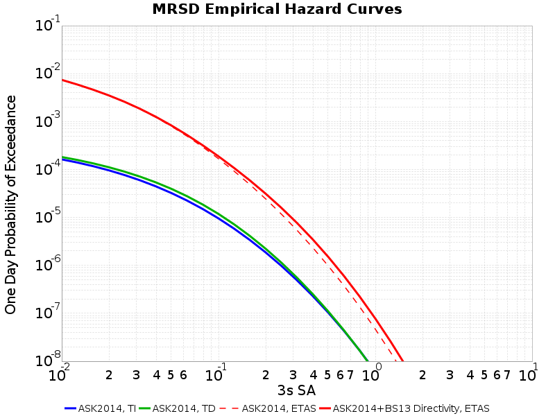 |  |  |
| One Week | 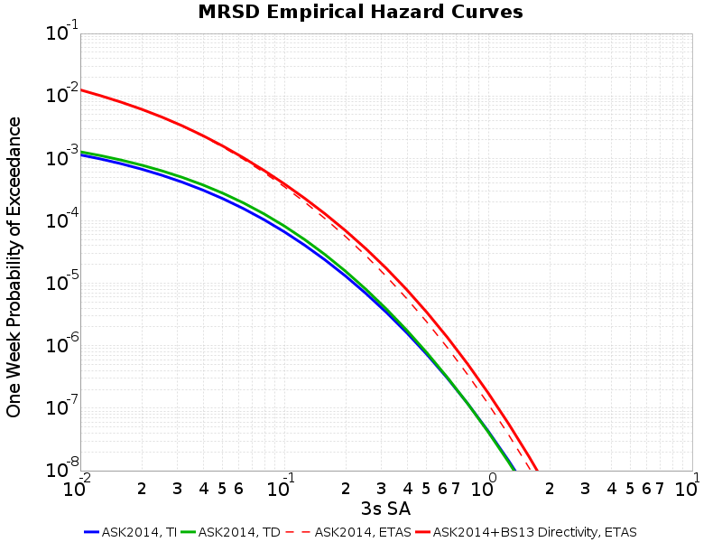 | 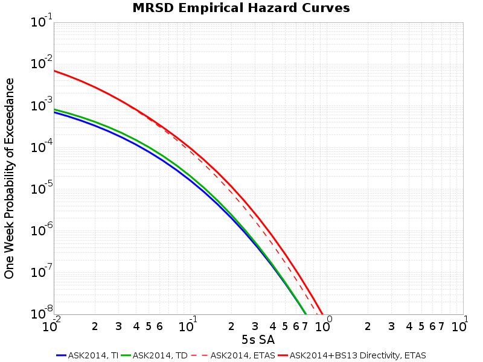 |  |
| One Year | 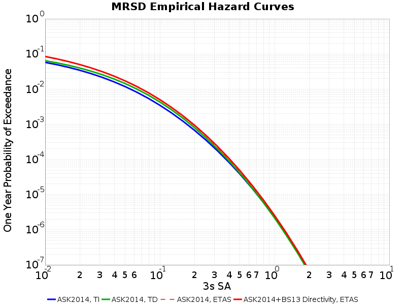 | 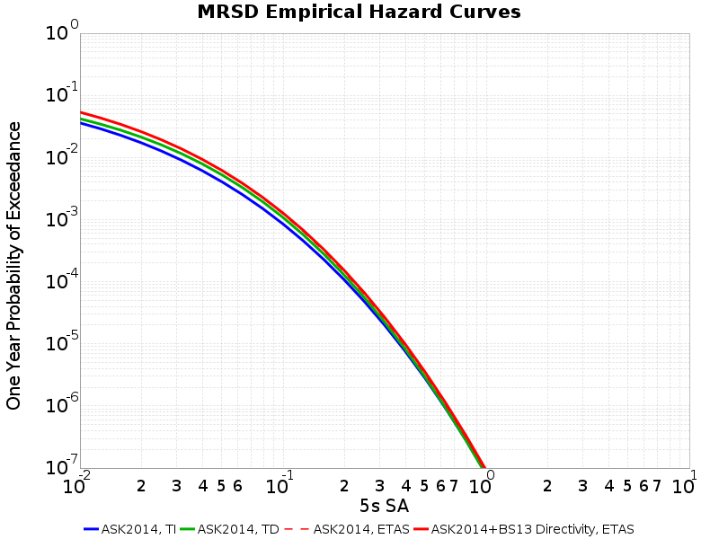 |  |

#### GMPE MRSD 5s Hazard Gain Table
*[(top)](#table-of-contents)*

| Dividend | Divisor | One Day Min | One Day Max | One Week Min | One Week Max | One Year Min | One Year Max |
|-----|-----|-----|-----|-----|-----|-----|-----|
| ASK2014, TD | ASK2014, TI | 0.833 at 5.012 g | 1.296 at 0.063 g | 0.821 at 6.310 g | 1.296 at 0.063 g | 0.872 at 7.943 g | 1.296 at 0.063 g |
| ASK2014, ETAS | ASK2014, TD | 6.498 at 3.162 g | 34.379 at 0.010 g | 2.377 at 3.981 g | 8.453 at 0.010 g | 1.040 at 10.000 g | 1.275 at 0.010 g |
| ASK2014+BS13 Directivity, ETAS | ASK2014, TD | 12.689 at 3.162 g | 34.271 at 0.010 g | 3.217 at 6.310 g | 8.428 at 0.010 g | 1.000 at 10.000 g | 1.275 at 0.010 g |
| ASK2014+BS13 Directivity, ETAS | ASK2014, ETAS | 0.500 at 7.943 g | 1.960 at 3.981 g | 0.997 at 0.010 g | 1.694 at 1.585 g | 0.962 at 10.000 g | 1.082 at 0.794 g |

### STNI Hazard Curves
*[(top)](#table-of-contents)*

| Site Location Map |
|-----|
| 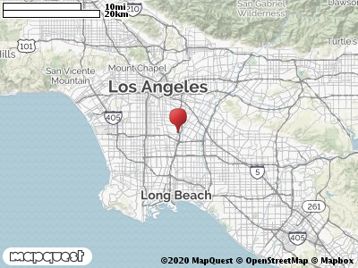 |

#### CyberShake STNI Hazard Curves
*[(top)](#table-of-contents)*

| Time Span | 3s | 5s | 10s |
|-----|-----|-----|-----|
| One Day | 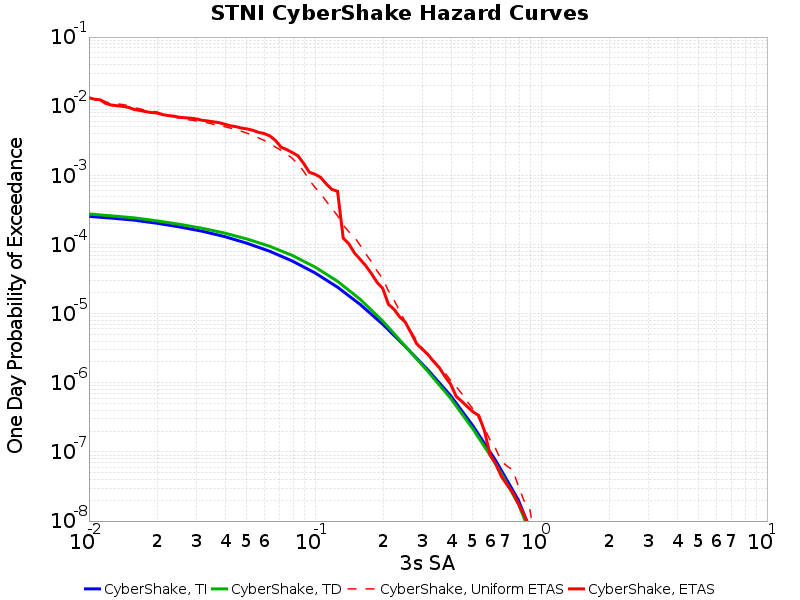 | 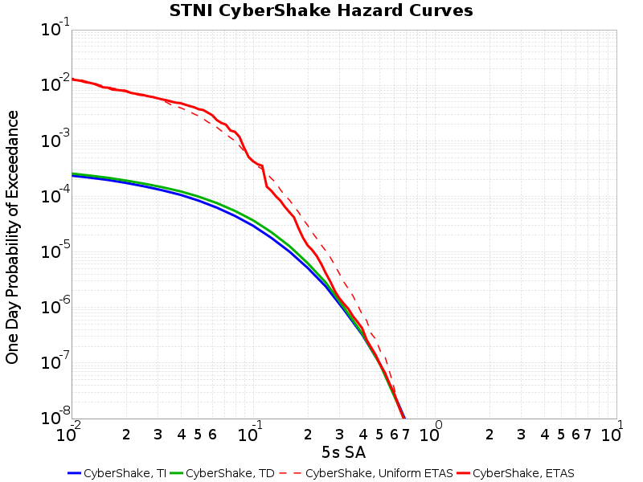 |  |
| One Week |  |  | 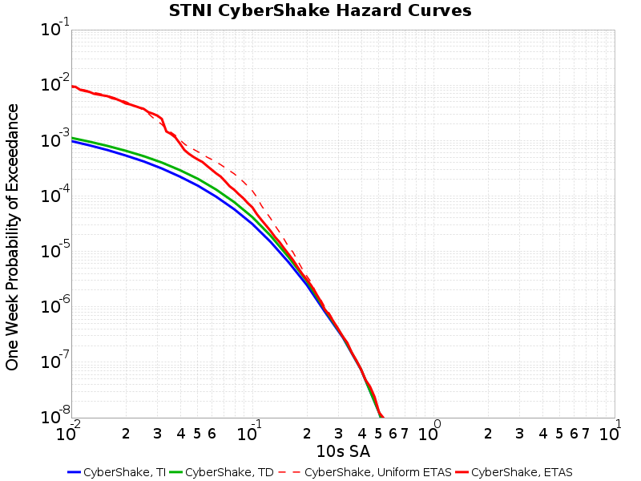 |
| One Year |  |  | 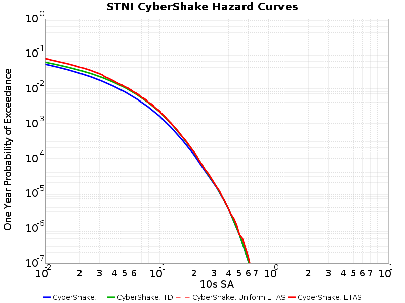 |

#### CyberShake STNI 5s Hazard Gain Table
*[(top)](#table-of-contents)*

| Dividend | Divisor | One Day Min | One Day Max | One Week Min | One Week Max | One Year Min | One Year Max |
|-----|-----|-----|-----|-----|-----|-----|-----|
| CyberShake, TD | CyberShake, TI | 0.891 at 0.794 g | 1.267 at 0.126 g | 0.891 at 0.794 g | 1.267 at 0.126 g | 0.891 at 0.794 g | 1.265 at 0.126 g |
| CyberShake, Uniform ETAS | CyberShake, TD | 0.975 at 0.708 g | 51.987 at 0.010 g | 0.975 at 0.708 g | 12.122 at 0.010 g | 0.975 at 0.708 g | 2.331 at 1.189 g |
| CyberShake, ETAS | CyberShake, TD | 0.975 at 0.708 g | 49.239 at 0.010 g | 0.975 at 0.708 g | 11.444 at 0.010 g | 0.975 at 0.708 g | 2.331 at 1.189 g |
| CyberShake, ETAS | CyberShake, Uniform ETAS | 0.346 at 0.282 g | 1.489 at 0.071 g | 0.691 at 0.133 g | 1.373 at 0.056 g | 0.964 at 0.119 g | 1.062 at 0.056 g |

#### GMPE STNI Hazard Curves
*[(top)](#table-of-contents)*

| Time Span | 3s | 5s | 10s |
|-----|-----|-----|-----|
| One Day |  | 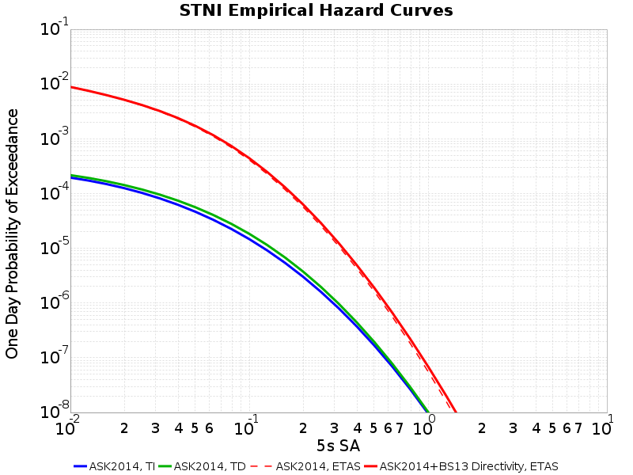 |  |
| One Week |  |  | 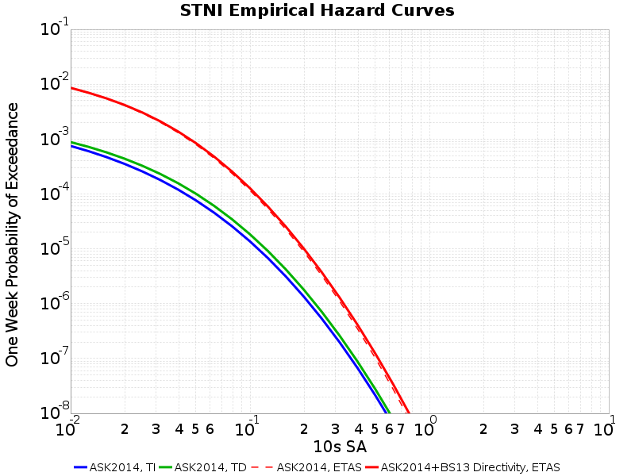 |
| One Year |  | 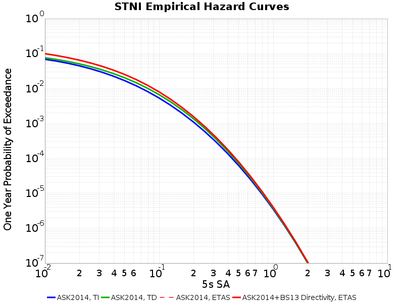 |  |

#### GMPE STNI 5s Hazard Gain Table
*[(top)](#table-of-contents)*

| Dividend | Divisor | One Day Min | One Day Max | One Week Min | One Week Max | One Year Min | One Year Max |
|-----|-----|-----|-----|-----|-----|-----|-----|
| ASK2014, TD | ASK2014, TI | 0.906 at 10.000 g | 1.254 at 0.126 g | 0.913 at 10.000 g | 1.254 at 0.126 g | 0.916 at 10.000 g | 1.253 at 0.126 g |
| ASK2014, ETAS | ASK2014, TD | 2.977 at 6.310 g | 40.880 at 0.010 g | 1.404 at 10.000 g | 9.748 at 0.010 g | 1.020 at 10.000 g | 1.309 at 0.010 g |
| ASK2014+BS13 Directivity, ETAS | ASK2014, TD | 4.779 at 5.012 g | 40.945 at 0.010 g | 1.750 at 10.000 g | 9.760 at 0.010 g | 1.056 at 10.000 g | 1.310 at 0.010 g |
| ASK2014+BS13 Directivity, ETAS | ASK2014, ETAS | 1.002 at 0.010 g | 1.760 at 10.000 g | 1.001 at 0.010 g | 1.297 at 7.943 g | 1.000 at 0.010 g | 1.038 at 7.943 g |

### PDU Hazard Curves
*[(top)](#table-of-contents)*

| Site Location Map |
|-----|
|  |

#### CyberShake PDU Hazard Curves
*[(top)](#table-of-contents)*

| Time Span | 3s | 5s | 10s |
|-----|-----|-----|-----|
| One Day |  | 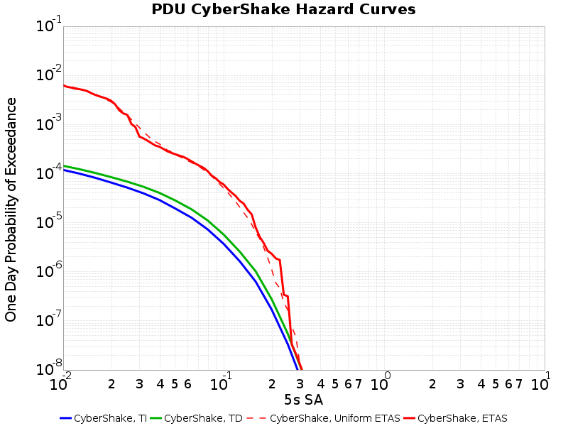 |  |
| One Week | 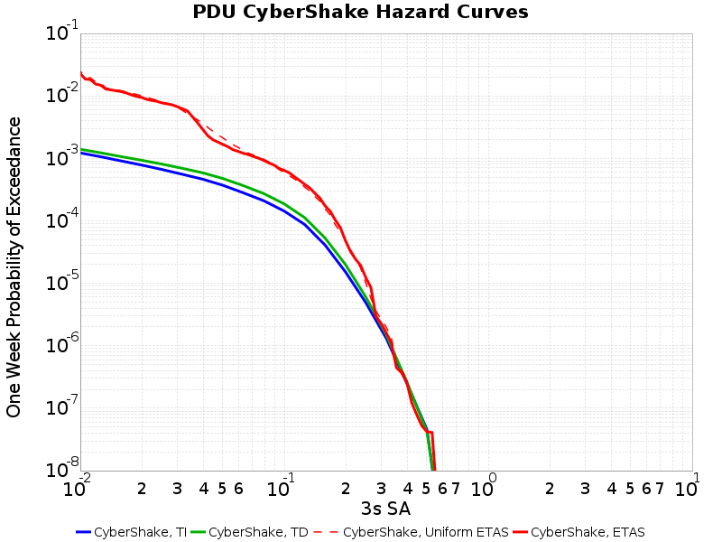 |  | 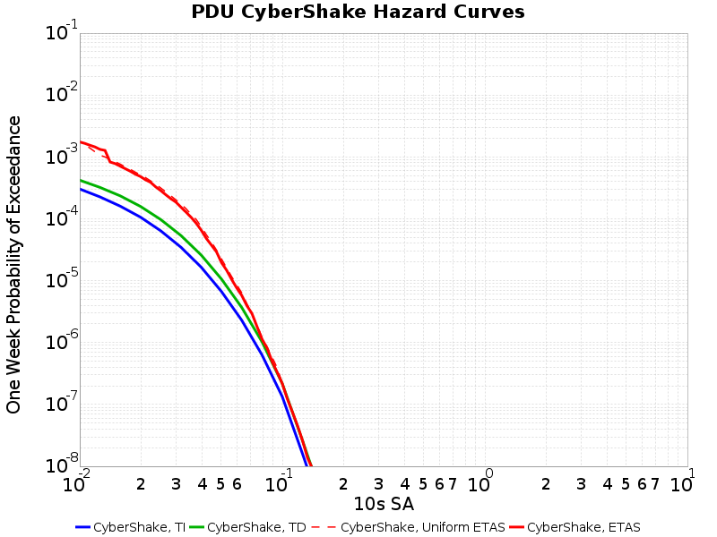 |
| One Year | 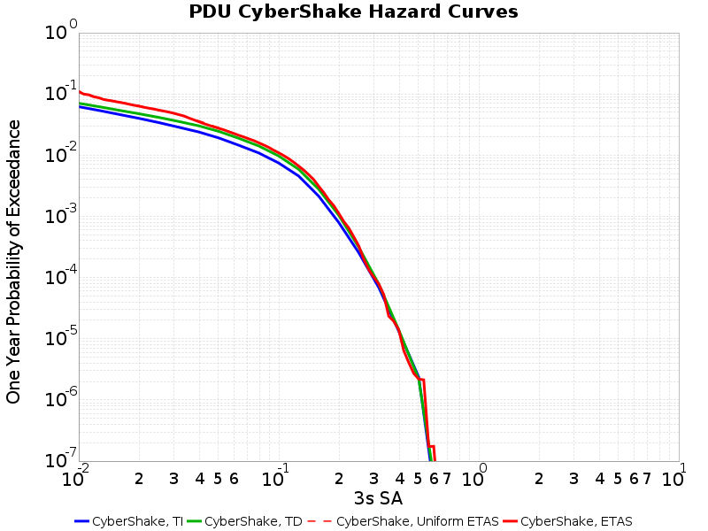 | 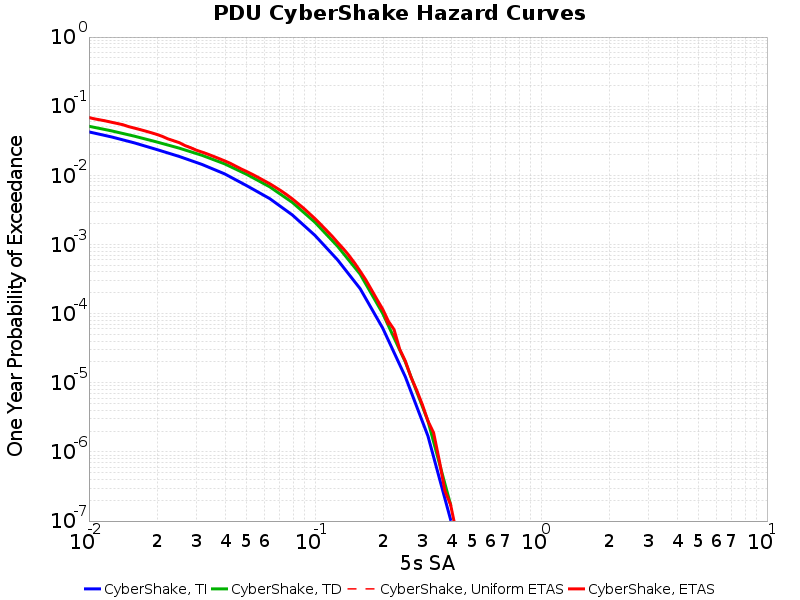 | 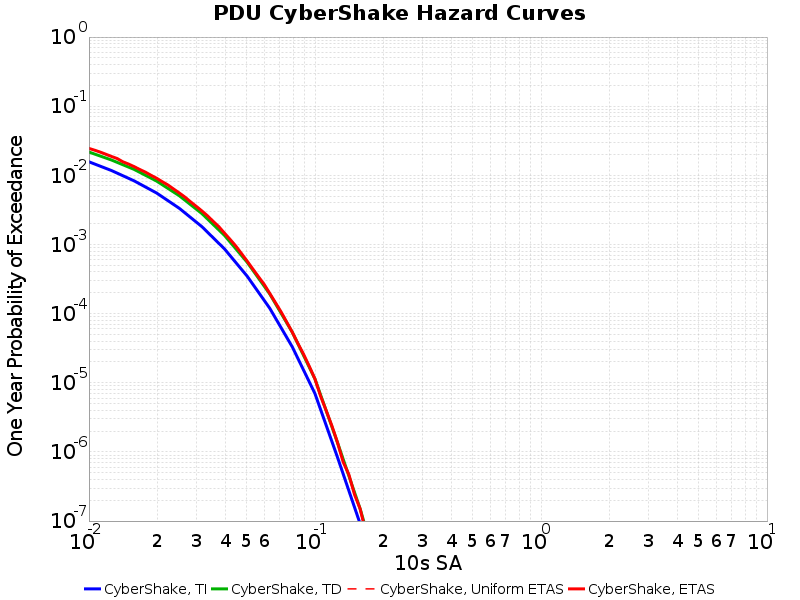 |

#### CyberShake PDU 5s Hazard Gain Table
*[(top)](#table-of-contents)*

| Dividend | Divisor | One Day Min | One Day Max | One Week Min | One Week Max | One Year Min | One Year Max |
|-----|-----|-----|-----|-----|-----|-----|-----|
| CyberShake, TD | CyberShake, TI | 1.211 at 0.010 g | 1.650 at 0.316 g | 1.211 at 0.010 g | 1.650 at 0.316 g | 1.206 at 0.010 g | 1.650 at 0.316 g |
| CyberShake, Uniform ETAS | CyberShake, TD | 0.786 at 0.376 g | 44.632 at 0.010 g | 0.786 at 0.376 g | 10.657 at 0.010 g | 0.786 at 0.376 g | 1.355 at 0.335 g |
| CyberShake, ETAS | CyberShake, TD | 0.786 at 0.376 g | 43.180 at 0.010 g | 0.786 at 0.376 g | 10.320 at 0.010 g | 0.786 at 0.376 g | 1.355 at 0.335 g |
| CyberShake, ETAS | CyberShake, Uniform ETAS | 0.444 at 0.282 g | 3.760 at 0.224 g | 0.766 at 0.030 g | 3.076 at 0.224 g | 0.975 at 0.030 g | 1.220 at 0.224 g |

#### GMPE PDU Hazard Curves
*[(top)](#table-of-contents)*

| Time Span | 3s | 5s | 10s |
|-----|-----|-----|-----|
| One Day |  | 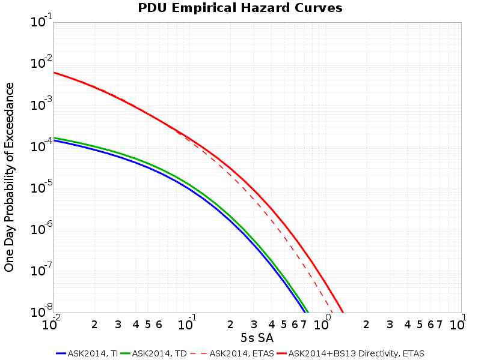 |  |
| One Week |  | 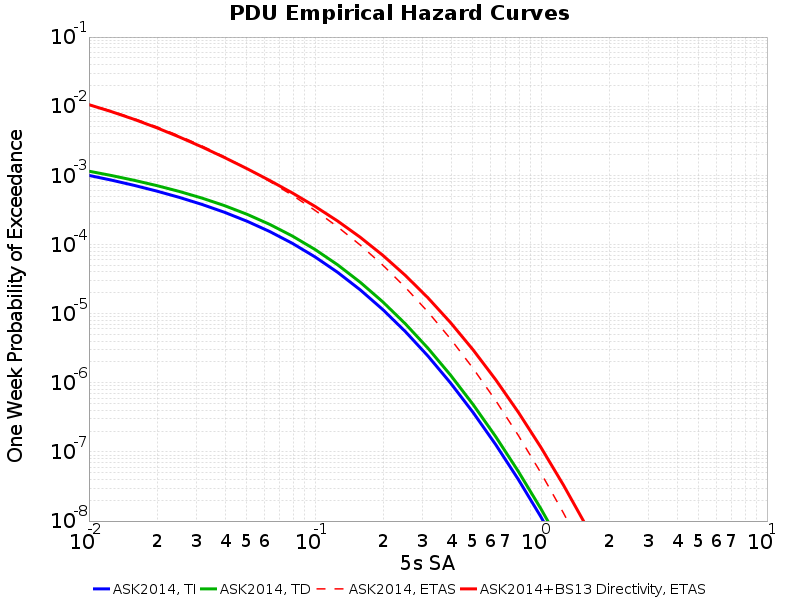 | 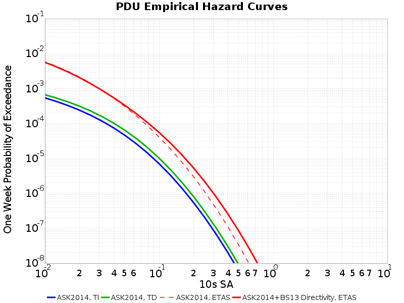 |
| One Year | 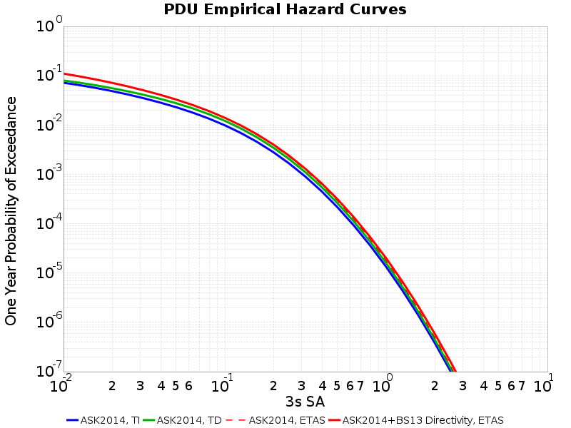 | 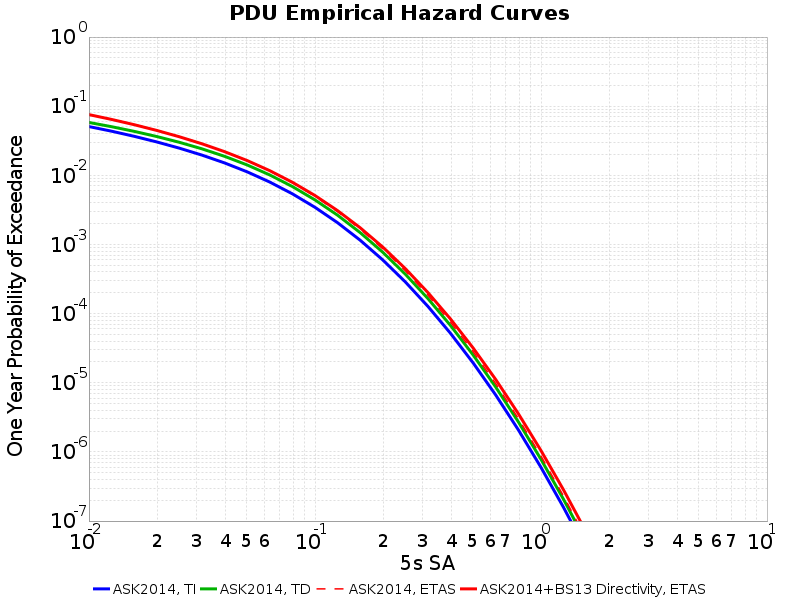 | 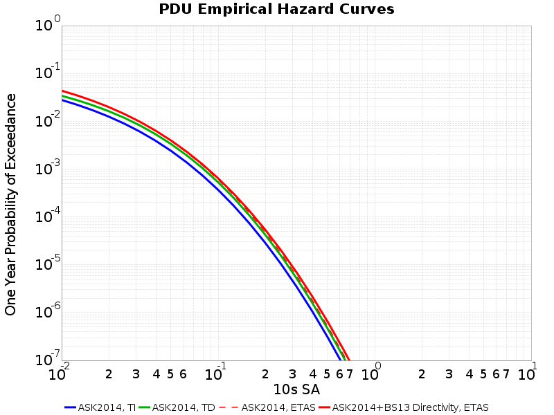 |

#### GMPE PDU 5s Hazard Gain Table
*[(top)](#table-of-contents)*

| Dividend | Divisor | One Day Min | One Day Max | One Week Min | One Week Max | One Year Min | One Year Max |
|-----|-----|-----|-----|-----|-----|-----|-----|
| ASK2014, TD | ASK2014, TI | 1.151 at 0.010 g | 1.550 at 6.310 g | 1.151 at 0.010 g | 1.550 at 7.943 g | 1.146 at 0.010 g | 1.335 at 10.000 g |
| ASK2014, ETAS | ASK2014, TD | 9.088 at 3.162 g | 38.164 at 0.010 g | 3.208 at 3.981 g | 9.285 at 0.010 g | 1.107 at 6.310 g | 1.303 at 0.010 g |
| ASK2014+BS13 Directivity, ETAS | ASK2014, TD | 12.991 at 0.100 g | 62.935 at 6.310 g | 4.200 at 0.079 g | 17.677 at 7.943 g | 1.153 at 0.079 g | 1.600 at 6.310 g |
| ASK2014+BS13 Directivity, ETAS | ASK2014, ETAS | 0.952 at 0.032 g | 5.553 at 7.943 g | 0.963 at 0.025 g | 4.315 at 7.943 g | 0.994 at 0.020 g | 1.445 at 6.310 g |

## Hazard Maps
*[(top)](#table-of-contents)*

### 5s One Day Hazard Maps
*[(top)](#table-of-contents)*

#### One Day 5s Sa (g) with POE=1.0E-4, Maps
*[(top)](#table-of-contents)*

##### One Day 5s Sa (g) with POE=1.0E-4, CyberShake Maps
*[(top)](#table-of-contents)*

|  | CS-TI | CS-TD | CS-ETAS-Uniform | CS-ETAS |
|-----|-----|-----|-----|-----|
| **CS-TI** |  |  |  |  |
| **CS-TD** |  |  |  |  |
| **CS-ETAS (Uniform)** | 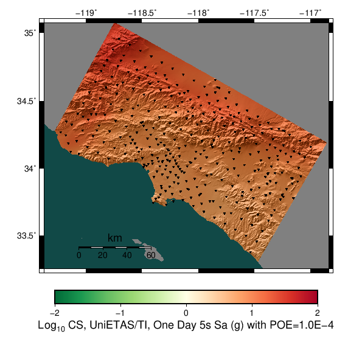 |  |  | 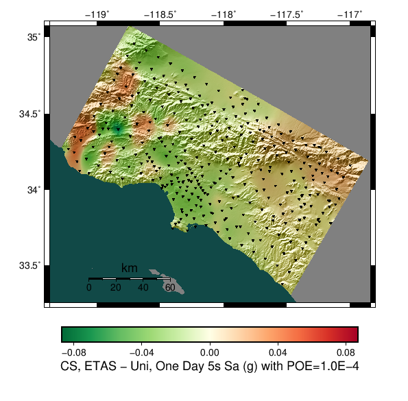 |
| **CS-ETAS** |  | 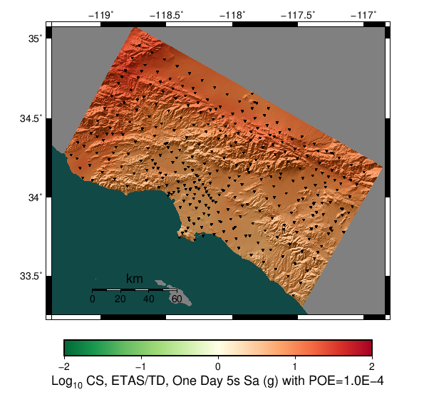 | 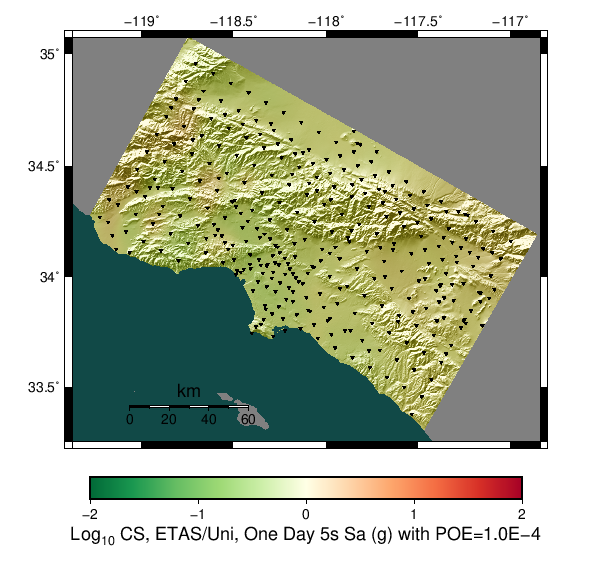 |  |

##### One Day 5s Sa (g) with POE=1.0E-4, GMPE Maps
*[(top)](#table-of-contents)*

|  | ASK2014-TI | ASK2014-TD | ASK2014-ETAS-Uniform | ASK2014-ETAS |
|-----|-----|-----|-----|-----|
| **ASK2014-TI** |  |  |  |  |
| **ASK2014-TD** |  |  |  |  |
| **ASK2014-ETAS (Uniform)** |  |  |  |  |
| **ASK2014-ETAS** |  |  |  |  |

#### One Day 5s Sa (g) with POE=0.001, Maps
*[(top)](#table-of-contents)*

##### One Day 5s Sa (g) with POE=0.001, CyberShake Maps
*[(top)](#table-of-contents)*

|  | CS-TI | CS-TD | CS-ETAS-Uniform | CS-ETAS |
|-----|-----|-----|-----|-----|
| **CS-TI** |  | *(N/A)* | *(N/A)* | *(N/A)* |
| **CS-TD** | *(N/A)* |  | *(N/A)* | *(N/A)* |
| **CS-ETAS (Uniform)** | *(N/A)* | *(N/A)* |  |  |
| **CS-ETAS** | *(N/A)* | *(N/A)* |  |  |

##### One Day 5s Sa (g) with POE=0.001, GMPE Maps
*[(top)](#table-of-contents)*

|  | ASK2014-TI | ASK2014-TD | ASK2014-ETAS-Uniform | ASK2014-ETAS |
|-----|-----|-----|-----|-----|
| **ASK2014-TI** |  | *(N/A)* | *(N/A)* | *(N/A)* |
| **ASK2014-TD** | *(N/A)* |  | *(N/A)* | *(N/A)* |
| **ASK2014-ETAS (Uniform)** | *(N/A)* | *(N/A)* |  |  |
| **ASK2014-ETAS** | *(N/A)* | *(N/A)* |  |  |

#### One Day 5s Sa (g) with POE=0.01, Maps
*[(top)](#table-of-contents)*

##### One Day 5s Sa (g) with POE=0.01, CyberShake Maps
*[(top)](#table-of-contents)*

|  | CS-TI | CS-TD | CS-ETAS-Uniform | CS-ETAS |
|-----|-----|-----|-----|-----|
| **CS-TI** |  | *(N/A)* | *(N/A)* | *(N/A)* |
| **CS-TD** | *(N/A)* |  | *(N/A)* | *(N/A)* |
| **CS-ETAS (Uniform)** | *(N/A)* | *(N/A)* |  |  |
| **CS-ETAS** | *(N/A)* | *(N/A)* |  |  |

##### One Day 5s Sa (g) with POE=0.01, GMPE Maps
*[(top)](#table-of-contents)*

|  | ASK2014-TI | ASK2014-TD | ASK2014-ETAS-Uniform | ASK2014-ETAS |
|-----|-----|-----|-----|-----|
| **ASK2014-TI** |  | *(N/A)* | *(N/A)* | *(N/A)* |
| **ASK2014-TD** | *(N/A)* |  | *(N/A)* | *(N/A)* |
| **ASK2014-ETAS (Uniform)** | *(N/A)* | *(N/A)* |  |  |
| **ASK2014-ETAS** | *(N/A)* | *(N/A)* |  |  |

#### One Day POE 0.01 (g) 5s SA, Maps
*[(top)](#table-of-contents)*

##### One Day POE 0.01 (g) 5s SA, CyberShake Maps
*[(top)](#table-of-contents)*

|  | CS-TI | CS-TD | CS-ETAS-Uniform | CS-ETAS |
|-----|-----|-----|-----|-----|
| **CS-TI** |  |  |  |  |
| **CS-TD** |  |  |  |  |
| **CS-ETAS (Uniform)** |  |  |  |  |
| **CS-ETAS** |  |  |  |  |

##### One Day POE 0.01 (g) 5s SA, GMPE Maps
*[(top)](#table-of-contents)*

|  | ASK2014-TI | ASK2014-TD | ASK2014-ETAS-Uniform | ASK2014-ETAS |
|-----|-----|-----|-----|-----|
| **ASK2014-TI** |  |  |  |  |
| **ASK2014-TD** |  |  |  |  |
| **ASK2014-ETAS (Uniform)** |  |  |  |  |
| **ASK2014-ETAS** |  |  |  |  |

#### One Day POE 0.1 (g) 5s SA, Maps
*[(top)](#table-of-contents)*

##### One Day POE 0.1 (g) 5s SA, CyberShake Maps
*[(top)](#table-of-contents)*

|  | CS-TI | CS-TD | CS-ETAS-Uniform | CS-ETAS |
|-----|-----|-----|-----|-----|
| **CS-TI** |  |  |  |  |
| **CS-TD** |  |  |  |  |
| **CS-ETAS (Uniform)** |  |  |  |  |
| **CS-ETAS** |  |  |  |  |

##### One Day POE 0.1 (g) 5s SA, GMPE Maps
*[(top)](#table-of-contents)*

|  | ASK2014-TI | ASK2014-TD | ASK2014-ETAS-Uniform | ASK2014-ETAS |
|-----|-----|-----|-----|-----|
| **ASK2014-TI** |  |  |  |  |
| **ASK2014-TD** |  |  |  |  |
| **ASK2014-ETAS (Uniform)** |  |  |  |  |
| **ASK2014-ETAS** |  |  |  |  |

#### One Day POE 0.2 (g) 5s SA, Maps
*[(top)](#table-of-contents)*

##### One Day POE 0.2 (g) 5s SA, CyberShake Maps
*[(top)](#table-of-contents)*

|  | CS-TI | CS-TD | CS-ETAS-Uniform | CS-ETAS |
|-----|-----|-----|-----|-----|
| **CS-TI** |  |  |  |  |
| **CS-TD** |  |  |  |  |
| **CS-ETAS (Uniform)** |  |  |  |  |
| **CS-ETAS** |  |  |  |  |

##### One Day POE 0.2 (g) 5s SA, GMPE Maps
*[(top)](#table-of-contents)*

|  | ASK2014-TI | ASK2014-TD | ASK2014-ETAS-Uniform | ASK2014-ETAS |
|-----|-----|-----|-----|-----|
| **ASK2014-TI** |  |  |  |  |
| **ASK2014-TD** |  |  |  |  |
| **ASK2014-ETAS (Uniform)** |  |  |  |  |
| **ASK2014-ETAS** |  |  |  |  |

#### One Day POE 0.5 (g) 5s SA, Maps
*[(top)](#table-of-contents)*

##### One Day POE 0.5 (g) 5s SA, CyberShake Maps
*[(top)](#table-of-contents)*

|  | CS-TI | CS-TD | CS-ETAS-Uniform | CS-ETAS |
|-----|-----|-----|-----|-----|
| **CS-TI** |  |  |  |  |
| **CS-TD** |  |  |  |  |
| **CS-ETAS (Uniform)** |  |  |  |  |
| **CS-ETAS** |  |  |  |  |

##### One Day POE 0.5 (g) 5s SA, GMPE Maps
*[(top)](#table-of-contents)*

|  | ASK2014-TI | ASK2014-TD | ASK2014-ETAS-Uniform | ASK2014-ETAS |
|-----|-----|-----|-----|-----|
| **ASK2014-TI** |  |  |  |  |
| **ASK2014-TD** |  |  |  |  |
| **ASK2014-ETAS (Uniform)** |  |  |  |  |
| **ASK2014-ETAS** |  |  |  |  |

### 5s One Day EATS Gains Table
*[(top)](#table-of-contents)*

| Map Value | CyberShake ETAS/TD Gain | CyberShake ETAS/Uniform Gain | GMPE ETAS/TD Gain | GMPE ETAS/Uniform Gain |
|-----|-----|-----|-----|-----|
| **One Day 5s Sa (g) with POE=1.0E-4** |  |  |  |  |
| **One Day 5s Sa (g) with POE=0.001** | *(N/A)* |  | *(N/A)* |  |
| **One Day 5s Sa (g) with POE=0.01** | *(N/A)* |  | *(N/A)* |  |
| **One Day POE 0.01 (g) 5s SA** |  |  |  |  |
| **One Day POE 0.1 (g) 5s SA** |  |  |  |  |
| **One Day POE 0.2 (g) 5s SA** |  |  |  |  |
| **One Day POE 0.5 (g) 5s SA** |  |  |  |  |

### 5s One Week Hazard Maps
*[(top)](#table-of-contents)*

#### One Week 5s Sa (g) with POE=1.0E-4, Maps
*[(top)](#table-of-contents)*

##### One Week 5s Sa (g) with POE=1.0E-4, CyberShake Maps
*[(top)](#table-of-contents)*

|  | CS-TI | CS-TD | CS-ETAS-Uniform | CS-ETAS |
|-----|-----|-----|-----|-----|
| **CS-TI** |  |  |  |  |
| **CS-TD** |  |  |  |  |
| **CS-ETAS (Uniform)** |  |  |  |  |
| **CS-ETAS** |  |  |  |  |

##### One Week 5s Sa (g) with POE=1.0E-4, GMPE Maps
*[(top)](#table-of-contents)*

|  | ASK2014-TI | ASK2014-TD | ASK2014-ETAS-Uniform | ASK2014-ETAS |
|-----|-----|-----|-----|-----|
| **ASK2014-TI** |  |  |  |  |
| **ASK2014-TD** |  |  |  |  |
| **ASK2014-ETAS (Uniform)** |  |  |  |  |
| **ASK2014-ETAS** |  |  |  |  |

#### One Week 5s Sa (g) with POE=0.001, Maps
*[(top)](#table-of-contents)*

##### One Week 5s Sa (g) with POE=0.001, CyberShake Maps
*[(top)](#table-of-contents)*

|  | CS-TI | CS-TD | CS-ETAS-Uniform | CS-ETAS |
|-----|-----|-----|-----|-----|
| **CS-TI** |  |  |  |  |
| **CS-TD** |  |  |  |  |
| **CS-ETAS (Uniform)** |  |  |  |  |
| **CS-ETAS** |  |  |  |  |

##### One Week 5s Sa (g) with POE=0.001, GMPE Maps
*[(top)](#table-of-contents)*

|  | ASK2014-TI | ASK2014-TD | ASK2014-ETAS-Uniform | ASK2014-ETAS |
|-----|-----|-----|-----|-----|
| **ASK2014-TI** |  |  |  |  |
| **ASK2014-TD** |  |  |  |  |
| **ASK2014-ETAS (Uniform)** |  |  |  |  |
| **ASK2014-ETAS** |  |  |  |  |

#### One Week 5s Sa (g) with POE=0.01, Maps
*[(top)](#table-of-contents)*

##### One Week 5s Sa (g) with POE=0.01, CyberShake Maps
*[(top)](#table-of-contents)*

|  | CS-TI | CS-TD | CS-ETAS-Uniform | CS-ETAS |
|-----|-----|-----|-----|-----|
| **CS-TI** |  | *(N/A)* | *(N/A)* | *(N/A)* |
| **CS-TD** | *(N/A)* |  | *(N/A)* | *(N/A)* |
| **CS-ETAS (Uniform)** | *(N/A)* | *(N/A)* |  |  |
| **CS-ETAS** | *(N/A)* | *(N/A)* |  |  |

##### One Week 5s Sa (g) with POE=0.01, GMPE Maps
*[(top)](#table-of-contents)*

|  | ASK2014-TI | ASK2014-TD | ASK2014-ETAS-Uniform | ASK2014-ETAS |
|-----|-----|-----|-----|-----|
| **ASK2014-TI** |  | *(N/A)* | *(N/A)* | *(N/A)* |
| **ASK2014-TD** | *(N/A)* |  | *(N/A)* | *(N/A)* |
| **ASK2014-ETAS (Uniform)** | *(N/A)* | *(N/A)* |  |  |
| **ASK2014-ETAS** | *(N/A)* | *(N/A)* |  |  |

#### One Week POE 0.01 (g) 5s SA, Maps
*[(top)](#table-of-contents)*

##### One Week POE 0.01 (g) 5s SA, CyberShake Maps
*[(top)](#table-of-contents)*

|  | CS-TI | CS-TD | CS-ETAS-Uniform | CS-ETAS |
|-----|-----|-----|-----|-----|
| **CS-TI** |  |  |  |  |
| **CS-TD** |  |  |  |  |
| **CS-ETAS (Uniform)** |  |  |  |  |
| **CS-ETAS** |  |  |  |  |

##### One Week POE 0.01 (g) 5s SA, GMPE Maps
*[(top)](#table-of-contents)*

|  | ASK2014-TI | ASK2014-TD | ASK2014-ETAS-Uniform | ASK2014-ETAS |
|-----|-----|-----|-----|-----|
| **ASK2014-TI** |  |  |  |  |
| **ASK2014-TD** |  |  |  |  |
| **ASK2014-ETAS (Uniform)** |  |  |  |  |
| **ASK2014-ETAS** |  |  |  |  |

#### One Week POE 0.1 (g) 5s SA, Maps
*[(top)](#table-of-contents)*

##### One Week POE 0.1 (g) 5s SA, CyberShake Maps
*[(top)](#table-of-contents)*

|  | CS-TI | CS-TD | CS-ETAS-Uniform | CS-ETAS |
|-----|-----|-----|-----|-----|
| **CS-TI** |  |  |  |  |
| **CS-TD** |  |  |  |  |
| **CS-ETAS (Uniform)** |  |  |  |  |
| **CS-ETAS** |  |  |  |  |

##### One Week POE 0.1 (g) 5s SA, GMPE Maps
*[(top)](#table-of-contents)*

|  | ASK2014-TI | ASK2014-TD | ASK2014-ETAS-Uniform | ASK2014-ETAS |
|-----|-----|-----|-----|-----|
| **ASK2014-TI** |  |  |  |  |
| **ASK2014-TD** |  |  |  |  |
| **ASK2014-ETAS (Uniform)** |  |  |  |  |
| **ASK2014-ETAS** |  |  |  |  |

#### One Week POE 0.2 (g) 5s SA, Maps
*[(top)](#table-of-contents)*

##### One Week POE 0.2 (g) 5s SA, CyberShake Maps
*[(top)](#table-of-contents)*

|  | CS-TI | CS-TD | CS-ETAS-Uniform | CS-ETAS |
|-----|-----|-----|-----|-----|
| **CS-TI** |  |  |  |  |
| **CS-TD** |  |  |  |  |
| **CS-ETAS (Uniform)** |  |  |  |  |
| **CS-ETAS** |  |  |  |  |

##### One Week POE 0.2 (g) 5s SA, GMPE Maps
*[(top)](#table-of-contents)*

|  | ASK2014-TI | ASK2014-TD | ASK2014-ETAS-Uniform | ASK2014-ETAS |
|-----|-----|-----|-----|-----|
| **ASK2014-TI** |  |  |  |  |
| **ASK2014-TD** |  |  |  |  |
| **ASK2014-ETAS (Uniform)** |  |  |  |  |
| **ASK2014-ETAS** |  |  |  |  |

#### One Week POE 0.5 (g) 5s SA, Maps
*[(top)](#table-of-contents)*

##### One Week POE 0.5 (g) 5s SA, CyberShake Maps
*[(top)](#table-of-contents)*

|  | CS-TI | CS-TD | CS-ETAS-Uniform | CS-ETAS |
|-----|-----|-----|-----|-----|
| **CS-TI** |  |  |  |  |
| **CS-TD** |  |  |  |  |
| **CS-ETAS (Uniform)** |  |  |  |  |
| **CS-ETAS** |  |  |  |  |

##### One Week POE 0.5 (g) 5s SA, GMPE Maps
*[(top)](#table-of-contents)*

|  | ASK2014-TI | ASK2014-TD | ASK2014-ETAS-Uniform | ASK2014-ETAS |
|-----|-----|-----|-----|-----|
| **ASK2014-TI** |  |  |  |  |
| **ASK2014-TD** |  |  |  |  |
| **ASK2014-ETAS (Uniform)** |  |  |  |  |
| **ASK2014-ETAS** |  |  |  |  |

### 5s One Week EATS Gains Table
*[(top)](#table-of-contents)*

| Map Value | CyberShake ETAS/TD Gain | CyberShake ETAS/Uniform Gain | GMPE ETAS/TD Gain | GMPE ETAS/Uniform Gain |
|-----|-----|-----|-----|-----|
| **One Week 5s Sa (g) with POE=1.0E-4** |  |  |  |  |
| **One Week 5s Sa (g) with POE=0.001** |  |  |  |  |
| **One Week 5s Sa (g) with POE=0.01** | *(N/A)* |  | *(N/A)* |  |
| **One Week POE 0.01 (g) 5s SA** |  |  |  |  |
| **One Week POE 0.1 (g) 5s SA** |  |  |  |  |
| **One Week POE 0.2 (g) 5s SA** |  |  |  |  |
| **One Week POE 0.5 (g) 5s SA** |  |  |  |  |

### 5s One Year Hazard Maps
*[(top)](#table-of-contents)*

#### One Year 5s Sa (g) with POE=1.0E-4, Maps
*[(top)](#table-of-contents)*

##### One Year 5s Sa (g) with POE=1.0E-4, CyberShake Maps
*[(top)](#table-of-contents)*

|  | CS-TI | CS-TD | CS-ETAS-Uniform | CS-ETAS |
|-----|-----|-----|-----|-----|
| **CS-TI** |  |  |  |  |
| **CS-TD** |  |  |  |  |
| **CS-ETAS (Uniform)** |  |  |  |  |
| **CS-ETAS** |  |  |  |  |

##### One Year 5s Sa (g) with POE=1.0E-4, GMPE Maps
*[(top)](#table-of-contents)*

|  | ASK2014-TI | ASK2014-TD | ASK2014-ETAS-Uniform | ASK2014-ETAS |
|-----|-----|-----|-----|-----|
| **ASK2014-TI** |  |  |  |  |
| **ASK2014-TD** |  |  |  |  |
| **ASK2014-ETAS (Uniform)** |  |  |  |  |
| **ASK2014-ETAS** |  |  |  |  |

#### One Year 5s Sa (g) with POE=0.001, Maps
*[(top)](#table-of-contents)*

##### One Year 5s Sa (g) with POE=0.001, CyberShake Maps
*[(top)](#table-of-contents)*

|  | CS-TI | CS-TD | CS-ETAS-Uniform | CS-ETAS |
|-----|-----|-----|-----|-----|
| **CS-TI** |  |  |  |  |
| **CS-TD** |  |  |  |  |
| **CS-ETAS (Uniform)** |  |  |  |  |
| **CS-ETAS** |  |  |  |  |

##### One Year 5s Sa (g) with POE=0.001, GMPE Maps
*[(top)](#table-of-contents)*

|  | ASK2014-TI | ASK2014-TD | ASK2014-ETAS-Uniform | ASK2014-ETAS |
|-----|-----|-----|-----|-----|
| **ASK2014-TI** |  |  |  |  |
| **ASK2014-TD** |  |  |  |  |
| **ASK2014-ETAS (Uniform)** |  |  |  |  |
| **ASK2014-ETAS** |  |  |  |  |

#### One Year 5s Sa (g) with POE=0.01, Maps
*[(top)](#table-of-contents)*

##### One Year 5s Sa (g) with POE=0.01, CyberShake Maps
*[(top)](#table-of-contents)*

|  | CS-TI | CS-TD | CS-ETAS-Uniform | CS-ETAS |
|-----|-----|-----|-----|-----|
| **CS-TI** |  |  |  |  |
| **CS-TD** |  |  |  |  |
| **CS-ETAS (Uniform)** |  |  |  |  |
| **CS-ETAS** |  |  |  |  |

##### One Year 5s Sa (g) with POE=0.01, GMPE Maps
*[(top)](#table-of-contents)*

|  | ASK2014-TI | ASK2014-TD | ASK2014-ETAS-Uniform | ASK2014-ETAS |
|-----|-----|-----|-----|-----|
| **ASK2014-TI** |  |  |  |  |
| **ASK2014-TD** |  |  |  |  |
| **ASK2014-ETAS (Uniform)** |  |  |  |  |
| **ASK2014-ETAS** |  |  |  |  |

#### One Year POE 0.01 (g) 5s SA, Maps
*[(top)](#table-of-contents)*

##### One Year POE 0.01 (g) 5s SA, CyberShake Maps
*[(top)](#table-of-contents)*

|  | CS-TI | CS-TD | CS-ETAS-Uniform | CS-ETAS |
|-----|-----|-----|-----|-----|
| **CS-TI** |  |  |  |  |
| **CS-TD** |  |  |  |  |
| **CS-ETAS (Uniform)** |  |  |  |  |
| **CS-ETAS** |  |  |  |  |

##### One Year POE 0.01 (g) 5s SA, GMPE Maps
*[(top)](#table-of-contents)*

|  | ASK2014-TI | ASK2014-TD | ASK2014-ETAS-Uniform | ASK2014-ETAS |
|-----|-----|-----|-----|-----|
| **ASK2014-TI** |  |  |  |  |
| **ASK2014-TD** |  |  |  |  |
| **ASK2014-ETAS (Uniform)** |  |  |  |  |
| **ASK2014-ETAS** |  |  |  |  |

#### One Year POE 0.1 (g) 5s SA, Maps
*[(top)](#table-of-contents)*

##### One Year POE 0.1 (g) 5s SA, CyberShake Maps
*[(top)](#table-of-contents)*

|  | CS-TI | CS-TD | CS-ETAS-Uniform | CS-ETAS |
|-----|-----|-----|-----|-----|
| **CS-TI** |  |  |  |  |
| **CS-TD** |  |  |  |  |
| **CS-ETAS (Uniform)** |  |  |  |  |
| **CS-ETAS** |  |  |  |  |

##### One Year POE 0.1 (g) 5s SA, GMPE Maps
*[(top)](#table-of-contents)*

|  | ASK2014-TI | ASK2014-TD | ASK2014-ETAS-Uniform | ASK2014-ETAS |
|-----|-----|-----|-----|-----|
| **ASK2014-TI** |  |  |  |  |
| **ASK2014-TD** |  |  |  |  |
| **ASK2014-ETAS (Uniform)** |  |  |  |  |
| **ASK2014-ETAS** |  |  |  |  |

#### One Year POE 0.2 (g) 5s SA, Maps
*[(top)](#table-of-contents)*

##### One Year POE 0.2 (g) 5s SA, CyberShake Maps
*[(top)](#table-of-contents)*

|  | CS-TI | CS-TD | CS-ETAS-Uniform | CS-ETAS |
|-----|-----|-----|-----|-----|
| **CS-TI** |  |  |  |  |
| **CS-TD** |  |  |  |  |
| **CS-ETAS (Uniform)** |  |  |  |  |
| **CS-ETAS** |  |  |  |  |

##### One Year POE 0.2 (g) 5s SA, GMPE Maps
*[(top)](#table-of-contents)*

|  | ASK2014-TI | ASK2014-TD | ASK2014-ETAS-Uniform | ASK2014-ETAS |
|-----|-----|-----|-----|-----|
| **ASK2014-TI** |  |  |  |  |
| **ASK2014-TD** |  |  |  |  |
| **ASK2014-ETAS (Uniform)** |  |  |  |  |
| **ASK2014-ETAS** |  |  |  |  |

#### One Year POE 0.5 (g) 5s SA, Maps
*[(top)](#table-of-contents)*

##### One Year POE 0.5 (g) 5s SA, CyberShake Maps
*[(top)](#table-of-contents)*

|  | CS-TI | CS-TD | CS-ETAS-Uniform | CS-ETAS |
|-----|-----|-----|-----|-----|
| **CS-TI** |  |  |  |  |
| **CS-TD** |  |  |  |  |
| **CS-ETAS (Uniform)** |  |  |  |  |
| **CS-ETAS** |  |  |  |  |

##### One Year POE 0.5 (g) 5s SA, GMPE Maps
*[(top)](#table-of-contents)*

|  | ASK2014-TI | ASK2014-TD | ASK2014-ETAS-Uniform | ASK2014-ETAS |
|-----|-----|-----|-----|-----|
| **ASK2014-TI** |  |  |  |  |
| **ASK2014-TD** |  |  |  |  |
| **ASK2014-ETAS (Uniform)** |  |  |  |  |
| **ASK2014-ETAS** |  |  |  |  |

### 5s One Year EATS Gains Table
*[(top)](#table-of-contents)*

| Map Value | CyberShake ETAS/TD Gain | CyberShake ETAS/Uniform Gain | GMPE ETAS/TD Gain | GMPE ETAS/Uniform Gain |
|-----|-----|-----|-----|-----|
| **One Year 5s Sa (g) with POE=1.0E-4** |  |  |  |  |
| **One Year 5s Sa (g) with POE=0.001** |  |  |  |  |
| **One Year 5s Sa (g) with POE=0.01** |  |  |  |  |
| **One Year POE 0.01 (g) 5s SA** |  |  |  |  |
| **One Year POE 0.1 (g) 5s SA** |  |  |  |  |
| **One Year POE 0.2 (g) 5s SA** |  |  |  |  |
| **One Year POE 0.5 (g) 5s SA** |  |  |  |  |

