# CyberShake-ETAS Simulations, Mojave Point M6

[View ETAS Simulation Information and Plots](etas_plots)

CyberShake Study: Study 15.4 with 336 sites

## Table Of Contents
* [Mapping Information](#mapping-information)
* [Hazard Curves](#hazard-curves)
  * [SBSM Hazard Curves](#sbsm-hazard-curves)
    * [CyberShake SBSM Hazard Curves](#cybershake-sbsm-hazard-curves)
    * [CyberShake SBSM 5s Hazard Gain Table](#cybershake-sbsm-5s-hazard-gain-table)
    * [GMPE SBSM Hazard Curves](#gmpe-sbsm-hazard-curves)
    * [GMPE SBSM 5s Hazard Gain Table](#gmpe-sbsm-5s-hazard-gain-table)
  * [MRSD Hazard Curves](#mrsd-hazard-curves)
    * [CyberShake MRSD Hazard Curves](#cybershake-mrsd-hazard-curves)
    * [CyberShake MRSD 5s Hazard Gain Table](#cybershake-mrsd-5s-hazard-gain-table)
    * [GMPE MRSD Hazard Curves](#gmpe-mrsd-hazard-curves)
    * [GMPE MRSD 5s Hazard Gain Table](#gmpe-mrsd-5s-hazard-gain-table)
  * [STNI Hazard Curves](#stni-hazard-curves)
    * [CyberShake STNI Hazard Curves](#cybershake-stni-hazard-curves)
    * [CyberShake STNI 5s Hazard Gain Table](#cybershake-stni-5s-hazard-gain-table)
    * [GMPE STNI Hazard Curves](#gmpe-stni-hazard-curves)
    * [GMPE STNI 5s Hazard Gain Table](#gmpe-stni-5s-hazard-gain-table)
  * [PDU Hazard Curves](#pdu-hazard-curves)
    * [CyberShake PDU Hazard Curves](#cybershake-pdu-hazard-curves)
    * [CyberShake PDU 5s Hazard Gain Table](#cybershake-pdu-5s-hazard-gain-table)
    * [GMPE PDU Hazard Curves](#gmpe-pdu-hazard-curves)
    * [GMPE PDU 5s Hazard Gain Table](#gmpe-pdu-5s-hazard-gain-table)
* [Hazard Maps](#hazard-maps)
  * [5s One Day Hazard Maps](#5s-one-day-hazard-maps)
    * [One Day 5s Sa (g) with POE=1.0E-4, Maps](#one-day-5s-sa-g-with-poe10e-4-maps)
      * [One Day 5s Sa (g) with POE=1.0E-4, CyberShake Maps](#one-day-5s-sa-g-with-poe10e-4-cybershake-maps)
      * [One Day 5s Sa (g) with POE=1.0E-4, GMPE Maps](#one-day-5s-sa-g-with-poe10e-4-gmpe-maps)
    * [One Day 5s Sa (g) with POE=0.001, Maps](#one-day-5s-sa-g-with-poe0001-maps)
      * [One Day 5s Sa (g) with POE=0.001, CyberShake Maps](#one-day-5s-sa-g-with-poe0001-cybershake-maps)
      * [One Day 5s Sa (g) with POE=0.001, GMPE Maps](#one-day-5s-sa-g-with-poe0001-gmpe-maps)
    * [One Day 5s Sa (g) with POE=0.01, Maps](#one-day-5s-sa-g-with-poe001-maps)
      * [One Day 5s Sa (g) with POE=0.01, CyberShake Maps](#one-day-5s-sa-g-with-poe001-cybershake-maps)
      * [One Day 5s Sa (g) with POE=0.01, GMPE Maps](#one-day-5s-sa-g-with-poe001-gmpe-maps)
    * [One Day POE 0.01 (g) 5s SA, Maps](#one-day-poe-001-g-5s-sa-maps)
      * [One Day POE 0.01 (g) 5s SA, CyberShake Maps](#one-day-poe-001-g-5s-sa-cybershake-maps)
      * [One Day POE 0.01 (g) 5s SA, GMPE Maps](#one-day-poe-001-g-5s-sa-gmpe-maps)
    * [One Day POE 0.1 (g) 5s SA, Maps](#one-day-poe-01-g-5s-sa-maps)
      * [One Day POE 0.1 (g) 5s SA, CyberShake Maps](#one-day-poe-01-g-5s-sa-cybershake-maps)
      * [One Day POE 0.1 (g) 5s SA, GMPE Maps](#one-day-poe-01-g-5s-sa-gmpe-maps)
    * [One Day POE 0.2 (g) 5s SA, Maps](#one-day-poe-02-g-5s-sa-maps)
      * [One Day POE 0.2 (g) 5s SA, CyberShake Maps](#one-day-poe-02-g-5s-sa-cybershake-maps)
      * [One Day POE 0.2 (g) 5s SA, GMPE Maps](#one-day-poe-02-g-5s-sa-gmpe-maps)
    * [One Day POE 0.5 (g) 5s SA, Maps](#one-day-poe-05-g-5s-sa-maps)
      * [One Day POE 0.5 (g) 5s SA, CyberShake Maps](#one-day-poe-05-g-5s-sa-cybershake-maps)
      * [One Day POE 0.5 (g) 5s SA, GMPE Maps](#one-day-poe-05-g-5s-sa-gmpe-maps)
  * [5s One Day EATS Gains Table](#5s-one-day-eats-gains-table)
  * [5s One Week Hazard Maps](#5s-one-week-hazard-maps)
    * [One Week 5s Sa (g) with POE=1.0E-4, Maps](#one-week-5s-sa-g-with-poe10e-4-maps)
      * [One Week 5s Sa (g) with POE=1.0E-4, CyberShake Maps](#one-week-5s-sa-g-with-poe10e-4-cybershake-maps)
      * [One Week 5s Sa (g) with POE=1.0E-4, GMPE Maps](#one-week-5s-sa-g-with-poe10e-4-gmpe-maps)
    * [One Week 5s Sa (g) with POE=0.001, Maps](#one-week-5s-sa-g-with-poe0001-maps)
      * [One Week 5s Sa (g) with POE=0.001, CyberShake Maps](#one-week-5s-sa-g-with-poe0001-cybershake-maps)
      * [One Week 5s Sa (g) with POE=0.001, GMPE Maps](#one-week-5s-sa-g-with-poe0001-gmpe-maps)
    * [One Week 5s Sa (g) with POE=0.01, Maps](#one-week-5s-sa-g-with-poe001-maps)
      * [One Week 5s Sa (g) with POE=0.01, CyberShake Maps](#one-week-5s-sa-g-with-poe001-cybershake-maps)
      * [One Week 5s Sa (g) with POE=0.01, GMPE Maps](#one-week-5s-sa-g-with-poe001-gmpe-maps)
    * [One Week POE 0.01 (g) 5s SA, Maps](#one-week-poe-001-g-5s-sa-maps)
      * [One Week POE 0.01 (g) 5s SA, CyberShake Maps](#one-week-poe-001-g-5s-sa-cybershake-maps)
      * [One Week POE 0.01 (g) 5s SA, GMPE Maps](#one-week-poe-001-g-5s-sa-gmpe-maps)
    * [One Week POE 0.1 (g) 5s SA, Maps](#one-week-poe-01-g-5s-sa-maps)
      * [One Week POE 0.1 (g) 5s SA, CyberShake Maps](#one-week-poe-01-g-5s-sa-cybershake-maps)
      * [One Week POE 0.1 (g) 5s SA, GMPE Maps](#one-week-poe-01-g-5s-sa-gmpe-maps)
    * [One Week POE 0.2 (g) 5s SA, Maps](#one-week-poe-02-g-5s-sa-maps)
      * [One Week POE 0.2 (g) 5s SA, CyberShake Maps](#one-week-poe-02-g-5s-sa-cybershake-maps)
      * [One Week POE 0.2 (g) 5s SA, GMPE Maps](#one-week-poe-02-g-5s-sa-gmpe-maps)
    * [One Week POE 0.5 (g) 5s SA, Maps](#one-week-poe-05-g-5s-sa-maps)
      * [One Week POE 0.5 (g) 5s SA, CyberShake Maps](#one-week-poe-05-g-5s-sa-cybershake-maps)
      * [One Week POE 0.5 (g) 5s SA, GMPE Maps](#one-week-poe-05-g-5s-sa-gmpe-maps)
  * [5s One Week EATS Gains Table](#5s-one-week-eats-gains-table)
  * [5s One Year Hazard Maps](#5s-one-year-hazard-maps)
    * [One Year 5s Sa (g) with POE=1.0E-4, Maps](#one-year-5s-sa-g-with-poe10e-4-maps)
      * [One Year 5s Sa (g) with POE=1.0E-4, CyberShake Maps](#one-year-5s-sa-g-with-poe10e-4-cybershake-maps)
      * [One Year 5s Sa (g) with POE=1.0E-4, GMPE Maps](#one-year-5s-sa-g-with-poe10e-4-gmpe-maps)
    * [One Year 5s Sa (g) with POE=0.001, Maps](#one-year-5s-sa-g-with-poe0001-maps)
      * [One Year 5s Sa (g) with POE=0.001, CyberShake Maps](#one-year-5s-sa-g-with-poe0001-cybershake-maps)
      * [One Year 5s Sa (g) with POE=0.001, GMPE Maps](#one-year-5s-sa-g-with-poe0001-gmpe-maps)
    * [One Year 5s Sa (g) with POE=0.01, Maps](#one-year-5s-sa-g-with-poe001-maps)
      * [One Year 5s Sa (g) with POE=0.01, CyberShake Maps](#one-year-5s-sa-g-with-poe001-cybershake-maps)
      * [One Year 5s Sa (g) with POE=0.01, GMPE Maps](#one-year-5s-sa-g-with-poe001-gmpe-maps)
    * [One Year POE 0.01 (g) 5s SA, Maps](#one-year-poe-001-g-5s-sa-maps)
      * [One Year POE 0.01 (g) 5s SA, CyberShake Maps](#one-year-poe-001-g-5s-sa-cybershake-maps)
      * [One Year POE 0.01 (g) 5s SA, GMPE Maps](#one-year-poe-001-g-5s-sa-gmpe-maps)
    * [One Year POE 0.1 (g) 5s SA, Maps](#one-year-poe-01-g-5s-sa-maps)
      * [One Year POE 0.1 (g) 5s SA, CyberShake Maps](#one-year-poe-01-g-5s-sa-cybershake-maps)
      * [One Year POE 0.1 (g) 5s SA, GMPE Maps](#one-year-poe-01-g-5s-sa-gmpe-maps)
    * [One Year POE 0.2 (g) 5s SA, Maps](#one-year-poe-02-g-5s-sa-maps)
      * [One Year POE 0.2 (g) 5s SA, CyberShake Maps](#one-year-poe-02-g-5s-sa-cybershake-maps)
      * [One Year POE 0.2 (g) 5s SA, GMPE Maps](#one-year-poe-02-g-5s-sa-gmpe-maps)
    * [One Year POE 0.5 (g) 5s SA, Maps](#one-year-poe-05-g-5s-sa-maps)
      * [One Year POE 0.5 (g) 5s SA, CyberShake Maps](#one-year-poe-05-g-5s-sa-cybershake-maps)
      * [One Year POE 0.5 (g) 5s SA, GMPE Maps](#one-year-poe-05-g-5s-sa-gmpe-maps)
  * [5s One Year EATS Gains Table](#5s-one-year-eats-gains-table)
## Mapping Information

| Num Catalogs | 500000 |
|-----|-----|
| Mapped Ruptures | 54329 |
| Mean variations per ruptures | 8.840508 |
| Median variations per ruptures | 9.0 |
| Min variations per ruptures | 1.0 |
| Max variations per ruptures | 24.0 |

## Hazard Curves
*[(top)](#table-of-contents)*

### SBSM Hazard Curves
*[(top)](#table-of-contents)*

| Site Location Map |
|-----|
|  |

#### CyberShake SBSM Hazard Curves
*[(top)](#table-of-contents)*

| Time Span | 3s | 5s | 10s |
|-----|-----|-----|-----|
| One Day |  |  |  |
| One Week |  |  |  |
| One Year |  |  |  |

#### CyberShake SBSM 5s Hazard Gain Table
*[(top)](#table-of-contents)*

| Dividend | Divisor | One Day Min | One Day Max | One Week Min | One Week Max | One Year Min | One Year Max |
|-----|-----|-----|-----|-----|-----|-----|-----|
| CyberShake, TD | CyberShake, TI | 1.088 at 1.585 g | 1.445 at 0.158 g | 1.088 at 1.585 g | 1.445 at 0.158 g | 1.088 at 1.585 g | 1.443 at 0.158 g |
| CyberShake, Uniform ETAS | CyberShake, TD | 0.393 at 1.059 g | 350.515 at 0.168 g | 0.393 at 1.059 g | 74.580 at 0.168 g | 0.393 at 1.059 g | 10.285 at 1.496 g |
| CyberShake, ETAS | CyberShake, TD | 0.393 at 1.059 g | 308.977 at 0.126 g | 0.393 at 1.059 g | 65.927 at 0.126 g | 0.393 at 1.059 g | 10.285 at 1.496 g |
| CyberShake, ETAS | CyberShake, Uniform ETAS | 0.012 at 0.631 g | 1.005 at 0.017 g | 0.051 at 0.631 g | 1.005 at 0.017 g | 0.495 at 0.422 g | 1.008 at 0.022 g |

#### GMPE SBSM Hazard Curves
*[(top)](#table-of-contents)*

| Time Span | 3s | 5s | 10s |
|-----|-----|-----|-----|
| One Day |  | 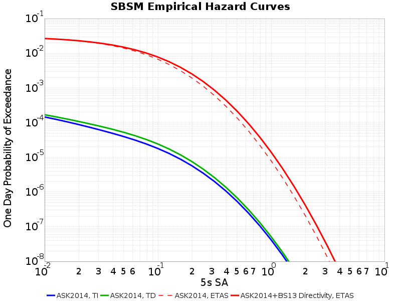 |  |
| One Week |  |  |  |
| One Year |  | 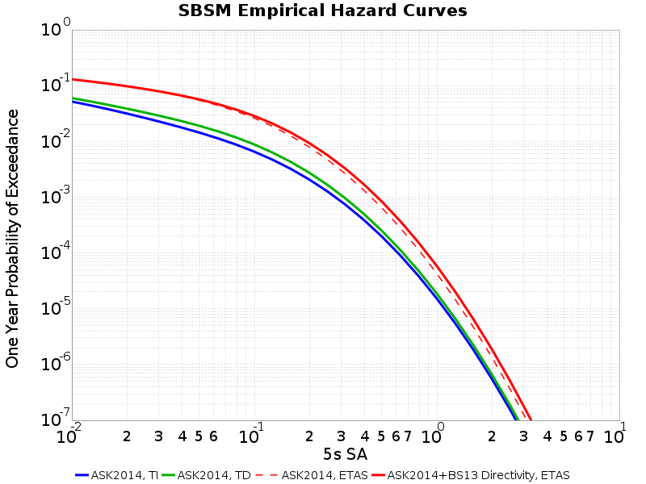 |  |

#### GMPE SBSM 5s Hazard Gain Table
*[(top)](#table-of-contents)*

| Dividend | Divisor | One Day Min | One Day Max | One Week Min | One Week Max | One Year Min | One Year Max |
|-----|-----|-----|-----|-----|-----|-----|-----|
| ASK2014, TD | ASK2014, TI | 1.159 at 0.010 g | 1.348 at 0.100 g | 1.159 at 0.010 g | 1.348 at 0.100 g | 1.154 at 0.010 g | 1.346 at 0.100 g |
| ASK2014, ETAS | ASK2014, TD | 71.880 at 10.000 g | 291.735 at 0.100 g | 19.483 at 10.000 g | 63.537 at 0.100 g | 1.799 at 10.000 g | 3.125 at 0.126 g |
| ASK2014+BS13 Directivity, ETAS | ASK2014, TD | 163.582 at 0.010 g | 356.727 at 0.251 g | 37.206 at 0.010 g | 78.378 at 0.251 g | 2.286 at 0.010 g | 3.665 at 0.316 g |
| ASK2014+BS13 Directivity, ETAS | ASK2014, ETAS | 1.003 at 0.010 g | 2.294 at 10.000 g | 1.003 at 0.010 g | 2.037 at 10.000 g | 1.002 at 0.010 g | 1.414 at 3.981 g |

### MRSD Hazard Curves
*[(top)](#table-of-contents)*

| Site Location Map |
|-----|
|  |

#### CyberShake MRSD Hazard Curves
*[(top)](#table-of-contents)*

| Time Span | 3s | 5s | 10s |
|-----|-----|-----|-----|
| One Day | 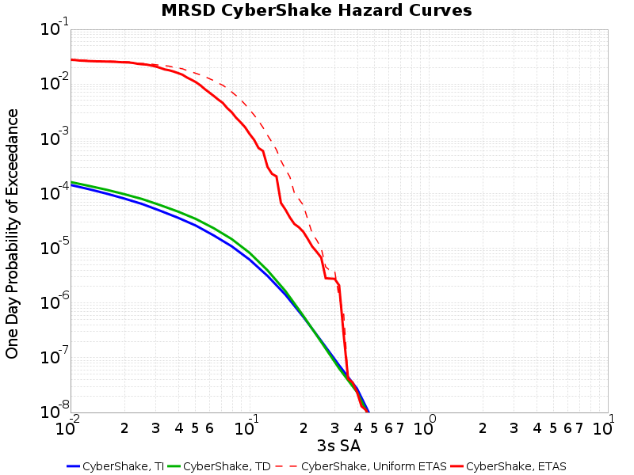 |  | 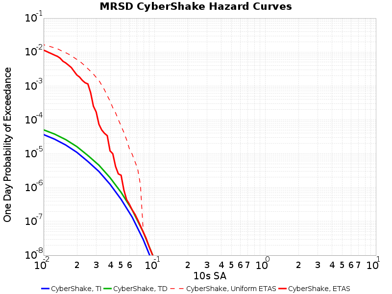 |
| One Week |  |  |  |
| One Year | 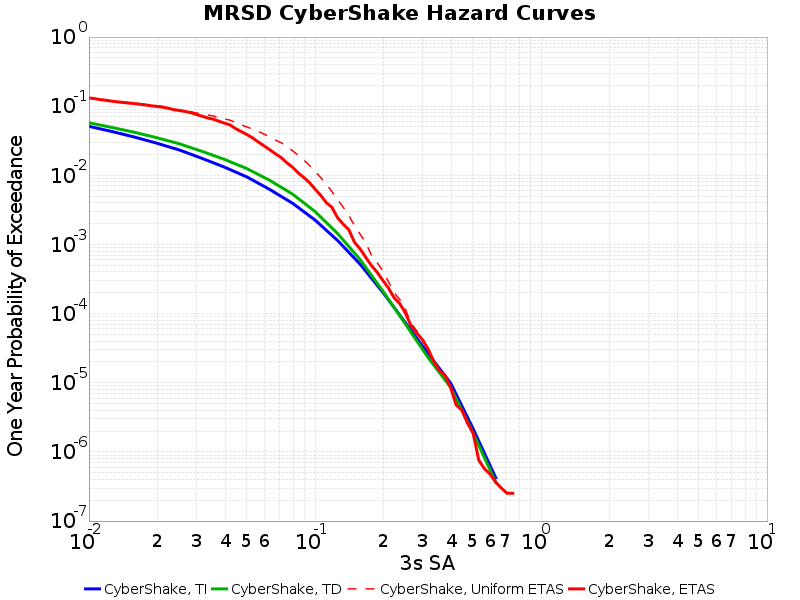 |  | 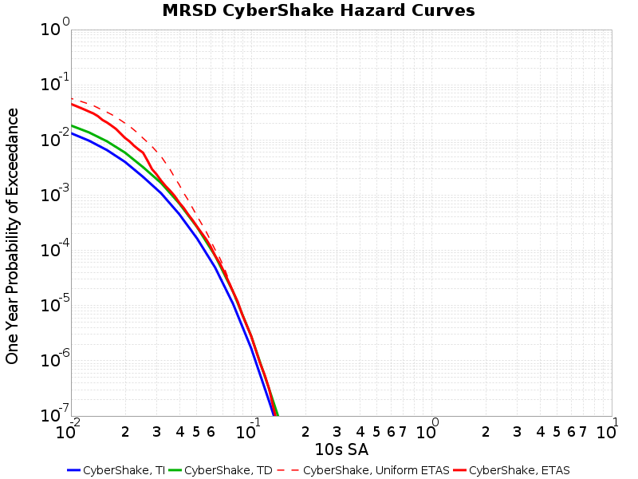 |

#### CyberShake MRSD 5s Hazard Gain Table
*[(top)](#table-of-contents)*

| Dividend | Divisor | One Day Min | One Day Max | One Week Min | One Week Max | One Year Min | One Year Max |
|-----|-----|-----|-----|-----|-----|-----|-----|
| CyberShake, TD | CyberShake, TI | 0.988 at 0.316 g | 1.494 at 0.100 g | 0.988 at 0.316 g | 1.494 at 0.100 g | 0.988 at 0.316 g | 1.494 at 0.100 g |
| CyberShake, Uniform ETAS | CyberShake, TD | 0.740 at 0.299 g | 475.812 at 0.047 g | 0.740 at 0.299 g | 98.562 at 0.047 g | 0.740 at 0.299 g | 4.091 at 0.047 g |
| CyberShake, ETAS | CyberShake, TD | 0.740 at 0.299 g | 315.121 at 0.021 g | 0.740 at 0.299 g | 65.950 at 0.020 g | 0.740 at 0.299 g | 3.095 at 0.020 g |
| CyberShake, ETAS | CyberShake, Uniform ETAS | 0.008 at 0.141 g | 1.000 at 0.251 g | 0.039 at 0.119 g | 1.000 at 0.251 g | 0.395 at 0.079 g | 1.000 at 0.251 g |

#### GMPE MRSD Hazard Curves
*[(top)](#table-of-contents)*

| Time Span | 3s | 5s | 10s |
|-----|-----|-----|-----|
| One Day |  |  | 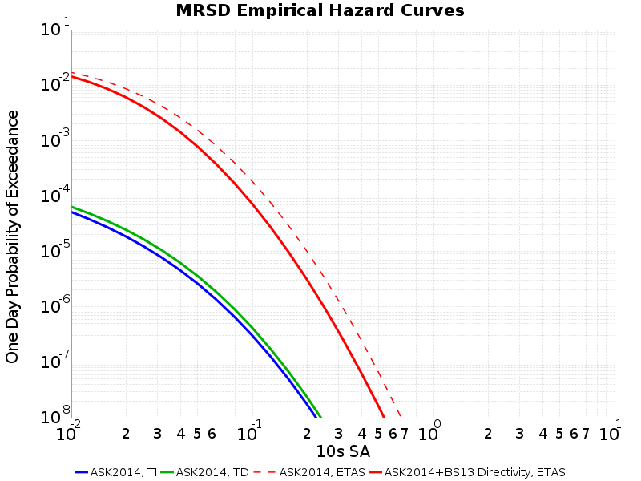 |
| One Week |  |  | 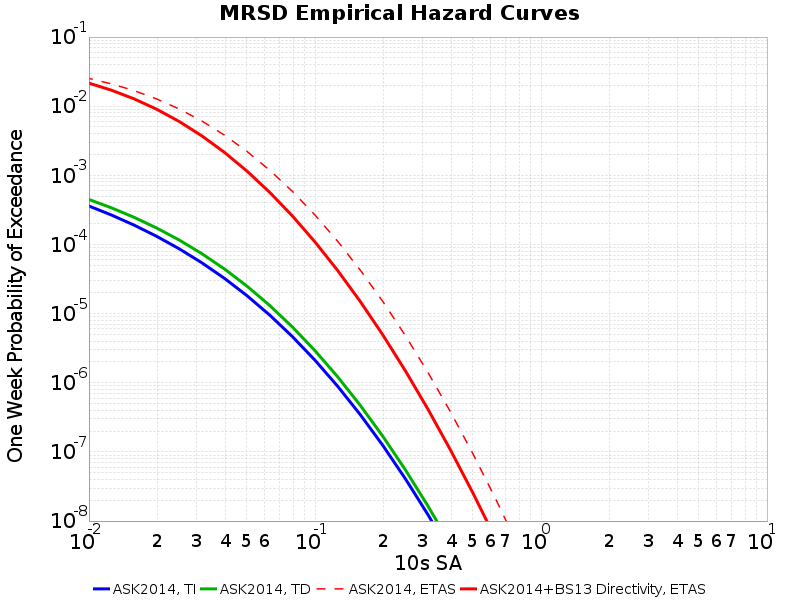 |
| One Year |  |  | 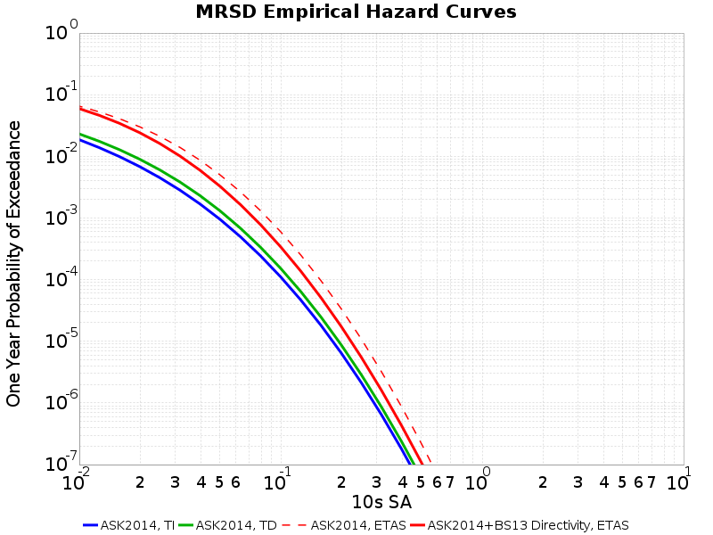 |

#### GMPE MRSD 5s Hazard Gain Table
*[(top)](#table-of-contents)*

| Dividend | Divisor | One Day Min | One Day Max | One Week Min | One Week Max | One Year Min | One Year Max |
|-----|-----|-----|-----|-----|-----|-----|-----|
| ASK2014, TD | ASK2014, TI | 0.833 at 5.012 g | 1.276 at 0.063 g | 0.821 at 6.310 g | 1.276 at 0.063 g | 0.872 at 7.943 g | 1.276 at 0.063 g |
| ASK2014, ETAS | ASK2014, TD | 129.477 at 3.981 g | 410.901 at 0.100 g | 31.568 at 3.981 g | 87.074 at 0.100 g | 2.270 at 6.310 g | 3.861 at 0.100 g |
| ASK2014+BS13 Directivity, ETAS | ASK2014, TD | 112.131 at 2.512 g | 263.786 at 0.040 g | 30.819 at 3.981 g | 61.000 at 7.943 g | 1.000 at 10.000 g | 2.914 at 0.040 g |
| ASK2014+BS13 Directivity, ETAS | ASK2014, ETAS | 0.000 at 10.000 g | 1.173 at 7.943 g | 0.000 at 10.000 g | 1.119 at 7.943 g | 0.424 at 10.000 g | 1.105 at 7.943 g |

### STNI Hazard Curves
*[(top)](#table-of-contents)*

| Site Location Map |
|-----|
|  |

#### CyberShake STNI Hazard Curves
*[(top)](#table-of-contents)*

| Time Span | 3s | 5s | 10s |
|-----|-----|-----|-----|
| One Day |  |  | 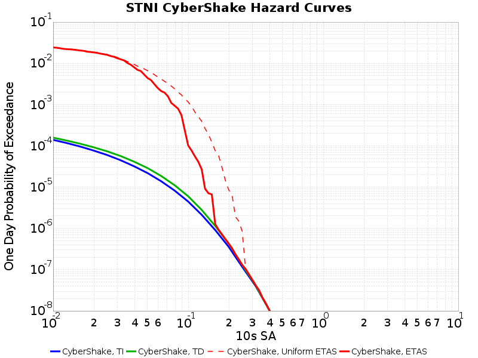 |
| One Week |  |  | 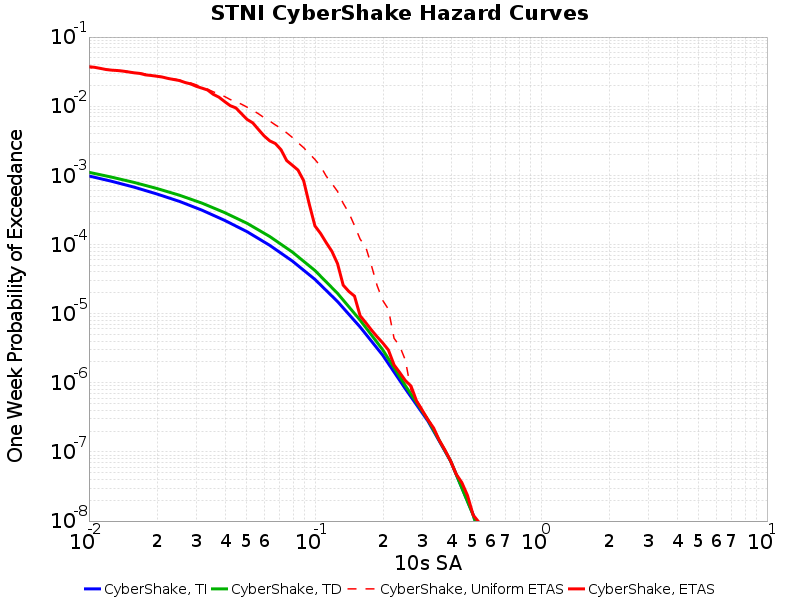 |
| One Year |  |  |  |

#### CyberShake STNI 5s Hazard Gain Table
*[(top)](#table-of-contents)*

| Dividend | Divisor | One Day Min | One Day Max | One Week Min | One Week Max | One Year Min | One Year Max |
|-----|-----|-----|-----|-----|-----|-----|-----|
| CyberShake, TD | CyberShake, TI | 0.887 at 1.000 g | 1.266 at 0.126 g | 0.887 at 1.000 g | 1.266 at 0.126 g | 0.887 at 1.000 g | 1.265 at 0.126 g |
| CyberShake, Uniform ETAS | CyberShake, TD | 0.957 at 0.708 g | 278.336 at 0.112 g | 0.957 at 0.708 g | 58.053 at 0.112 g | 0.957 at 0.708 g | 2.812 at 0.094 g |
| CyberShake, ETAS | CyberShake, TD | 0.957 at 0.708 g | 237.117 at 0.067 g | 0.957 at 0.708 g | 51.479 at 0.067 g | 0.957 at 0.708 g | 2.698 at 0.067 g |
| CyberShake, ETAS | CyberShake, Uniform ETAS | 0.022 at 0.335 g | 1.003 at 0.032 g | 0.057 at 0.282 g | 1.008 at 0.032 g | 0.535 at 0.200 g | 1.007 at 0.032 g |

#### GMPE STNI Hazard Curves
*[(top)](#table-of-contents)*

| Time Span | 3s | 5s | 10s |
|-----|-----|-----|-----|
| One Day |  |  |  |
| One Week |  | 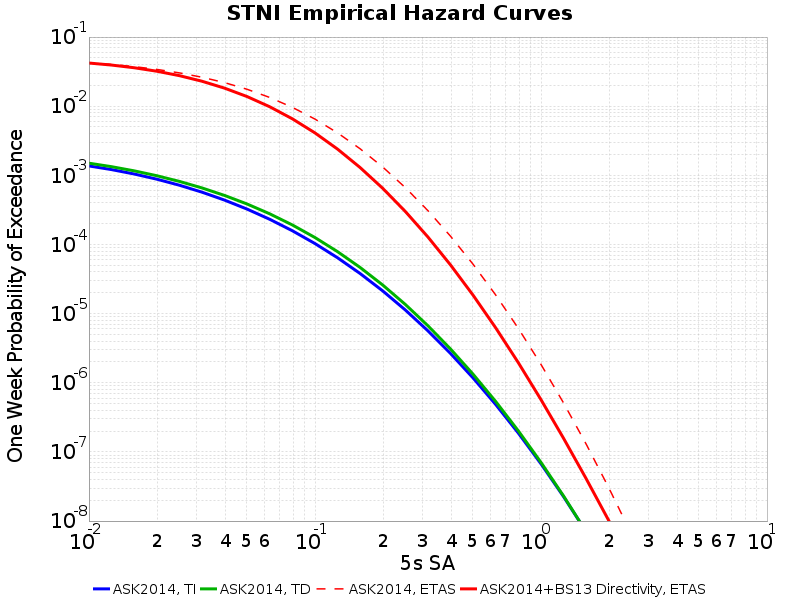 | 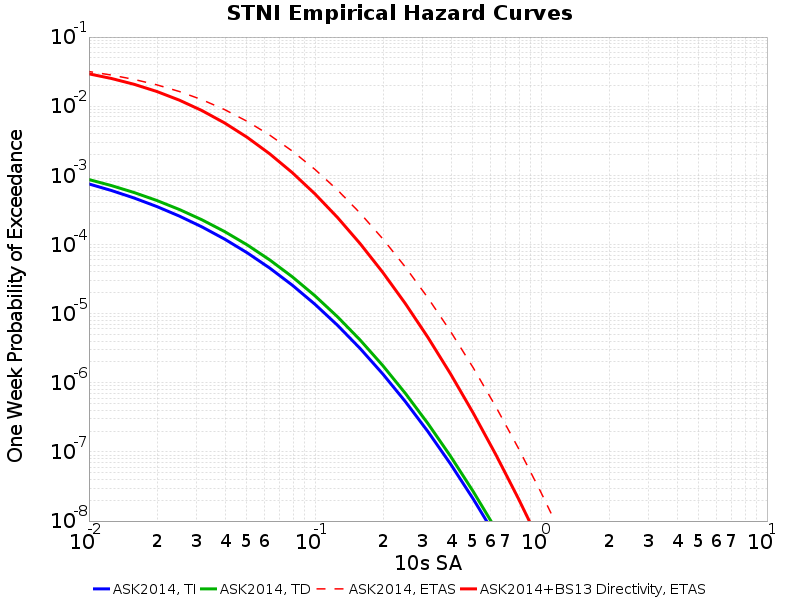 |
| One Year | 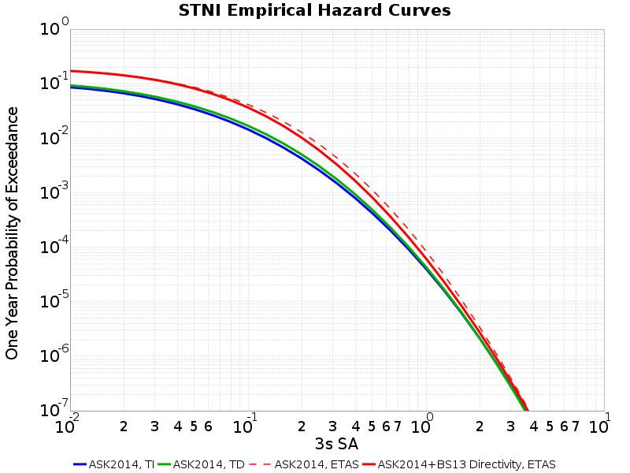 |  |  |

#### GMPE STNI 5s Hazard Gain Table
*[(top)](#table-of-contents)*

| Dividend | Divisor | One Day Min | One Day Max | One Week Min | One Week Max | One Year Min | One Year Max |
|-----|-----|-----|-----|-----|-----|-----|-----|
| ASK2014, TD | ASK2014, TI | 0.897 at 7.943 g | 1.226 at 0.126 g | 0.899 at 10.000 g | 1.226 at 0.126 g | 0.910 at 10.000 g | 1.226 at 0.126 g |
| ASK2014, ETAS | ASK2014, TD | 25.374 at 7.943 g | 259.183 at 0.126 g | 5.373 at 10.000 g | 54.635 at 0.126 g | 1.170 at 10.000 g | 2.739 at 0.126 g |
| ASK2014+BS13 Directivity, ETAS | ASK2014, TD | 12.841 at 7.943 g | 171.981 at 0.050 g | 4.325 at 7.943 g | 37.350 at 0.050 g | 1.256 at 2.512 g | 2.233 at 0.040 g |
| ASK2014+BS13 Directivity, ETAS | ASK2014, ETAS | 0.269 at 1.585 g | 0.987 at 0.010 g | 0.313 at 1.259 g | 0.989 at 0.010 g | 0.649 at 0.398 g | 1.106 at 10.000 g |

### PDU Hazard Curves
*[(top)](#table-of-contents)*

| Site Location Map |
|-----|
|  |

#### CyberShake PDU Hazard Curves
*[(top)](#table-of-contents)*

| Time Span | 3s | 5s | 10s |
|-----|-----|-----|-----|
| One Day |  |  |  |
| One Week |  |  |  |
| One Year |  |  |  |

#### CyberShake PDU 5s Hazard Gain Table
*[(top)](#table-of-contents)*

| Dividend | Divisor | One Day Min | One Day Max | One Week Min | One Week Max | One Year Min | One Year Max |
|-----|-----|-----|-----|-----|-----|-----|-----|
| CyberShake, TD | CyberShake, TI | 1.193 at 0.010 g | 1.663 at 0.316 g | 1.193 at 0.010 g | 1.663 at 0.316 g | 1.188 at 0.010 g | 1.663 at 0.316 g |
| CyberShake, Uniform ETAS | CyberShake, TD | 0.788 at 0.376 g | 444.671 at 0.075 g | 0.788 at 0.376 g | 92.156 at 0.075 g | 0.788 at 0.376 g | 3.863 at 0.075 g |
| CyberShake, ETAS | CyberShake, TD | 0.788 at 0.376 g | 286.093 at 0.027 g | 0.788 at 0.376 g | 62.966 at 0.024 g | 0.788 at 0.376 g | 3.164 at 0.024 g |
| CyberShake, ETAS | CyberShake, Uniform ETAS | 0.007 at 0.168 g | 1.000 at 0.335 g | 0.026 at 0.168 g | 1.000 at 0.335 g | 0.360 at 0.106 g | 1.000 at 0.335 g |

#### GMPE PDU Hazard Curves
*[(top)](#table-of-contents)*

| Time Span | 3s | 5s | 10s |
|-----|-----|-----|-----|
| One Day |  |  |  |
| One Week |  |  |  |
| One Year | 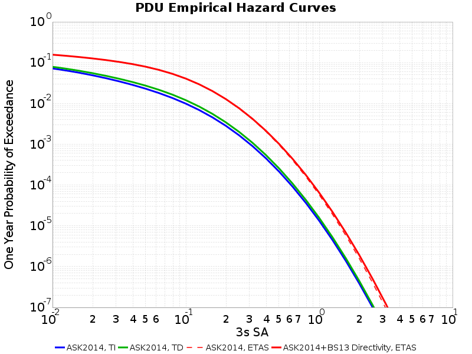 |  |  |

#### GMPE PDU 5s Hazard Gain Table
*[(top)](#table-of-contents)*

| Dividend | Divisor | One Day Min | One Day Max | One Week Min | One Week Max | One Year Min | One Year Max |
|-----|-----|-----|-----|-----|-----|-----|-----|
| ASK2014, TD | ASK2014, TI | 1.135 at 0.010 g | 1.550 at 6.310 g | 1.135 at 0.010 g | 1.550 at 7.943 g | 1.131 at 0.010 g | 1.317 at 10.000 g |
| ASK2014, ETAS | ASK2014, TD | 174.307 at 0.010 g | 516.839 at 6.310 g | 39.755 at 0.010 g | 110.258 at 7.943 g | 2.390 at 0.010 g | 4.066 at 0.251 g |
| ASK2014+BS13 Directivity, ETAS | ASK2014, TD | 173.728 at 0.010 g | 487.226 at 6.310 g | 39.620 at 0.010 g | 89.022 at 6.310 g | 1.058 at 10.000 g | 4.136 at 0.501 g |
| ASK2014+BS13 Directivity, ETAS | ASK2014, ETAS | 0.014 at 10.000 g | 0.997 at 0.010 g | 0.016 at 10.000 g | 1.030 at 5.012 g | 0.284 at 10.000 g | 1.152 at 6.310 g |

## Hazard Maps
*[(top)](#table-of-contents)*

### 5s One Day Hazard Maps
*[(top)](#table-of-contents)*

#### One Day 5s Sa (g) with POE=1.0E-4, Maps
*[(top)](#table-of-contents)*

##### One Day 5s Sa (g) with POE=1.0E-4, CyberShake Maps
*[(top)](#table-of-contents)*

|  | CS-TI | CS-TD | CS-ETAS-Uniform | CS-ETAS |
|-----|-----|-----|-----|-----|
| **CS-TI** |  |  |  |  |
| **CS-TD** |  |  |  |  |
| **CS-ETAS (Uniform)** |  |  |  |  |
| **CS-ETAS** |  |  |  |  |

##### One Day 5s Sa (g) with POE=1.0E-4, GMPE Maps
*[(top)](#table-of-contents)*

|  | ASK2014-TI | ASK2014-TD | ASK2014-ETAS-Uniform | ASK2014-ETAS |
|-----|-----|-----|-----|-----|
| **ASK2014-TI** |  |  |  |  |
| **ASK2014-TD** |  |  |  |  |
| **ASK2014-ETAS (Uniform)** |  | 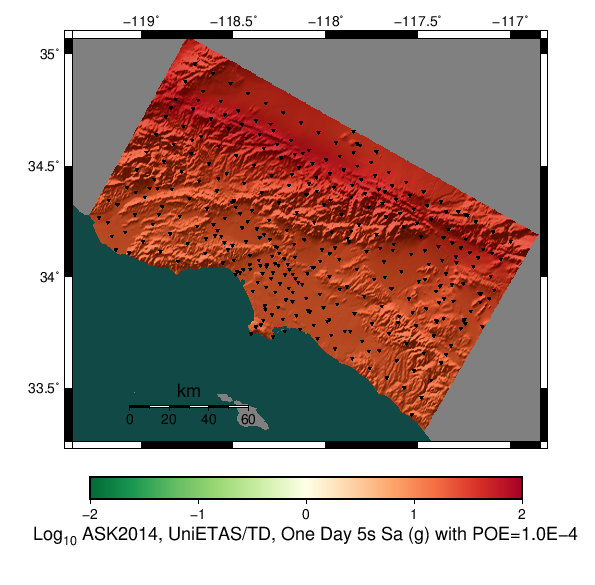 |  |  |
| **ASK2014-ETAS** |  |  |  |  |

#### One Day 5s Sa (g) with POE=0.001, Maps
*[(top)](#table-of-contents)*

##### One Day 5s Sa (g) with POE=0.001, CyberShake Maps
*[(top)](#table-of-contents)*

|  | CS-TI | CS-TD | CS-ETAS-Uniform | CS-ETAS |
|-----|-----|-----|-----|-----|
| **CS-TI** |  | *(N/A)* | *(N/A)* | *(N/A)* |
| **CS-TD** | *(N/A)* |  | *(N/A)* | *(N/A)* |
| **CS-ETAS (Uniform)** | *(N/A)* | *(N/A)* |  |  |
| **CS-ETAS** | *(N/A)* | *(N/A)* |  |  |

##### One Day 5s Sa (g) with POE=0.001, GMPE Maps
*[(top)](#table-of-contents)*

|  | ASK2014-TI | ASK2014-TD | ASK2014-ETAS-Uniform | ASK2014-ETAS |
|-----|-----|-----|-----|-----|
| **ASK2014-TI** |  | *(N/A)* | *(N/A)* | *(N/A)* |
| **ASK2014-TD** | *(N/A)* |  | *(N/A)* | *(N/A)* |
| **ASK2014-ETAS (Uniform)** | *(N/A)* | *(N/A)* |  |  |
| **ASK2014-ETAS** | *(N/A)* | *(N/A)* |  |  |

#### One Day 5s Sa (g) with POE=0.01, Maps
*[(top)](#table-of-contents)*

##### One Day 5s Sa (g) with POE=0.01, CyberShake Maps
*[(top)](#table-of-contents)*

|  | CS-TI | CS-TD | CS-ETAS-Uniform | CS-ETAS |
|-----|-----|-----|-----|-----|
| **CS-TI** |  | *(N/A)* | *(N/A)* | *(N/A)* |
| **CS-TD** | *(N/A)* |  | *(N/A)* | *(N/A)* |
| **CS-ETAS (Uniform)** | *(N/A)* | *(N/A)* |  |  |
| **CS-ETAS** | *(N/A)* | *(N/A)* |  |  |

##### One Day 5s Sa (g) with POE=0.01, GMPE Maps
*[(top)](#table-of-contents)*

|  | ASK2014-TI | ASK2014-TD | ASK2014-ETAS-Uniform | ASK2014-ETAS |
|-----|-----|-----|-----|-----|
| **ASK2014-TI** |  | *(N/A)* | *(N/A)* | *(N/A)* |
| **ASK2014-TD** | *(N/A)* |  | *(N/A)* | *(N/A)* |
| **ASK2014-ETAS (Uniform)** | *(N/A)* | *(N/A)* |  |  |
| **ASK2014-ETAS** | *(N/A)* | *(N/A)* |  |  |

#### One Day POE 0.01 (g) 5s SA, Maps
*[(top)](#table-of-contents)*

##### One Day POE 0.01 (g) 5s SA, CyberShake Maps
*[(top)](#table-of-contents)*

|  | CS-TI | CS-TD | CS-ETAS-Uniform | CS-ETAS |
|-----|-----|-----|-----|-----|
| **CS-TI** |  |  |  |  |
| **CS-TD** |  |  |  |  |
| **CS-ETAS (Uniform)** |  |  |  |  |
| **CS-ETAS** |  |  |  |  |

##### One Day POE 0.01 (g) 5s SA, GMPE Maps
*[(top)](#table-of-contents)*

|  | ASK2014-TI | ASK2014-TD | ASK2014-ETAS-Uniform | ASK2014-ETAS |
|-----|-----|-----|-----|-----|
| **ASK2014-TI** |  |  |  |  |
| **ASK2014-TD** |  |  |  |  |
| **ASK2014-ETAS (Uniform)** |  |  |  |  |
| **ASK2014-ETAS** |  |  |  |  |

#### One Day POE 0.1 (g) 5s SA, Maps
*[(top)](#table-of-contents)*

##### One Day POE 0.1 (g) 5s SA, CyberShake Maps
*[(top)](#table-of-contents)*

|  | CS-TI | CS-TD | CS-ETAS-Uniform | CS-ETAS |
|-----|-----|-----|-----|-----|
| **CS-TI** |  |  |  |  |
| **CS-TD** |  |  |  |  |
| **CS-ETAS (Uniform)** |  |  |  |  |
| **CS-ETAS** |  |  |  |  |

##### One Day POE 0.1 (g) 5s SA, GMPE Maps
*[(top)](#table-of-contents)*

|  | ASK2014-TI | ASK2014-TD | ASK2014-ETAS-Uniform | ASK2014-ETAS |
|-----|-----|-----|-----|-----|
| **ASK2014-TI** |  |  |  |  |
| **ASK2014-TD** |  |  |  |  |
| **ASK2014-ETAS (Uniform)** |  |  |  |  |
| **ASK2014-ETAS** |  |  |  |  |

#### One Day POE 0.2 (g) 5s SA, Maps
*[(top)](#table-of-contents)*

##### One Day POE 0.2 (g) 5s SA, CyberShake Maps
*[(top)](#table-of-contents)*

|  | CS-TI | CS-TD | CS-ETAS-Uniform | CS-ETAS |
|-----|-----|-----|-----|-----|
| **CS-TI** |  |  |  |  |
| **CS-TD** |  |  |  |  |
| **CS-ETAS (Uniform)** |  |  |  |  |
| **CS-ETAS** |  |  |  |  |

##### One Day POE 0.2 (g) 5s SA, GMPE Maps
*[(top)](#table-of-contents)*

|  | ASK2014-TI | ASK2014-TD | ASK2014-ETAS-Uniform | ASK2014-ETAS |
|-----|-----|-----|-----|-----|
| **ASK2014-TI** |  |  |  |  |
| **ASK2014-TD** |  |  |  |  |
| **ASK2014-ETAS (Uniform)** |  |  |  |  |
| **ASK2014-ETAS** |  |  |  |  |

#### One Day POE 0.5 (g) 5s SA, Maps
*[(top)](#table-of-contents)*

##### One Day POE 0.5 (g) 5s SA, CyberShake Maps
*[(top)](#table-of-contents)*

|  | CS-TI | CS-TD | CS-ETAS-Uniform | CS-ETAS |
|-----|-----|-----|-----|-----|
| **CS-TI** |  |  |  |  |
| **CS-TD** |  |  |  |  |
| **CS-ETAS (Uniform)** |  | 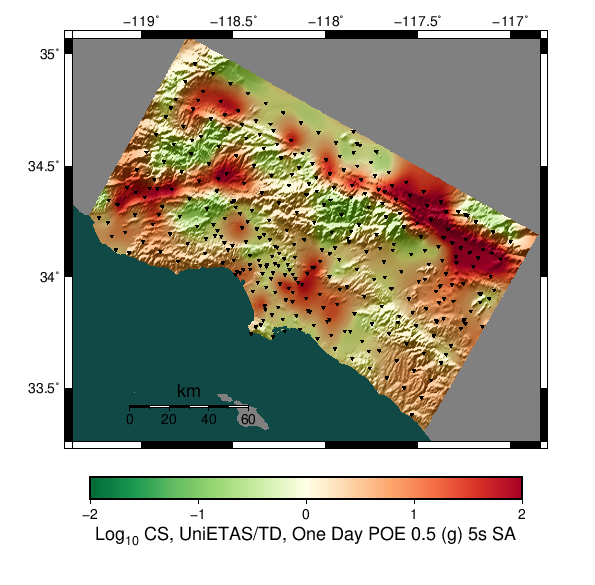 |  |  |
| **CS-ETAS** |  |  |  |  |

##### One Day POE 0.5 (g) 5s SA, GMPE Maps
*[(top)](#table-of-contents)*

|  | ASK2014-TI | ASK2014-TD | ASK2014-ETAS-Uniform | ASK2014-ETAS |
|-----|-----|-----|-----|-----|
| **ASK2014-TI** |  |  |  |  |
| **ASK2014-TD** |  |  |  |  |
| **ASK2014-ETAS (Uniform)** |  |  |  |  |
| **ASK2014-ETAS** | 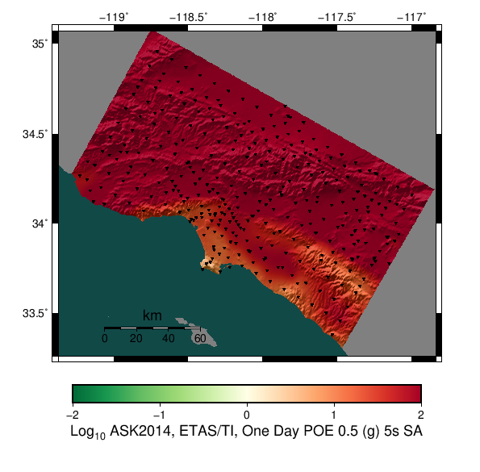 |  |  |  |

### 5s One Day EATS Gains Table
*[(top)](#table-of-contents)*

| Map Value | CyberShake ETAS/TD Gain | CyberShake ETAS/Uniform Gain | GMPE ETAS/TD Gain | GMPE ETAS/Uniform Gain |
|-----|-----|-----|-----|-----|
| **One Day 5s Sa (g) with POE=1.0E-4** |  |  |  |  |
| **One Day 5s Sa (g) with POE=0.001** | *(N/A)* |  | *(N/A)* |  |
| **One Day 5s Sa (g) with POE=0.01** | *(N/A)* |  | *(N/A)* |  |
| **One Day POE 0.01 (g) 5s SA** |  |  |  |  |
| **One Day POE 0.1 (g) 5s SA** |  |  |  |  |
| **One Day POE 0.2 (g) 5s SA** |  |  |  |  |
| **One Day POE 0.5 (g) 5s SA** |  |  |  |  |

### 5s One Week Hazard Maps
*[(top)](#table-of-contents)*

#### One Week 5s Sa (g) with POE=1.0E-4, Maps
*[(top)](#table-of-contents)*

##### One Week 5s Sa (g) with POE=1.0E-4, CyberShake Maps
*[(top)](#table-of-contents)*

|  | CS-TI | CS-TD | CS-ETAS-Uniform | CS-ETAS |
|-----|-----|-----|-----|-----|
| **CS-TI** |  |  |  |  |
| **CS-TD** |  |  |  |  |
| **CS-ETAS (Uniform)** |  |  |  |  |
| **CS-ETAS** |  |  |  |  |

##### One Week 5s Sa (g) with POE=1.0E-4, GMPE Maps
*[(top)](#table-of-contents)*

|  | ASK2014-TI | ASK2014-TD | ASK2014-ETAS-Uniform | ASK2014-ETAS |
|-----|-----|-----|-----|-----|
| **ASK2014-TI** |  |  |  |  |
| **ASK2014-TD** |  |  |  |  |
| **ASK2014-ETAS (Uniform)** |  |  |  |  |
| **ASK2014-ETAS** |  |  |  |  |

#### One Week 5s Sa (g) with POE=0.001, Maps
*[(top)](#table-of-contents)*

##### One Week 5s Sa (g) with POE=0.001, CyberShake Maps
*[(top)](#table-of-contents)*

|  | CS-TI | CS-TD | CS-ETAS-Uniform | CS-ETAS |
|-----|-----|-----|-----|-----|
| **CS-TI** |  |  |  |  |
| **CS-TD** |  |  |  |  |
| **CS-ETAS (Uniform)** |  |  |  |  |
| **CS-ETAS** |  |  |  |  |

##### One Week 5s Sa (g) with POE=0.001, GMPE Maps
*[(top)](#table-of-contents)*

|  | ASK2014-TI | ASK2014-TD | ASK2014-ETAS-Uniform | ASK2014-ETAS |
|-----|-----|-----|-----|-----|
| **ASK2014-TI** |  |  |  |  |
| **ASK2014-TD** |  |  |  |  |
| **ASK2014-ETAS (Uniform)** |  |  |  |  |
| **ASK2014-ETAS** |  |  |  |  |

#### One Week 5s Sa (g) with POE=0.01, Maps
*[(top)](#table-of-contents)*

##### One Week 5s Sa (g) with POE=0.01, CyberShake Maps
*[(top)](#table-of-contents)*

|  | CS-TI | CS-TD | CS-ETAS-Uniform | CS-ETAS |
|-----|-----|-----|-----|-----|
| **CS-TI** |  | *(N/A)* | *(N/A)* | *(N/A)* |
| **CS-TD** | *(N/A)* |  | *(N/A)* | *(N/A)* |
| **CS-ETAS (Uniform)** | *(N/A)* | *(N/A)* |  |  |
| **CS-ETAS** | *(N/A)* | *(N/A)* |  |  |

##### One Week 5s Sa (g) with POE=0.01, GMPE Maps
*[(top)](#table-of-contents)*

|  | ASK2014-TI | ASK2014-TD | ASK2014-ETAS-Uniform | ASK2014-ETAS |
|-----|-----|-----|-----|-----|
| **ASK2014-TI** |  | *(N/A)* | *(N/A)* | *(N/A)* |
| **ASK2014-TD** | *(N/A)* |  | *(N/A)* | *(N/A)* |
| **ASK2014-ETAS (Uniform)** | *(N/A)* | *(N/A)* |  | 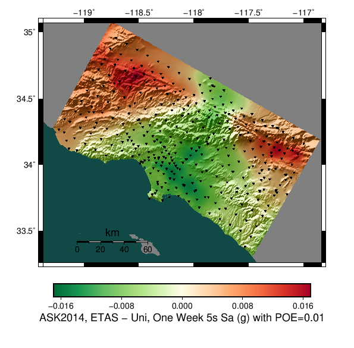 |
| **ASK2014-ETAS** | *(N/A)* | *(N/A)* |  |  |

#### One Week POE 0.01 (g) 5s SA, Maps
*[(top)](#table-of-contents)*

##### One Week POE 0.01 (g) 5s SA, CyberShake Maps
*[(top)](#table-of-contents)*

|  | CS-TI | CS-TD | CS-ETAS-Uniform | CS-ETAS |
|-----|-----|-----|-----|-----|
| **CS-TI** |  |  |  |  |
| **CS-TD** |  |  |  |  |
| **CS-ETAS (Uniform)** |  |  |  |  |
| **CS-ETAS** |  |  |  |  |

##### One Week POE 0.01 (g) 5s SA, GMPE Maps
*[(top)](#table-of-contents)*

|  | ASK2014-TI | ASK2014-TD | ASK2014-ETAS-Uniform | ASK2014-ETAS |
|-----|-----|-----|-----|-----|
| **ASK2014-TI** |  |  |  |  |
| **ASK2014-TD** |  |  |  |  |
| **ASK2014-ETAS (Uniform)** |  |  |  |  |
| **ASK2014-ETAS** |  |  |  |  |

#### One Week POE 0.1 (g) 5s SA, Maps
*[(top)](#table-of-contents)*

##### One Week POE 0.1 (g) 5s SA, CyberShake Maps
*[(top)](#table-of-contents)*

|  | CS-TI | CS-TD | CS-ETAS-Uniform | CS-ETAS |
|-----|-----|-----|-----|-----|
| **CS-TI** |  |  |  |  |
| **CS-TD** |  |  |  |  |
| **CS-ETAS (Uniform)** |  |  |  |  |
| **CS-ETAS** |  |  |  |  |

##### One Week POE 0.1 (g) 5s SA, GMPE Maps
*[(top)](#table-of-contents)*

|  | ASK2014-TI | ASK2014-TD | ASK2014-ETAS-Uniform | ASK2014-ETAS |
|-----|-----|-----|-----|-----|
| **ASK2014-TI** |  |  |  |  |
| **ASK2014-TD** |  |  |  |  |
| **ASK2014-ETAS (Uniform)** |  |  |  |  |
| **ASK2014-ETAS** |  |  |  |  |

#### One Week POE 0.2 (g) 5s SA, Maps
*[(top)](#table-of-contents)*

##### One Week POE 0.2 (g) 5s SA, CyberShake Maps
*[(top)](#table-of-contents)*

|  | CS-TI | CS-TD | CS-ETAS-Uniform | CS-ETAS |
|-----|-----|-----|-----|-----|
| **CS-TI** |  |  |  |  |
| **CS-TD** |  |  |  |  |
| **CS-ETAS (Uniform)** |  |  |  |  |
| **CS-ETAS** |  |  |  |  |

##### One Week POE 0.2 (g) 5s SA, GMPE Maps
*[(top)](#table-of-contents)*

|  | ASK2014-TI | ASK2014-TD | ASK2014-ETAS-Uniform | ASK2014-ETAS |
|-----|-----|-----|-----|-----|
| **ASK2014-TI** |  |  |  |  |
| **ASK2014-TD** |  |  |  |  |
| **ASK2014-ETAS (Uniform)** |  |  |  |  |
| **ASK2014-ETAS** |  |  |  |  |

#### One Week POE 0.5 (g) 5s SA, Maps
*[(top)](#table-of-contents)*

##### One Week POE 0.5 (g) 5s SA, CyberShake Maps
*[(top)](#table-of-contents)*

|  | CS-TI | CS-TD | CS-ETAS-Uniform | CS-ETAS |
|-----|-----|-----|-----|-----|
| **CS-TI** |  |  |  |  |
| **CS-TD** |  |  |  |  |
| **CS-ETAS (Uniform)** |  |  |  |  |
| **CS-ETAS** |  |  |  | 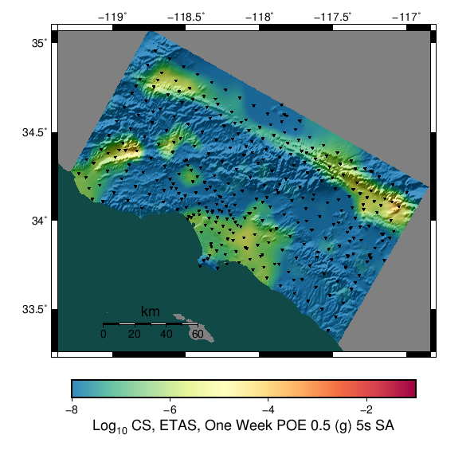 |

##### One Week POE 0.5 (g) 5s SA, GMPE Maps
*[(top)](#table-of-contents)*

|  | ASK2014-TI | ASK2014-TD | ASK2014-ETAS-Uniform | ASK2014-ETAS |
|-----|-----|-----|-----|-----|
| **ASK2014-TI** |  |  |  |  |
| **ASK2014-TD** |  |  |  |  |
| **ASK2014-ETAS (Uniform)** |  |  |  |  |
| **ASK2014-ETAS** |  |  |  |  |

### 5s One Week EATS Gains Table
*[(top)](#table-of-contents)*

| Map Value | CyberShake ETAS/TD Gain | CyberShake ETAS/Uniform Gain | GMPE ETAS/TD Gain | GMPE ETAS/Uniform Gain |
|-----|-----|-----|-----|-----|
| **One Week 5s Sa (g) with POE=1.0E-4** |  |  |  |  |
| **One Week 5s Sa (g) with POE=0.001** |  |  |  |  |
| **One Week 5s Sa (g) with POE=0.01** | *(N/A)* |  | *(N/A)* |  |
| **One Week POE 0.01 (g) 5s SA** |  |  |  |  |
| **One Week POE 0.1 (g) 5s SA** |  |  |  |  |
| **One Week POE 0.2 (g) 5s SA** |  |  |  |  |
| **One Week POE 0.5 (g) 5s SA** |  |  |  |  |

### 5s One Year Hazard Maps
*[(top)](#table-of-contents)*

#### One Year 5s Sa (g) with POE=1.0E-4, Maps
*[(top)](#table-of-contents)*

##### One Year 5s Sa (g) with POE=1.0E-4, CyberShake Maps
*[(top)](#table-of-contents)*

|  | CS-TI | CS-TD | CS-ETAS-Uniform | CS-ETAS |
|-----|-----|-----|-----|-----|
| **CS-TI** |  |  |  |  |
| **CS-TD** |  |  |  |  |
| **CS-ETAS (Uniform)** |  |  |  | 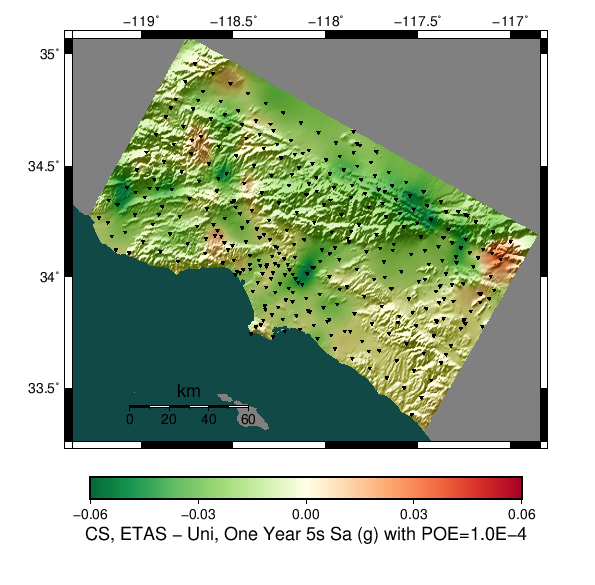 |
| **CS-ETAS** |  |  |  |  |

##### One Year 5s Sa (g) with POE=1.0E-4, GMPE Maps
*[(top)](#table-of-contents)*

|  | ASK2014-TI | ASK2014-TD | ASK2014-ETAS-Uniform | ASK2014-ETAS |
|-----|-----|-----|-----|-----|
| **ASK2014-TI** |  |  |  |  |
| **ASK2014-TD** |  |  |  |  |
| **ASK2014-ETAS (Uniform)** |  |  |  |  |
| **ASK2014-ETAS** |  |  |  |  |

#### One Year 5s Sa (g) with POE=0.001, Maps
*[(top)](#table-of-contents)*

##### One Year 5s Sa (g) with POE=0.001, CyberShake Maps
*[(top)](#table-of-contents)*

|  | CS-TI | CS-TD | CS-ETAS-Uniform | CS-ETAS |
|-----|-----|-----|-----|-----|
| **CS-TI** |  |  |  |  |
| **CS-TD** |  |  |  |  |
| **CS-ETAS (Uniform)** |  |  |  |  |
| **CS-ETAS** |  |  |  |  |

##### One Year 5s Sa (g) with POE=0.001, GMPE Maps
*[(top)](#table-of-contents)*

|  | ASK2014-TI | ASK2014-TD | ASK2014-ETAS-Uniform | ASK2014-ETAS |
|-----|-----|-----|-----|-----|
| **ASK2014-TI** |  |  |  |  |
| **ASK2014-TD** |  |  |  |  |
| **ASK2014-ETAS (Uniform)** |  |  |  |  |
| **ASK2014-ETAS** |  |  |  |  |

#### One Year 5s Sa (g) with POE=0.01, Maps
*[(top)](#table-of-contents)*

##### One Year 5s Sa (g) with POE=0.01, CyberShake Maps
*[(top)](#table-of-contents)*

|  | CS-TI | CS-TD | CS-ETAS-Uniform | CS-ETAS |
|-----|-----|-----|-----|-----|
| **CS-TI** |  |  |  |  |
| **CS-TD** |  |  |  |  |
| **CS-ETAS (Uniform)** |  |  |  |  |
| **CS-ETAS** |  |  |  |  |

##### One Year 5s Sa (g) with POE=0.01, GMPE Maps
*[(top)](#table-of-contents)*

|  | ASK2014-TI | ASK2014-TD | ASK2014-ETAS-Uniform | ASK2014-ETAS |
|-----|-----|-----|-----|-----|
| **ASK2014-TI** |  |  |  |  |
| **ASK2014-TD** |  |  |  |  |
| **ASK2014-ETAS (Uniform)** |  |  |  |  |
| **ASK2014-ETAS** |  |  |  |  |

#### One Year POE 0.01 (g) 5s SA, Maps
*[(top)](#table-of-contents)*

##### One Year POE 0.01 (g) 5s SA, CyberShake Maps
*[(top)](#table-of-contents)*

|  | CS-TI | CS-TD | CS-ETAS-Uniform | CS-ETAS |
|-----|-----|-----|-----|-----|
| **CS-TI** |  |  |  |  |
| **CS-TD** |  |  |  |  |
| **CS-ETAS (Uniform)** |  |  |  |  |
| **CS-ETAS** |  |  |  |  |

##### One Year POE 0.01 (g) 5s SA, GMPE Maps
*[(top)](#table-of-contents)*

|  | ASK2014-TI | ASK2014-TD | ASK2014-ETAS-Uniform | ASK2014-ETAS |
|-----|-----|-----|-----|-----|
| **ASK2014-TI** |  |  |  |  |
| **ASK2014-TD** |  |  |  |  |
| **ASK2014-ETAS (Uniform)** |  |  |  |  |
| **ASK2014-ETAS** |  |  |  |  |

#### One Year POE 0.1 (g) 5s SA, Maps
*[(top)](#table-of-contents)*

##### One Year POE 0.1 (g) 5s SA, CyberShake Maps
*[(top)](#table-of-contents)*

|  | CS-TI | CS-TD | CS-ETAS-Uniform | CS-ETAS |
|-----|-----|-----|-----|-----|
| **CS-TI** |  |  |  |  |
| **CS-TD** |  |  |  |  |
| **CS-ETAS (Uniform)** |  |  |  |  |
| **CS-ETAS** |  |  |  |  |

##### One Year POE 0.1 (g) 5s SA, GMPE Maps
*[(top)](#table-of-contents)*

|  | ASK2014-TI | ASK2014-TD | ASK2014-ETAS-Uniform | ASK2014-ETAS |
|-----|-----|-----|-----|-----|
| **ASK2014-TI** |  |  |  |  |
| **ASK2014-TD** |  |  | 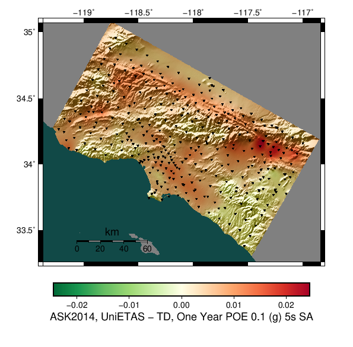 |  |
| **ASK2014-ETAS (Uniform)** |  |  |  |  |
| **ASK2014-ETAS** |  |  |  |  |

#### One Year POE 0.2 (g) 5s SA, Maps
*[(top)](#table-of-contents)*

##### One Year POE 0.2 (g) 5s SA, CyberShake Maps
*[(top)](#table-of-contents)*

|  | CS-TI | CS-TD | CS-ETAS-Uniform | CS-ETAS |
|-----|-----|-----|-----|-----|
| **CS-TI** |  |  |  |  |
| **CS-TD** |  |  |  |  |
| **CS-ETAS (Uniform)** |  |  |  |  |
| **CS-ETAS** |  |  |  |  |

##### One Year POE 0.2 (g) 5s SA, GMPE Maps
*[(top)](#table-of-contents)*

|  | ASK2014-TI | ASK2014-TD | ASK2014-ETAS-Uniform | ASK2014-ETAS |
|-----|-----|-----|-----|-----|
| **ASK2014-TI** |  |  |  |  |
| **ASK2014-TD** |  |  |  |  |
| **ASK2014-ETAS (Uniform)** |  |  |  |  |
| **ASK2014-ETAS** |  |  |  |  |

#### One Year POE 0.5 (g) 5s SA, Maps
*[(top)](#table-of-contents)*

##### One Year POE 0.5 (g) 5s SA, CyberShake Maps
*[(top)](#table-of-contents)*

|  | CS-TI | CS-TD | CS-ETAS-Uniform | CS-ETAS |
|-----|-----|-----|-----|-----|
| **CS-TI** |  |  |  |  |
| **CS-TD** |  |  |  |  |
| **CS-ETAS (Uniform)** |  |  |  |  |
| **CS-ETAS** |  |  |  |  |

##### One Year POE 0.5 (g) 5s SA, GMPE Maps
*[(top)](#table-of-contents)*

|  | ASK2014-TI | ASK2014-TD | ASK2014-ETAS-Uniform | ASK2014-ETAS |
|-----|-----|-----|-----|-----|
| **ASK2014-TI** |  |  |  |  |
| **ASK2014-TD** |  |  |  |  |
| **ASK2014-ETAS (Uniform)** |  |  |  |  |
| **ASK2014-ETAS** |  |  |  | 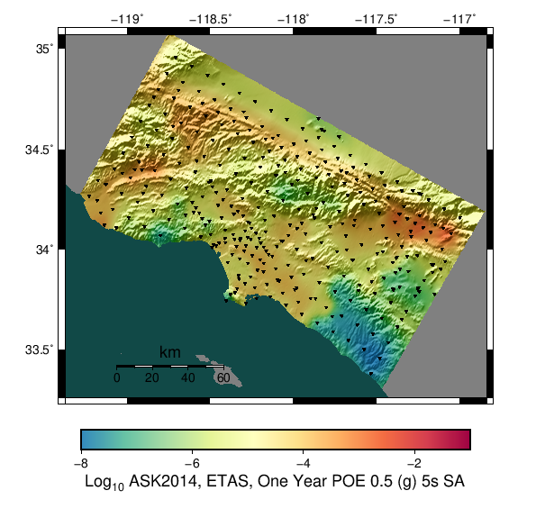 |

### 5s One Year EATS Gains Table
*[(top)](#table-of-contents)*

| Map Value | CyberShake ETAS/TD Gain | CyberShake ETAS/Uniform Gain | GMPE ETAS/TD Gain | GMPE ETAS/Uniform Gain |
|-----|-----|-----|-----|-----|
| **One Year 5s Sa (g) with POE=1.0E-4** |  |  |  |  |
| **One Year 5s Sa (g) with POE=0.001** |  |  |  |  |
| **One Year 5s Sa (g) with POE=0.01** |  |  |  |  |
| **One Year POE 0.01 (g) 5s SA** |  |  |  |  |
| **One Year POE 0.1 (g) 5s SA** |  |  |  |  |
| **One Year POE 0.2 (g) 5s SA** |  |  |  |  |
| **One Year POE 0.5 (g) 5s SA** |  |  |  |  |

