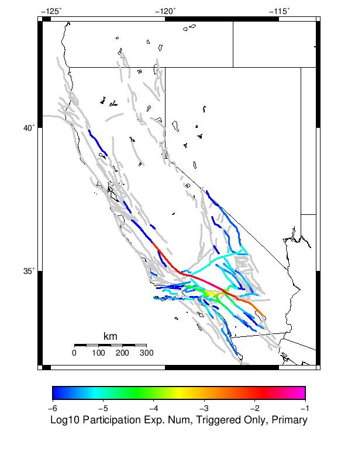
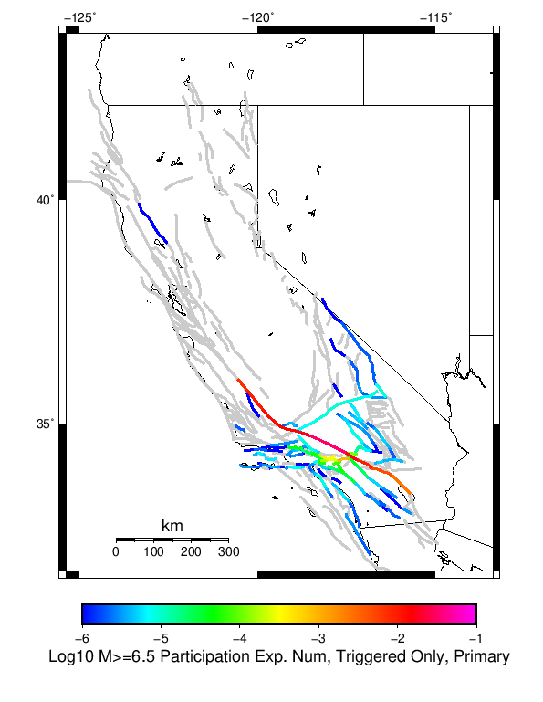

# Mojave Point M6 Results

|   | Mojave Point M6 |
|-----|-----|
| Num Simulations | 1000000 |
| Start Time | 2019/01/01 00:00:00 UTC |
| Start Time Epoch Milliseconds | 1546300800000 |
| Duration | 10 Years |
| Includes Spontaneous? | false |
| Historical Ruptures | *(none)* |

## Table Of Contents

* [Magnitude Number Distribution](#magnitude-number-distribution)
* [Hazard Change Over Time](#hazard-change-over-time)
  * [M&ge;5.0 Hazard Change Over Time](#mge50-hazard-change-over-time)
  * [M&ge;6.0 Hazard Change Over Time](#mge60-hazard-change-over-time)
  * [M&ge;7.0 Hazard Change Over Time](#mge70-hazard-change-over-time)
  * [M&ge;8.0 Hazard Change Over Time](#mge80-hazard-change-over-time)
* [Section Participation](#section-participation)
  * [Section Participation Plots](#section-participation-plots)
  * [Supra-Seismogenic Parent Sections Table](#supra-seismogenic-parent-sections-table)
  * [M≥6.5 Parent Sections Table](#m65-parent-sections-table)
  * [M≥7 Parent Sections Table](#m7-parent-sections-table)
  * [M≥7.5 Parent Sections Table](#m75-parent-sections-table)
  * [M≥8 Parent Sections Table](#m8-parent-sections-table)
* [Gridded Nucleation](#gridded-nucleation)
* [JSON Input File](#json-input-file)

## Magnitude Number Distribution
*[(top)](#table-of-contents)*

**Legend**
* **Mean** (thick black line): mean expected number across all 1000000 catalogs
* **2.5%,97.5%** (thin black lines): expected number percentiles across all 1000000 catalogs
* **Median** (thin blue line): median expected number across all 1000000 catalogs
* **Mode** (thin cyan line): modal expected number across all 1000000 catalogs
* **10 yr Probability** (thin red line): 10 year probability calculated as the fraction of catalogs with at least 1 occurrence
* **95% Conf** (light red shaded region): binomial 95% confidence bounds on probability
* **Primary** (thin green line): mean expected number from primary triggered aftershocks only (no secondary, tertiary, etc...) across all 1000000 catalogs


| Mag | Mean | 2.5 %ile | 97.5 %ile | Median | Mode | 10 yr Probability | Primary Aftershocks Mean |
|-----|-----|-----|-----|-----|-----|-----|-----|
| **M&ge;5** | 4.367 | 0.000 | 64.000 | 1.000 | 0.000 | 0.532 | 0.527 |
| **M&ge;5.1** | 3.438 | 0.000 | 50.000 | 0.000 | 0.000 | 0.460 | 0.419 |
| **M&ge;5.2** | 2.698 | 0.000 | 39.000 | 0.000 | 0.000 | 0.393 | 0.333 |
| **M&ge;5.3** | 2.111 | 0.000 | 30.000 | 0.000 | 0.000 | 0.333 | 0.265 |
| **M&ge;5.4** | 1.645 | 0.000 | 23.000 | 0.000 | 0.000 | 0.281 | 0.211 |
| **M&ge;5.5** | 1.274 | 0.000 | 18.000 | 0.000 | 0.000 | 0.236 | 0.168 |
| **M&ge;5.6** | 0.980 | 0.000 | 14.000 | 0.000 | 0.000 | 0.197 | 0.134 |
| **M&ge;5.7** | 0.746 | 0.000 | 11.000 | 0.000 | 0.000 | 0.164 | 0.107 |
| **M&ge;5.8** | 0.560 | 0.000 | 8.000 | 0.000 | 0.000 | 0.137 | 0.085 |
| **M&ge;5.9** | 0.414 | 0.000 | 6.000 | 0.000 | 0.000 | 0.114 | 0.067 |
| **M&ge;6** | 0.301 | 0.000 | 4.000 | 0.000 | 0.000 | 0.094 | 0.054 |
| **M&ge;6.1** | 0.217 | 0.000 | 3.000 | 0.000 | 0.000 | 0.079 | 0.043 |
| **M&ge;6.2** | 0.173 | 0.000 | 3.000 | 0.000 | 0.000 | 0.073 | 0.039 |
| **M&ge;6.3** | 0.149 | 0.000 | 2.000 | 0.000 | 0.000 | 0.069 | 0.036 |
| **M&ge;6.4** | 0.139 | 0.000 | 2.000 | 0.000 | 0.000 | 0.068 | 0.036 |
| **M&ge;6.5** | 0.136 | 0.000 | 2.000 | 0.000 | 0.000 | 0.068 | 0.036 |
| **M&ge;6.6** | 0.108 | 0.000 | 2.000 | 0.000 | 0.000 | 0.064 | 0.034 |
| **M&ge;6.7** | 0.100 | 0.000 | 1.000 | 0.000 | 0.000 | 0.063 | 0.034 |
| **M&ge;6.8** | 0.088 | 0.000 | 1.000 | 0.000 | 0.000 | 0.062 | 0.034 |
| **M&ge;6.9** | 0.085 | 0.000 | 1.000 | 0.000 | 0.000 | 0.062 | 0.033 |
| **M&ge;7** | 0.081 | 0.000 | 1.000 | 0.000 | 0.000 | 0.061 | 0.033 |
| **M&ge;7.1** | 0.070 | 0.000 | 1.000 | 0.000 | 0.000 | 0.061 | 0.033 |
| **M&ge;7.2** | 0.065 | 0.000 | 1.000 | 0.000 | 0.000 | 0.060 | 0.033 |
| **M&ge;7.3** | 0.056 | 0.000 | 1.000 | 0.000 | 0.000 | 0.052 | 0.028 |
| **M&ge;7.4** | 0.054 | 0.000 | 1.000 | 0.000 | 0.000 | 0.052 | 0.028 |
| **M&ge;7.5** | 0.041 | 0.000 | 1.000 | 0.000 | 0.000 | 0.039 | 0.021 |
| **M&ge;7.6** | 0.035 | 0.000 | 1.000 | 0.000 | 0.000 | 0.034 | 0.018 |
| **M&ge;7.7** | 0.031 | 0.000 | 1.000 | 0.000 | 0.000 | 0.030 | 0.016 |
| **M&ge;7.8** | 0.025 | 0.000 | 0.000 | 0.000 | 0.000 | 0.025 | 0.014 |
| **M&ge;7.9** | 7.45E-3 | 0.000 | 0.000 | 0.000 | 0.000 | 7.45E-3 | 4.03E-3 |
| **M&ge;8** | 1.80E-3 | 0.000 | 0.000 | 0.000 | 0.000 | 1.80E-3 | 9.65E-4 |
| **M&ge;8.1** | 5.44E-4 | 0.000 | 0.000 | 0.000 | 0.000 | 5.44E-4 | 2.88E-4 |
| **M&ge;8.2** | 0.000 | 0.000 | 0.000 | 0.000 | 0.000 | 0.000 | 0.000 |
| **M&ge;8.3** | 0.000 | 0.000 | 0.000 | 0.000 | 0.000 | 0.000 | 0.000 |
| **M&ge;8.4** | 0.000 | 0.000 | 0.000 | 0.000 | 0.000 | 0.000 | 0.000 |
| **M&ge;8.5** | 0.000 | 0.000 | 0.000 | 0.000 | 0.000 | 0.000 | 0.000 |
| **M&ge;8.6** | 0.000 | 0.000 | 0.000 | 0.000 | 0.000 | 0.000 | 0.000 |
| **M&ge;8.7** | 0.000 | 0.000 | 0.000 | 0.000 | 0.000 | 0.000 | 0.000 |
| **M&ge;8.8** | 0.000 | 0.000 | 0.000 | 0.000 | 0.000 | 0.000 | 0.000 |
| **M&ge;8.9** | 0.000 | 0.000 | 0.000 | 0.000 | 0.000 | 0.000 | 0.000 |
| **M&ge;9** | 0.000 | 0.000 | 0.000 | 0.000 | 0.000 | 0.000 | 0.000 |

## Hazard Change Over Time
*[(top)](#table-of-contents)*

These plots show how the probability of ruptures of various magnitudes within 100km of any scenario rupture changes over time

### M&ge;5.0 Hazard Change Over Time
*[(top)](#table-of-contents)*


| Forecast Duration | UCERF3-ETAS [95% Conf] | UCERF3-ETAS Triggered Only | UCERF3-TD | UCERF3-TI |
|-----|-----|-----|-----|-----|
| 1 Hour | 0.113 [0.112 - 0.113] | 0.113 | 8.84E-5 | 8.54E-5 |
| 1 Day | 0.262 [0.261 - 0.263] | 0.260 | 2.12E-3 | 2.05E-3 |
| 1 Week | 0.349 [0.348 - 0.350] | 0.339 | 0.015 | 0.014 |
| 1 Month | 0.429 [0.428 - 0.430] | 0.392 | 0.062 | 0.060 |
| 1 Year | 0.756 [0.755 - 0.756] | 0.470 | 0.539 | 0.527 |
| 10 Years | 1.000 [1.000 - 1.000] | 0.529 | 1.000 | 0.999 |
| 30 Years | 1.000 [1.000 - 1.000] \* | \* | 1.000 | 1.000 |
| 100 Years | 1.000 [1.000 - 1.000] \* | \* | 1.000 | 1.000 |

\* *forecast duration is longer than simulation length, only ETAS ruptures from the first 10 years are included*
### M&ge;6.0 Hazard Change Over Time
*[(top)](#table-of-contents)*


| Forecast Duration | UCERF3-ETAS [95% Conf] | UCERF3-ETAS Triggered Only | UCERF3-TD | UCERF3-TI |
|-----|-----|-----|-----|-----|
| 1 Hour | 0.013 [0.012 - 0.013] | 0.012 | 1.69E-5 | 1.39E-5 |
| 1 Day | 0.034 [0.033 - 0.034] | 0.033 | 4.06E-4 | 3.33E-4 |
| 1 Week | 0.050 [0.049 - 0.050] | 0.047 | 2.84E-3 | 2.33E-3 |
| 1 Month | 0.069 [0.069 - 0.070] | 0.058 | 0.012 | 9.95E-3 |
| 1 Year | 0.204 [0.204 - 0.204] | 0.077 | 0.138 | 0.115 |
| 10 Years | 0.792 [0.791 - 0.792] | 0.094 | 0.770 | 0.704 |
| 30 Years | 0.987 [0.987 - 0.987] \* | \* | 0.986 | 0.974 |
| 100 Years | 1.000 [1.000 - 1.000] \* | \* | 1.000 | 1.000 |

\* *forecast duration is longer than simulation length, only ETAS ruptures from the first 10 years are included*
### M&ge;7.0 Hazard Change Over Time
*[(top)](#table-of-contents)*


| Forecast Duration | UCERF3-ETAS [95% Conf] | UCERF3-ETAS Triggered Only | UCERF3-TD | UCERF3-TI |
|-----|-----|-----|-----|-----|
| 1 Hour | 7.86E-3 [7.69E-3 - 8.04E-3] | 7.85E-3 | 7.08E-6 | 6.07E-6 |
| 1 Day | 0.021 [0.021 - 0.022] | 0.021 | 1.70E-4 | 1.46E-4 |
| 1 Week | 0.031 [0.031 - 0.032] | 0.030 | 1.19E-3 | 1.02E-3 |
| 1 Month | 0.042 [0.042 - 0.042] | 0.037 | 5.09E-3 | 4.36E-3 |
| 1 Year | 0.107 [0.106 - 0.107] | 0.049 | 0.060 | 0.052 |
| 10 Years | 0.488 [0.488 - 0.488] | 0.061 | 0.455 | 0.412 |
| 30 Years | 0.826 [0.826 - 0.826] \* | \* | 0.815 | 0.797 |
| 100 Years | 0.986 [0.986 - 0.986] \* | \* | 0.986 | 0.995 |

\* *forecast duration is longer than simulation length, only ETAS ruptures from the first 10 years are included*
### M&ge;8.0 Hazard Change Over Time
*[(top)](#table-of-contents)*


| Forecast Duration | UCERF3-ETAS [95% Conf] | UCERF3-ETAS Triggered Only | UCERF3-TD | UCERF3-TI |
|-----|-----|-----|-----|-----|
| 1 Hour | 2.32E-4 [2.04E-4 - 2.65E-4] | 2.32E-4 | 1.85E-7 | 1.76E-7 |
| 1 Day | 6.36E-4 [5.89E-4 - 6.88E-4] | 6.32E-4 | 4.45E-6 | 4.21E-6 |
| 1 Week | 9.52E-4 [8.94E-4 - 1.01E-3] | 9.21E-4 | 3.12E-5 | 2.95E-5 |
| 1 Month | 1.24E-3 [1.18E-3 - 1.31E-3] | 1.11E-3 | 1.34E-4 | 1.26E-4 |
| 1 Year | 3.08E-3 [3.00E-3 - 3.15E-3] | 1.45E-3 | 1.62E-3 | 1.54E-3 |
| 10 Years | 0.017 [0.017 - 0.017] | 1.80E-3 | 0.015 | 0.015 |
| 30 Years | 0.038 [0.038 - 0.038] \* | \* | 0.036 | 0.045 |
| 100 Years | 0.059 [0.059 - 0.059] \* | \* | 0.058 | 0.143 |

\* *forecast duration is longer than simulation length, only ETAS ruptures from the first 10 years are included*
## Section Participation
*[(top)](#table-of-contents)*

### Section Participation Plots
*[(top)](#table-of-contents)*

| Min Mag | Triggered Ruptures (no spontaneous) | Triggered Ruptures (primary aftershocks only) |
|-----|-----|-----|
| **All Supra. Seis.** |  |  |
| **M&ge;6.5** |  |  |
| **M&ge;7** |  |  |
| **M&ge;7.5** |  |  |
| **M&ge;8** |  |  |

### Supra-Seismogenic Parent Sections Table
*[(top)](#table-of-contents)*

*First 10 of 148 with matching ruptures shown*

| Parent Name | Triggered Mean Count | Triggered 10 Year Prob | Triggered Primary Mean Count |
|-----|-----|-----|-----|
| San Andreas (Mojave S) | 0.060964 | 0.060659 | 0.033147 |
| San Andreas (San Bernardino N) | 0.033554 | 0.033412 | 0.017255 |
| San Andreas (Mojave N) | 0.033093 | 0.033059 | 0.017896 |
| San Andreas (Big Bend) | 0.02623 | 0.026213 | 0.014157 |
| San Andreas (Carrizo) rev | 0.023077 | 0.023048 | 0.012481 |
| San Andreas (Cholame) rev | 0.018872 | 0.018848 | 0.010097 |
| San Andreas (San Bernardino S) | 0.018105 | 0.018072 | 0.0094 |
| Cucamonga | 0.016579 | 0.016579 | 9.78E-4 |
| San Andreas (Parkfield) | 0.015083 | 0.015043 | 0.007627 |
| Cleghorn | 0.010051 | 0.010003 | 1.15E-4 |

### M≥6.5 Parent Sections Table
*[(top)](#table-of-contents)*

*First 10 of 139 with matching ruptures shown*

| Parent Name | Triggered Mean Count | Triggered 10 Year Prob | Triggered Primary Mean Count |
|-----|-----|-----|-----|
| San Andreas (Mojave S) | 0.060964 | 0.060659 | 0.033147 |
| San Andreas (San Bernardino N) | 0.033554 | 0.033412 | 0.017255 |
| San Andreas (Mojave N) | 0.033093 | 0.033059 | 0.017896 |
| San Andreas (Big Bend) | 0.02623 | 0.026213 | 0.014157 |
| San Andreas (Carrizo) rev | 0.023077 | 0.023048 | 0.012481 |
| San Andreas (Cholame) rev | 0.018872 | 0.018848 | 0.010097 |
| San Andreas (San Bernardino S) | 0.018105 | 0.018072 | 0.0094 |
| Cucamonga | 0.016579 | 0.016579 | 9.78E-4 |
| San Andreas (Parkfield) | 0.014333 | 0.014333 | 0.007626 |
| Cleghorn | 0.010051 | 0.010003 | 1.15E-4 |

### M≥7 Parent Sections Table
*[(top)](#table-of-contents)*

*First 10 of 81 with matching ruptures shown*

| Parent Name | Triggered Mean Count | Triggered 10 Year Prob | Triggered Primary Mean Count |
|-----|-----|-----|-----|
| San Andreas (Mojave S) | 0.059937 | 0.059686 | 0.032634 |
| San Andreas (Mojave N) | 0.033012 | 0.032978 | 0.017893 |
| San Andreas (San Bernardino N) | 0.032355 | 0.032248 | 0.017117 |
| San Andreas (Big Bend) | 0.026228 | 0.026211 | 0.014157 |
| San Andreas (Carrizo) rev | 0.023075 | 0.023047 | 0.012481 |
| San Andreas (Cholame) rev | 0.01887 | 0.018846 | 0.010097 |
| San Andreas (San Bernardino S) | 0.018084 | 0.018052 | 0.0094 |
| San Andreas (Parkfield) | 0.014333 | 0.014333 | 0.007626 |
| San Andreas (San Gorgonio Pass-Garnet HIll) | 0.009294 | 0.009266 | 0.004873 |
| San Jacinto (San Bernardino) | 0.006244 | 0.006211 | 3.5E-5 |

### M≥7.5 Parent Sections Table
*[(top)](#table-of-contents)*

*First 10 of 37 with matching ruptures shown*

| Parent Name | Triggered Mean Count | Triggered 10 Year Prob | Triggered Primary Mean Count |
|-----|-----|-----|-----|
| San Andreas (Mojave S) | 0.03874 | 0.038656 | 0.021082 |
| San Andreas (Mojave N) | 0.029199 | 0.029182 | 0.015829 |
| San Andreas (Big Bend) | 0.026083 | 0.02607 | 0.014111 |
| San Andreas (Carrizo) rev | 0.023016 | 0.023013 | 0.01248 |
| San Andreas (San Bernardino N) | 0.02191 | 0.021889 | 0.011834 |
| San Andreas (Cholame) rev | 0.018616 | 0.018616 | 0.010094 |
| San Andreas (San Bernardino S) | 0.016814 | 0.016805 | 0.00906 |
| San Andreas (Parkfield) | 0.014112 | 0.014112 | 0.007623 |
| San Andreas (San Gorgonio Pass-Garnet HIll) | 0.008915 | 0.00891 | 0.004794 |
| San Andreas (Coachella) rev | 0.005152 | 0.005152 | 0.002707 |

### M≥8 Parent Sections Table
*[(top)](#table-of-contents)*

| Parent Name | Triggered Mean Count | Triggered 10 Year Prob | Triggered Primary Mean Count |
|-----|-----|-----|-----|
| San Andreas (Big Bend) | 0.001801 | 0.001801 | 9.65E-4 |
| San Andreas (Carrizo) rev | 0.001801 | 0.001801 | 9.65E-4 |
| San Andreas (Mojave N) | 0.001801 | 0.001801 | 9.65E-4 |
| San Andreas (Mojave S) | 0.001801 | 0.001801 | 9.65E-4 |
| San Andreas (San Bernardino N) | 0.001801 | 0.001801 | 9.65E-4 |
| San Andreas (San Bernardino S) | 0.001801 | 0.001801 | 9.65E-4 |
| San Andreas (Cholame) rev | 0.001549 | 0.001549 | 8.27E-4 |
| San Andreas (Parkfield) | 0.001426 | 0.001426 | 7.69E-4 |
| San Andreas (San Gorgonio Pass-Garnet HIll) | 0.001184 | 0.001184 | 6.27E-4 |
| San Andreas (Coachella) rev | 7.82E-4 | 7.82E-4 | 4.12E-4 |
## Gridded Nucleation
*[(top)](#table-of-contents)*

| Min Mag | Triggered Ruptures (no spontaneous) | Triggered Ruptures (primary aftershocks only) |
|-----|-----|-----|
| **M&ge;5** |  |  |
| **M&ge;6** |  |  |
| **M&ge;7** |  |  |

## JSON Input File
*[(top)](#table-of-contents)*

```
{
  "numSimulations": 1000000,
  "duration": 10.0,
  "startYear": 2019,
  "includeSpontaneous": false,
  "randomSeed": 987654321,
  "binaryOutput": true,
  "binaryOutputFilters": [
    {
      "prefix": "results_complete",
      "descendantsOnly": false
    },
    {
      "prefix": "results_m5_preserve_chain",
      "minMag": 5.0,
      "preserveChainBelowMag": true,
      "descendantsOnly": false
    }
  ],
  "forceRecalc": false,
  "reuseERFs": false,
  "simulationName": "Mojave Point M6",
  "numRetries": 3,
  "outputDir": "${ETAS_SIM_DIR}/2019_04_25-MojavePointM6-u2mapped-noSpont-10yr",
  "triggerRuptures": [
    {
      "mag": 6.0,
      "latitude": 34.42295,
      "longitude": -117.80177,
      "depth": 5.8
    }
  ],
  "cacheDir": "${ETAS_LAUNCHER}/inputs/cache_u2_mapped_fm3p1",
  "fssFile": "${ETAS_LAUNCHER}/inputs/ucerf2_mapped_fm3p1.zip",
  "probModel": "FULL_TD",
  "applySubSeisForSupraNucl": true,
  "totRateScaleFactor": 1.14,
  "gridSeisCorr": true,
  "timeIndependentERF": false,
  "griddedOnly": false,
  "imposeGR": false,
  "includeIndirectTriggering": true,
  "gridSeisDiscr": 0.1,
  "catalogCompletenessModel": "RELAXED"
}
```

