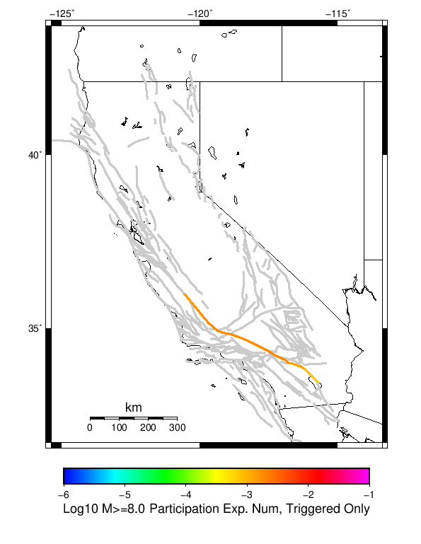

# Mojave Point M6 Results

|   | Mojave Point M6 |
|-----|-----|
| Num Simulations | 500000 |
| Start Time | 2019/01/01 00:00:00 UTC |
| Start Time Epoch Milliseconds | 1546300800000 |
| Duration | 10 Years |
| Includes Spontaneous? | false |
| Historical Ruptures | *(none)* |

## Table Of Contents

* [Magnitude Number Distribution](#magnitude-number-distribution)
* [Hazard Change Over Time](#hazard-change-over-time)
  * [M&ge;5.0 Hazard Change Over Time](#mge50-hazard-change-over-time)
  * [M&ge;6.0 Hazard Change Over Time](#mge60-hazard-change-over-time)
  * [M&ge;7.0 Hazard Change Over Time](#mge70-hazard-change-over-time)
  * [M&ge;8.0 Hazard Change Over Time](#mge80-hazard-change-over-time)
* [Section Participation](#section-participation)
  * [Section Participation Plots](#section-participation-plots)
  * [Supra-Seismogenic Parent Sections Table](#supra-seismogenic-parent-sections-table)
  * [M≥6.5 Parent Sections Table](#m65-parent-sections-table)
  * [M≥7 Parent Sections Table](#m7-parent-sections-table)
  * [M≥7.5 Parent Sections Table](#m75-parent-sections-table)
  * [M≥8 Parent Sections Table](#m8-parent-sections-table)
* [Gridded Nucleation](#gridded-nucleation)
* [JSON Input File](#json-input-file)

## Magnitude Number Distribution
*[(top)](#table-of-contents)*

**Legend**
* **Mean** (thick black line): mean expected number across all 500000 catalogs
* **2.5%,97.5%** (thin black lines): expected number percentiles across all 500000 catalogs
* **Median** (thin blue line): median expected number across all 500000 catalogs
* **Mode** (thin cyan line): modal expected number across all 500000 catalogs
* **10 yr Probability** (thin red line): 10 year probability calculated as the fraction of catalogs with at least 1 occurrence
* **95% Conf** (light red shaded region): binomial 95% confidence bounds on probability
* **Primary** (thin green line): mean expected number from primary triggered aftershocks only (no secondary, tertiary, etc...) across all 500000 catalogs


| Mag | Mean | 2.5 %ile | 97.5 %ile | Median | Mode | 10 yr Probability | Primary Aftershocks Mean |
|-----|-----|-----|-----|-----|-----|-----|-----|
| **M&ge;5** | 4.608 | 0.000 | 67.000 | 1.000 | 0.000 | 0.532 | 0.528 |
| **M&ge;5.1** | 3.630 | 0.000 | 53.000 | 0.000 | 0.000 | 0.460 | 0.420 |
| **M&ge;5.2** | 2.851 | 0.000 | 41.000 | 0.000 | 0.000 | 0.393 | 0.334 |
| **M&ge;5.3** | 2.235 | 0.000 | 32.000 | 0.000 | 0.000 | 0.333 | 0.265 |
| **M&ge;5.4** | 1.745 | 0.000 | 25.000 | 0.000 | 0.000 | 0.281 | 0.211 |
| **M&ge;5.5** | 1.355 | 0.000 | 19.000 | 0.000 | 0.000 | 0.236 | 0.168 |
| **M&ge;5.6** | 1.045 | 0.000 | 15.000 | 0.000 | 0.000 | 0.197 | 0.134 |
| **M&ge;5.7** | 0.800 | 0.000 | 11.000 | 0.000 | 0.000 | 0.165 | 0.107 |
| **M&ge;5.8** | 0.604 | 0.000 | 9.000 | 0.000 | 0.000 | 0.137 | 0.085 |
| **M&ge;5.9** | 0.449 | 0.000 | 6.000 | 0.000 | 0.000 | 0.114 | 0.068 |
| **M&ge;6** | 0.330 | 0.000 | 5.000 | 0.000 | 0.000 | 0.095 | 0.054 |
| **M&ge;6.1** | 0.242 | 0.000 | 4.000 | 0.000 | 0.000 | 0.079 | 0.043 |
| **M&ge;6.2** | 0.196 | 0.000 | 3.000 | 0.000 | 0.000 | 0.074 | 0.040 |
| **M&ge;6.3** | 0.170 | 0.000 | 3.000 | 0.000 | 0.000 | 0.069 | 0.037 |
| **M&ge;6.4** | 0.160 | 0.000 | 2.000 | 0.000 | 0.000 | 0.069 | 0.037 |
| **M&ge;6.5** | 0.157 | 0.000 | 2.000 | 0.000 | 0.000 | 0.069 | 0.037 |
| **M&ge;6.6** | 0.120 | 0.000 | 2.000 | 0.000 | 0.000 | 0.065 | 0.035 |
| **M&ge;6.7** | 0.112 | 0.000 | 2.000 | 0.000 | 0.000 | 0.064 | 0.034 |
| **M&ge;6.8** | 0.095 | 0.000 | 1.000 | 0.000 | 0.000 | 0.063 | 0.034 |
| **M&ge;6.9** | 0.092 | 0.000 | 1.000 | 0.000 | 0.000 | 0.062 | 0.034 |
| **M&ge;7** | 0.087 | 0.000 | 1.000 | 0.000 | 0.000 | 0.062 | 0.034 |
| **M&ge;7.1** | 0.073 | 0.000 | 1.000 | 0.000 | 0.000 | 0.061 | 0.033 |
| **M&ge;7.2** | 0.067 | 0.000 | 1.000 | 0.000 | 0.000 | 0.061 | 0.033 |
| **M&ge;7.3** | 0.058 | 0.000 | 1.000 | 0.000 | 0.000 | 0.053 | 0.029 |
| **M&ge;7.4** | 0.055 | 0.000 | 1.000 | 0.000 | 0.000 | 0.053 | 0.029 |
| **M&ge;7.5** | 0.043 | 0.000 | 1.000 | 0.000 | 0.000 | 0.041 | 0.022 |
| **M&ge;7.6** | 0.037 | 0.000 | 1.000 | 0.000 | 0.000 | 0.035 | 0.019 |
| **M&ge;7.7** | 0.032 | 0.000 | 1.000 | 0.000 | 0.000 | 0.032 | 0.017 |
| **M&ge;7.8** | 0.026 | 0.000 | 1.000 | 0.000 | 0.000 | 0.026 | 0.014 |
| **M&ge;7.9** | 8.01E-3 | 0.000 | 0.000 | 0.000 | 0.000 | 8.01E-3 | 4.30E-3 |
| **M&ge;8** | 2.00E-3 | 0.000 | 0.000 | 0.000 | 0.000 | 2.00E-3 | 1.06E-3 |
| **M&ge;8.1** | 6.56E-4 | 0.000 | 0.000 | 0.000 | 0.000 | 6.56E-4 | 3.32E-4 |
| **M&ge;8.2** | 0.000 | 0.000 | 0.000 | 0.000 | 0.000 | 0.000 | 0.000 |
| **M&ge;8.3** | 0.000 | 0.000 | 0.000 | 0.000 | 0.000 | 0.000 | 0.000 |
| **M&ge;8.4** | 0.000 | 0.000 | 0.000 | 0.000 | 0.000 | 0.000 | 0.000 |
| **M&ge;8.5** | 0.000 | 0.000 | 0.000 | 0.000 | 0.000 | 0.000 | 0.000 |
| **M&ge;8.6** | 0.000 | 0.000 | 0.000 | 0.000 | 0.000 | 0.000 | 0.000 |
| **M&ge;8.7** | 0.000 | 0.000 | 0.000 | 0.000 | 0.000 | 0.000 | 0.000 |
| **M&ge;8.8** | 0.000 | 0.000 | 0.000 | 0.000 | 0.000 | 0.000 | 0.000 |
| **M&ge;8.9** | 0.000 | 0.000 | 0.000 | 0.000 | 0.000 | 0.000 | 0.000 |
| **M&ge;9** | 0.000 | 0.000 | 0.000 | 0.000 | 0.000 | 0.000 | 0.000 |

## Hazard Change Over Time
*[(top)](#table-of-contents)*

These plots show how the probability of ruptures of various magnitudes within 100km of any scenario rupture changes over time

### M&ge;5.0 Hazard Change Over Time
*[(top)](#table-of-contents)*


| Forecast Duration | UCERF3-ETAS [95% Conf] | UCERF3-ETAS Triggered Only | UCERF3-TD | UCERF3-TI |
|-----|-----|-----|-----|-----|
| 1 Hour | 0.113 [0.113 - 0.114] | 0.113 | 8.84E-5 | 8.54E-5 |
| 1 Day | 0.262 [0.261 - 0.263] | 0.261 | 2.12E-3 | 2.05E-3 |
| 1 Week | 0.350 [0.348 - 0.351] | 0.340 | 0.015 | 0.014 |
| 1 Month | 0.429 [0.428 - 0.431] | 0.392 | 0.062 | 0.060 |
| 1 Year | 0.756 [0.755 - 0.756] | 0.469 | 0.539 | 0.527 |
| 10 Years | 1.000 [1.000 - 1.000] | 0.529 | 1.000 | 0.999 |
| 30 Years | 1.000 [1.000 - 1.000] \* | \* | 1.000 | 1.000 |
| 100 Years | 1.000 [1.000 - 1.000] \* | \* | 1.000 | 1.000 |

\* *forecast duration is longer than simulation length, only ETAS ruptures from the first 10 years are included*
### M&ge;6.0 Hazard Change Over Time
*[(top)](#table-of-contents)*


| Forecast Duration | UCERF3-ETAS [95% Conf] | UCERF3-ETAS Triggered Only | UCERF3-TD | UCERF3-TI |
|-----|-----|-----|-----|-----|
| 1 Hour | 0.013 [0.012 - 0.013] | 0.013 | 1.69E-5 | 1.39E-5 |
| 1 Day | 0.034 [0.034 - 0.035] | 0.034 | 4.06E-4 | 3.33E-4 |
| 1 Week | 0.050 [0.050 - 0.051] | 0.048 | 2.84E-3 | 2.33E-3 |
| 1 Month | 0.070 [0.069 - 0.071] | 0.059 | 0.012 | 9.95E-3 |
| 1 Year | 0.204 [0.204 - 0.205] | 0.077 | 0.138 | 0.115 |
| 10 Years | 0.792 [0.791 - 0.792] | 0.094 | 0.770 | 0.704 |
| 30 Years | 0.987 [0.987 - 0.987] \* | \* | 0.986 | 0.974 |
| 100 Years | 1.000 [1.000 - 1.000] \* | \* | 1.000 | 1.000 |

\* *forecast duration is longer than simulation length, only ETAS ruptures from the first 10 years are included*
### M&ge;7.0 Hazard Change Over Time
*[(top)](#table-of-contents)*


| Forecast Duration | UCERF3-ETAS [95% Conf] | UCERF3-ETAS Triggered Only | UCERF3-TD | UCERF3-TI |
|-----|-----|-----|-----|-----|
| 1 Hour | 8.02E-3 [7.78E-3 - 8.27E-3] | 8.01E-3 | 7.08E-6 | 6.07E-6 |
| 1 Day | 0.022 [0.021 - 0.022] | 0.022 | 1.70E-4 | 1.46E-4 |
| 1 Week | 0.032 [0.031 - 0.032] | 0.031 | 1.19E-3 | 1.02E-3 |
| 1 Month | 0.043 [0.042 - 0.043] | 0.038 | 5.09E-3 | 4.36E-3 |
| 1 Year | 0.107 [0.107 - 0.108] | 0.050 | 0.060 | 0.052 |
| 10 Years | 0.489 [0.488 - 0.489] | 0.062 | 0.455 | 0.412 |
| 30 Years | 0.826 [0.826 - 0.827] \* | \* | 0.815 | 0.797 |
| 100 Years | 0.986 [0.986 - 0.986] \* | \* | 0.986 | 0.995 |

\* *forecast duration is longer than simulation length, only ETAS ruptures from the first 10 years are included*
### M&ge;8.0 Hazard Change Over Time
*[(top)](#table-of-contents)*


| Forecast Duration | UCERF3-ETAS [95% Conf] | UCERF3-ETAS Triggered Only | UCERF3-TD | UCERF3-TI |
|-----|-----|-----|-----|-----|
| 1 Hour | 2.44E-4 [2.04E-4 - 2.93E-4] | 2.44E-4 | 1.85E-7 | 1.76E-7 |
| 1 Day | 6.98E-4 [6.28E-4 - 7.76E-4] | 6.94E-4 | 4.45E-6 | 4.21E-6 |
| 1 Week | 1.07E-3 [9.81E-4 - 1.16E-3] | 1.04E-3 | 3.12E-5 | 2.95E-5 |
| 1 Month | 1.37E-3 [1.28E-3 - 1.47E-3] | 1.24E-3 | 1.34E-4 | 1.26E-4 |
| 1 Year | 3.23E-3 [3.12E-3 - 3.35E-3] | 1.61E-3 | 1.62E-3 | 1.54E-3 |
| 10 Years | 0.017 [0.017 - 0.017] | 2.00E-3 | 0.015 | 0.015 |
| 30 Years | 0.038 [0.038 - 0.039] \* | \* | 0.036 | 0.045 |
| 100 Years | 0.060 [0.059 - 0.060] \* | \* | 0.058 | 0.143 |

\* *forecast duration is longer than simulation length, only ETAS ruptures from the first 10 years are included*
## Section Participation
*[(top)](#table-of-contents)*

### Section Participation Plots
*[(top)](#table-of-contents)*

| Min Mag | Triggered Ruptures (no spontaneous) | Triggered Ruptures (primary aftershocks only) |
|-----|-----|-----|
| **All Supra. Seis.** |  |  |
| **M&ge;6.5** |  |  |
| **M&ge;7** |  |  |
| **M&ge;7.5** |  |  |
| **M&ge;8** |  |  |

### Supra-Seismogenic Parent Sections Table
*[(top)](#table-of-contents)*

*First 10 of 139 with matching ruptures shown*

| Parent Name | Triggered Mean Count | Triggered 10 Year Prob | Triggered Primary Mean Count |
|-----|-----|-----|-----|
| San Andreas (Mojave S) | 0.061852 | 0.061414 | 0.033618 |
| San Andreas (San Bernardino N) | 0.035566 | 0.035358 | 0.01787 |
| San Andreas (Mojave N) | 0.033688 | 0.033638 | 0.018282 |
| San Andreas (Big Bend) | 0.026778 | 0.02676 | 0.014516 |
| San Andreas (Carrizo) rev | 0.023552 | 0.02353 | 0.01277 |
| Cucamonga | 0.02272 | 0.02272 | 0.001004 |
| San Andreas (San Bernardino S) | 0.019954 | 0.019902 | 0.010192 |
| San Andreas (Cholame) rev | 0.019414 | 0.019404 | 0.010344 |
| San Andreas (Parkfield) | 0.015806 | 0.015774 | 0.007892 |
| Cleghorn | 0.014186 | 0.014118 | 1.24E-4 |

### M≥6.5 Parent Sections Table
*[(top)](#table-of-contents)*

*First 10 of 131 with matching ruptures shown*

| Parent Name | Triggered Mean Count | Triggered 10 Year Prob | Triggered Primary Mean Count |
|-----|-----|-----|-----|
| San Andreas (Mojave S) | 0.061852 | 0.061414 | 0.033618 |
| San Andreas (San Bernardino N) | 0.035566 | 0.035358 | 0.01787 |
| San Andreas (Mojave N) | 0.033688 | 0.033638 | 0.018282 |
| San Andreas (Big Bend) | 0.026778 | 0.02676 | 0.014516 |
| San Andreas (Carrizo) rev | 0.023552 | 0.02353 | 0.01277 |
| Cucamonga | 0.02272 | 0.02272 | 0.001004 |
| San Andreas (San Bernardino S) | 0.019954 | 0.019902 | 0.010192 |
| San Andreas (Cholame) rev | 0.019414 | 0.019404 | 0.010344 |
| San Andreas (Parkfield) | 0.014982 | 0.014982 | 0.007892 |
| Cleghorn | 0.014186 | 0.014118 | 1.24E-4 |

### M≥7 Parent Sections Table
*[(top)](#table-of-contents)*

*First 10 of 74 with matching ruptures shown*

| Parent Name | Triggered Mean Count | Triggered 10 Year Prob | Triggered Primary Mean Count |
|-----|-----|-----|-----|
| San Andreas (Mojave S) | 0.060818 | 0.060458 | 0.033106 |
| San Andreas (San Bernardino N) | 0.034044 | 0.033892 | 0.017752 |
| San Andreas (Mojave N) | 0.033586 | 0.033536 | 0.018278 |
| San Andreas (Big Bend) | 0.026774 | 0.026756 | 0.014516 |
| San Andreas (Carrizo) rev | 0.02355 | 0.023528 | 0.01277 |
| San Andreas (San Bernardino S) | 0.019924 | 0.019874 | 0.010192 |
| San Andreas (Cholame) rev | 0.019412 | 0.019402 | 0.010344 |
| San Andreas (Parkfield) | 0.014982 | 0.014982 | 0.007892 |
| San Andreas (San Gorgonio Pass-Garnet HIll) | 0.010654 | 0.010604 | 0.00547 |
| San Jacinto (San Bernardino) | 0.008434 | 0.008388 | 3.4E-5 |

### M≥7.5 Parent Sections Table
*[(top)](#table-of-contents)*

*First 10 of 36 with matching ruptures shown*

| Parent Name | Triggered Mean Count | Triggered 10 Year Prob | Triggered Primary Mean Count |
|-----|-----|-----|-----|
| San Andreas (Mojave S) | 0.040328 | 0.040198 | 0.021992 |
| San Andreas (Mojave N) | 0.02994 | 0.029916 | 0.016268 |
| San Andreas (Big Bend) | 0.026606 | 0.026592 | 0.014468 |
| San Andreas (San Bernardino N) | 0.023572 | 0.023542 | 0.012674 |
| San Andreas (Carrizo) rev | 0.023482 | 0.02348 | 0.01277 |
| San Andreas (Cholame) rev | 0.019082 | 0.019082 | 0.01034 |
| San Andreas (San Bernardino S) | 0.018354 | 0.018338 | 0.009842 |
| San Andreas (Parkfield) | 0.014688 | 0.014688 | 0.007888 |
| San Andreas (San Gorgonio Pass-Garnet HIll) | 0.010152 | 0.010142 | 0.005382 |
| San Andreas (Coachella) rev | 0.005916 | 0.005916 | 0.003006 |

### M≥8 Parent Sections Table
*[(top)](#table-of-contents)*

| Parent Name | Triggered Mean Count | Triggered 10 Year Prob | Triggered Primary Mean Count |
|-----|-----|-----|-----|
| San Andreas (Big Bend) | 0.002002 | 0.002002 | 0.001058 |
| San Andreas (Carrizo) rev | 0.002002 | 0.002002 | 0.001058 |
| San Andreas (Mojave N) | 0.002002 | 0.002002 | 0.001058 |
| San Andreas (Mojave S) | 0.002002 | 0.002002 | 0.001058 |
| San Andreas (San Bernardino N) | 0.002002 | 0.002002 | 0.001058 |
| San Andreas (San Bernardino S) | 0.002002 | 0.002002 | 0.001058 |
| San Andreas (Cholame) rev | 0.00173 | 0.00173 | 8.96E-4 |
| San Andreas (Parkfield) | 0.001616 | 0.001616 | 8.46E-4 |
| San Andreas (San Gorgonio Pass-Garnet HIll) | 0.001332 | 0.001332 | 7.04E-4 |
| San Andreas (Coachella) rev | 8.84E-4 | 8.84E-4 | 4.54E-4 |
## Gridded Nucleation
*[(top)](#table-of-contents)*

| Min Mag | Triggered Ruptures (no spontaneous) | Triggered Ruptures (primary aftershocks only) |
|-----|-----|-----|
| **M&ge;5** |  |  |
| **M&ge;6** |  |  |
| **M&ge;7** |  |  |

## JSON Input File
*[(top)](#table-of-contents)*

```
{
  "numSimulations": 500000,
  "duration": 10.0,
  "startYear": 2019,
  "includeSpontaneous": false,
  "randomSeed": 123456789,
  "binaryOutput": true,
  "binaryOutputFilters": [
    {
      "prefix": "results_complete",
      "descendantsOnly": false
    },
    {
      "prefix": "results_m5_preserve_chain",
      "minMag": 5.0,
      "preserveChainBelowMag": true,
      "descendantsOnly": false
    }
  ],
  "forceRecalc": false,
  "simulationName": "Mojave Point M6",
  "numRetries": 3,
  "outputDir": "${ETAS_SIM_DIR}/2019_01_11-MojavePointM6-u2mapped-noSpont-10yr-8threads",
  "triggerRuptures": [
    {
      "mag": 6.0,
      "latitude": 34.42295,
      "longitude": -117.80177,
      "depth": 5.8
    }
  ],
  "cacheDir": "${ETAS_LAUNCHER}/inputs/cache_u2_mapped_fm3p1",
  "fssFile": "${ETAS_LAUNCHER}/inputs/ucerf2_mapped_fm3p1.zip",
  "probModel": "FULL_TD",
  "applySubSeisForSupraNucl": true,
  "totRateScaleFactor": 1.14,
  "gridSeisCorr": true,
  "timeIndependentERF": false,
  "griddedOnly": false,
  "imposeGR": false,
  "includeIndirectTriggering": true,
  "gridSeisDiscr": 0.1,
  "catalogCompletenessModel": "RELAXED"
}
```

