# Parkfield M6 Results

|   | Parkfield M6 |
|-----|-----|
| Num Simulations | 500000 |
| Start Time | 2019/01/01 00:00:00 UTC |
| Start Time Epoch Milliseconds | 1546300800000 |
| Duration | 10 Years |
| Includes Spontaneous? | false |
| Historical Ruptures | *(none)* |

## Table Of Contents

* [Magnitude Number Distribution](#magnitude-number-distribution)
* [Hazard Change Over Time](#hazard-change-over-time)
  * [M&ge;5.0 Hazard Change Over Time](#mge50-hazard-change-over-time)
  * [M&ge;6.0 Hazard Change Over Time](#mge60-hazard-change-over-time)
  * [M&ge;7.0 Hazard Change Over Time](#mge70-hazard-change-over-time)
  * [M&ge;8.0 Hazard Change Over Time](#mge80-hazard-change-over-time)
* [Section Participation](#section-participation)
  * [Section Participation Plots](#section-participation-plots)
  * [Supra-Seismogenic Parent Sections Table](#supra-seismogenic-parent-sections-table)
  * [M≥6.5 Parent Sections Table](#m65-parent-sections-table)
  * [M≥7 Parent Sections Table](#m7-parent-sections-table)
  * [M≥7.5 Parent Sections Table](#m75-parent-sections-table)
  * [M≥8 Parent Sections Table](#m8-parent-sections-table)
* [Gridded Nucleation](#gridded-nucleation)
* [JSON Input File](#json-input-file)

## Magnitude Number Distribution
*[(top)](#table-of-contents)*

**Legend**
* **Mean** (thick black line): mean expected number across all 500000 catalogs
* **2.5%,97.5%** (thin black lines): expected number percentiles across all 500000 catalogs
* **Median** (thin blue line): median expected number across all 500000 catalogs
* **Mode** (thin cyan line): modal expected number across all 500000 catalogs
* **10 yr Probability** (thin red line): 10 year probability calculated as the fraction of catalogs with at least 1 occurrence
* **95% Conf** (light red shaded region): binomial 95% confidence bounds on probability
* **Primary** (thin green line): mean expected number from primary triggered aftershocks only (no secondary, tertiary, etc...) across all 500000 catalogs


| Mag | Mean | 2.5 %ile | 97.5 %ile | Median | Mode | 10 yr Probability | Primary Aftershocks Mean |
|-----|-----|-----|-----|-----|-----|-----|-----|
| **M&ge;5** | 1.172 | 0.000 | 4.000 | 0.000 | 0.000 | 0.488 | 0.467 |
| **M&ge;5.1** | 0.905 | 0.000 | 4.000 | 0.000 | 0.000 | 0.407 | 0.358 |
| **M&ge;5.2** | 0.694 | 0.000 | 3.000 | 0.000 | 0.000 | 0.333 | 0.272 |
| **M&ge;5.3** | 0.526 | 0.000 | 3.000 | 0.000 | 0.000 | 0.267 | 0.205 |
| **M&ge;5.4** | 0.394 | 0.000 | 2.000 | 0.000 | 0.000 | 0.209 | 0.150 |
| **M&ge;5.5** | 0.288 | 0.000 | 2.000 | 0.000 | 0.000 | 0.157 | 0.107 |
| **M&ge;5.6** | 0.204 | 0.000 | 1.000 | 0.000 | 0.000 | 0.113 | 0.073 |
| **M&ge;5.7** | 0.137 | 0.000 | 1.000 | 0.000 | 0.000 | 0.075 | 0.046 |
| **M&ge;5.8** | 0.084 | 0.000 | 1.000 | 0.000 | 0.000 | 0.043 | 0.024 |
| **M&ge;5.9** | 0.056 | 0.000 | 1.000 | 0.000 | 0.000 | 0.028 | 0.015 |
| **M&ge;6** | 0.042 | 0.000 | 0.000 | 0.000 | 0.000 | 0.023 | 0.012 |
| **M&ge;6.1** | 0.034 | 0.000 | 0.000 | 0.000 | 0.000 | 0.021 | 0.010 |
| **M&ge;6.2** | 0.028 | 0.000 | 0.000 | 0.000 | 0.000 | 0.019 | 9.49E-3 |
| **M&ge;6.3** | 0.025 | 0.000 | 0.000 | 0.000 | 0.000 | 0.018 | 9.02E-3 |
| **M&ge;6.4** | 0.022 | 0.000 | 0.000 | 0.000 | 0.000 | 0.016 | 8.03E-3 |
| **M&ge;6.5** | 0.021 | 0.000 | 0.000 | 0.000 | 0.000 | 0.015 | 7.64E-3 |
| **M&ge;6.6** | 0.019 | 0.000 | 0.000 | 0.000 | 0.000 | 0.014 | 7.39E-3 |
| **M&ge;6.7** | 0.018 | 0.000 | 0.000 | 0.000 | 0.000 | 0.014 | 7.19E-3 |
| **M&ge;6.8** | 0.017 | 0.000 | 0.000 | 0.000 | 0.000 | 0.014 | 7.02E-3 |
| **M&ge;6.9** | 0.016 | 0.000 | 0.000 | 0.000 | 0.000 | 0.013 | 6.93E-3 |
| **M&ge;7** | 0.015 | 0.000 | 0.000 | 0.000 | 0.000 | 0.013 | 6.72E-3 |
| **M&ge;7.1** | 5.73E-3 | 0.000 | 0.000 | 0.000 | 0.000 | 4.92E-3 | 2.47E-3 |
| **M&ge;7.2** | 5.14E-3 | 0.000 | 0.000 | 0.000 | 0.000 | 4.78E-3 | 2.44E-3 |
| **M&ge;7.3** | 4.93E-3 | 0.000 | 0.000 | 0.000 | 0.000 | 4.68E-3 | 2.40E-3 |
| **M&ge;7.4** | 4.84E-3 | 0.000 | 0.000 | 0.000 | 0.000 | 4.64E-3 | 2.39E-3 |
| **M&ge;7.5** | 3.63E-3 | 0.000 | 0.000 | 0.000 | 0.000 | 3.49E-3 | 1.81E-3 |
| **M&ge;7.6** | 3.59E-3 | 0.000 | 0.000 | 0.000 | 0.000 | 3.47E-3 | 1.80E-3 |
| **M&ge;7.7** | 2.91E-3 | 0.000 | 0.000 | 0.000 | 0.000 | 2.87E-3 | 1.50E-3 |
| **M&ge;7.8** | 1.61E-3 | 0.000 | 0.000 | 0.000 | 0.000 | 1.60E-3 | 8.34E-4 |
| **M&ge;7.9** | 4.92E-4 | 0.000 | 0.000 | 0.000 | 0.000 | 4.92E-4 | 2.48E-4 |
| **M&ge;8** | 1.34E-4 | 0.000 | 0.000 | 0.000 | 0.000 | 1.34E-4 | 5.80E-5 |
| **M&ge;8.1** | 5.20E-5 | 0.000 | 0.000 | 0.000 | 0.000 | 5.20E-5 | 2.60E-5 |
| **M&ge;8.2** | 0.000 | 0.000 | 0.000 | 0.000 | 0.000 | 0.000 | 0.000 |
| **M&ge;8.3** | 0.000 | 0.000 | 0.000 | 0.000 | 0.000 | 0.000 | 0.000 |
| **M&ge;8.4** | 0.000 | 0.000 | 0.000 | 0.000 | 0.000 | 0.000 | 0.000 |
| **M&ge;8.5** | 0.000 | 0.000 | 0.000 | 0.000 | 0.000 | 0.000 | 0.000 |
| **M&ge;8.6** | 0.000 | 0.000 | 0.000 | 0.000 | 0.000 | 0.000 | 0.000 |
| **M&ge;8.7** | 0.000 | 0.000 | 0.000 | 0.000 | 0.000 | 0.000 | 0.000 |
| **M&ge;8.8** | 0.000 | 0.000 | 0.000 | 0.000 | 0.000 | 0.000 | 0.000 |
| **M&ge;8.9** | 0.000 | 0.000 | 0.000 | 0.000 | 0.000 | 0.000 | 0.000 |
| **M&ge;9** | 0.000 | 0.000 | 0.000 | 0.000 | 0.000 | 0.000 | 0.000 |

## Hazard Change Over Time
*[(top)](#table-of-contents)*

These plots show how the probability of ruptures of various magnitudes within 100km of any scenario rupture changes over time

### M&ge;5.0 Hazard Change Over Time
*[(top)](#table-of-contents)*

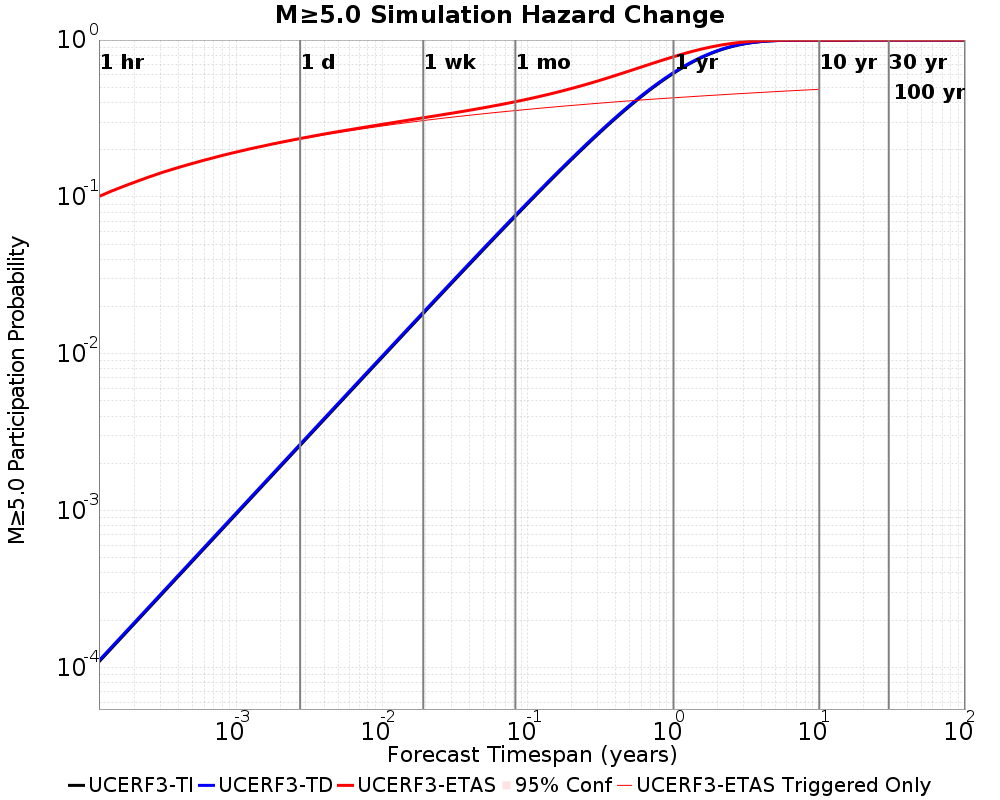

| Forecast Duration | UCERF3-ETAS [95% Conf] | UCERF3-ETAS Triggered Only | UCERF3-TD | UCERF3-TI |
|-----|-----|-----|-----|-----|
| 1 Hour | 0.101 [0.100 - 0.101] | 0.100 | 1.10E-4 | 1.08E-4 |
| 1 Day | 0.236 [0.234 - 0.237] | 0.234 | 2.65E-3 | 2.60E-3 |
| 1 Week | 0.319 [0.318 - 0.321] | 0.307 | 0.018 | 0.018 |
| 1 Month | 0.404 [0.403 - 0.406] | 0.355 | 0.076 | 0.075 |
| 1 Year | 0.783 [0.782 - 0.783] | 0.428 | 0.620 | 0.614 |
| 10 Years | 1.000 [1.000 - 1.000] | 0.485 | 1.000 | 1.000 |
| 30 Years | 1.000 [1.000 - 1.000] \* | \* | 1.000 | 1.000 |
| 100 Years | 1.000 [1.000 - 1.000] \* | \* | 1.000 | 1.000 |

\* *forecast duration is longer than simulation length, only ETAS ruptures from the first 10 years are included*
### M&ge;6.0 Hazard Change Over Time
*[(top)](#table-of-contents)*

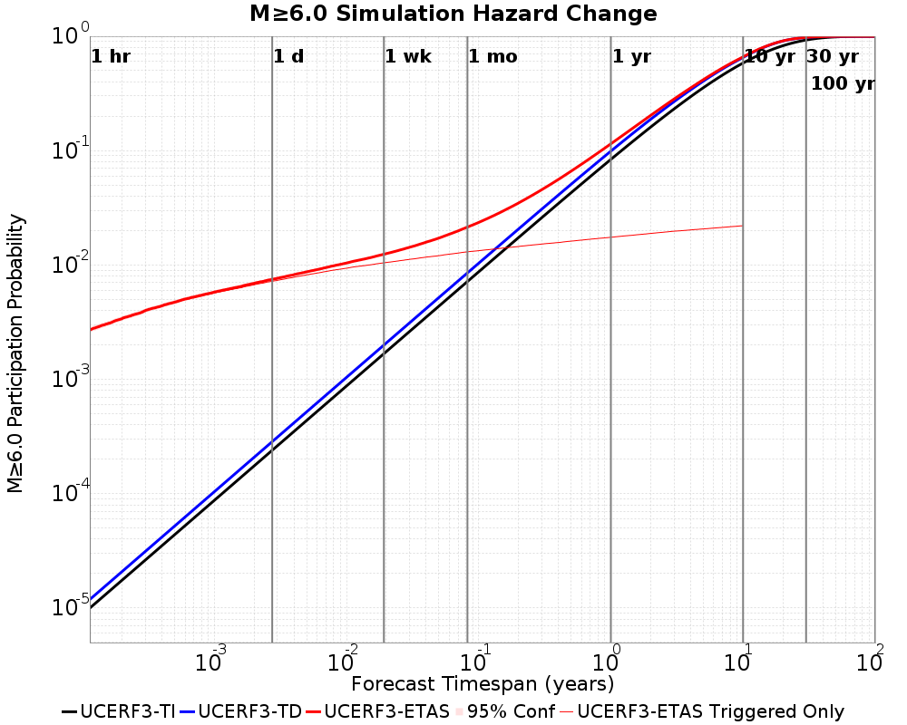

| Forecast Duration | UCERF3-ETAS [95% Conf] | UCERF3-ETAS Triggered Only | UCERF3-TD | UCERF3-TI |
|-----|-----|-----|-----|-----|
| 1 Hour | 2.71E-3 [2.56E-3 - 2.85E-3] | 2.69E-3 | 1.19E-5 | 9.99E-6 |
| 1 Day | 7.49E-3 [7.26E-3 - 7.73E-3] | 7.21E-3 | 2.85E-4 | 2.40E-4 |
| 1 Week | 0.012 [0.012 - 0.013] | 0.010 | 2.00E-3 | 1.68E-3 |
| 1 Month | 0.021 [0.021 - 0.022] | 0.013 | 8.52E-3 | 7.17E-3 |
| 1 Year | 0.115 [0.114 - 0.115] | 0.017 | 0.099 | 0.084 |
| 10 Years | 0.661 [0.661 - 0.661] | 0.022 | 0.653 | 0.584 |
| 30 Years | 0.978 [0.978 - 0.978] \* | \* | 0.978 | 0.928 |
| 100 Years | 1.000 [1.000 - 1.000] \* | \* | 1.000 | 1.000 |

\* *forecast duration is longer than simulation length, only ETAS ruptures from the first 10 years are included*
### M&ge;7.0 Hazard Change Over Time
*[(top)](#table-of-contents)*


| Forecast Duration | UCERF3-ETAS [95% Conf] | UCERF3-ETAS Triggered Only | UCERF3-TD | UCERF3-TI |
|-----|-----|-----|-----|-----|
| 1 Hour | 1.64E-3 [1.53E-3 - 1.76E-3] | 1.64E-3 | 3.89E-6 | 3.86E-6 |
| 1 Day | 4.38E-3 [4.20E-3 - 4.56E-3] | 4.28E-3 | 9.34E-5 | 9.26E-5 |
| 1 Week | 6.82E-3 [6.60E-3 - 7.04E-3] | 6.17E-3 | 6.54E-4 | 6.48E-4 |
| 1 Month | 0.010 [0.010 - 0.011] | 7.68E-3 | 2.80E-3 | 2.77E-3 |
| 1 Year | 0.044 [0.043 - 0.044] | 0.010 | 0.034 | 0.033 |
| 10 Years | 0.289 [0.289 - 0.290] | 0.013 | 0.280 | 0.287 |
| 30 Years | 0.584 [0.584 - 0.584] \* | \* | 0.578 | 0.637 |
| 100 Years | 0.813 [0.813 - 0.813] \* | \* | 0.810 | 0.966 |

\* *forecast duration is longer than simulation length, only ETAS ruptures from the first 10 years are included*
### M&ge;8.0 Hazard Change Over Time
*[(top)](#table-of-contents)*


| Forecast Duration | UCERF3-ETAS [95% Conf] | UCERF3-ETAS Triggered Only | UCERF3-TD | UCERF3-TI |
|-----|-----|-----|-----|-----|
| 1 Hour | 1.82E-5 [8.97E-6 - 3.57E-5] | 1.80E-5 | 1.82E-7 | 1.72E-7 |
| 1 Day | 4.24E-5 [2.79E-5 - 6.49E-5] | 3.80E-5 | 4.37E-6 | 4.13E-6 |
| 1 Week | 7.46E-5 [5.88E-5 - 9.84E-5] | 4.40E-5 | 3.06E-5 | 2.89E-5 |
| 1 Month | 1.87E-4 [1.69E-4 - 2.13E-4] | 5.60E-5 | 1.31E-4 | 1.24E-4 |
| 1 Year | 1.69E-3 [1.67E-3 - 1.72E-3] | 9.60E-5 | 1.59E-3 | 1.51E-3 |
| 10 Years | 0.015 [0.015 - 0.015] | 1.34E-4 | 0.015 | 0.015 |
| 30 Years | 0.036 [0.036 - 0.036] \* | \* | 0.036 | 0.044 |
| 100 Years | 0.058 [0.058 - 0.058] \* | \* | 0.058 | 0.140 |

\* *forecast duration is longer than simulation length, only ETAS ruptures from the first 10 years are included*
## Section Participation
*[(top)](#table-of-contents)*

### Section Participation Plots
*[(top)](#table-of-contents)*

| Min Mag | Triggered Ruptures (no spontaneous) | Triggered Ruptures (primary aftershocks only) |
|-----|-----|-----|
| **All Supra. Seis.** |  | 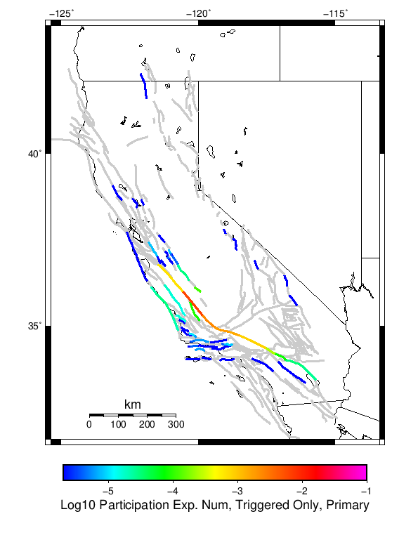 |
| **M&ge;6.5** | 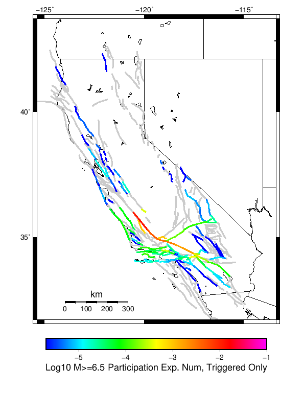 |  |
| **M&ge;7** | 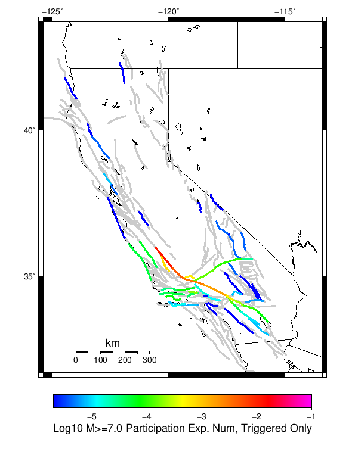 | 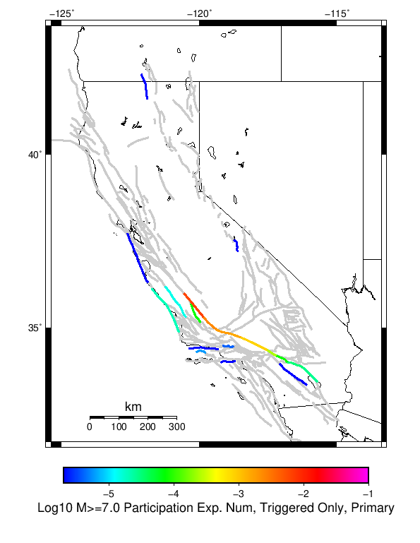 |
| **M&ge;7.5** |  |  |
| **M&ge;8** | 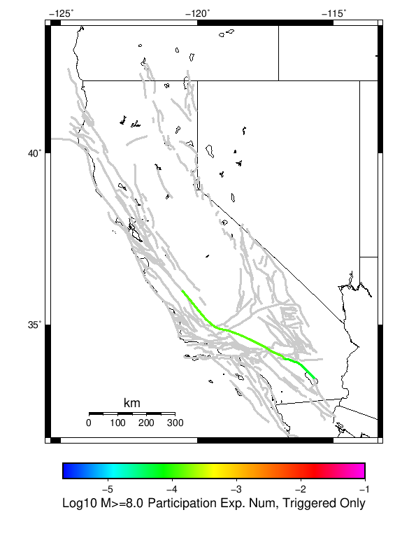 | 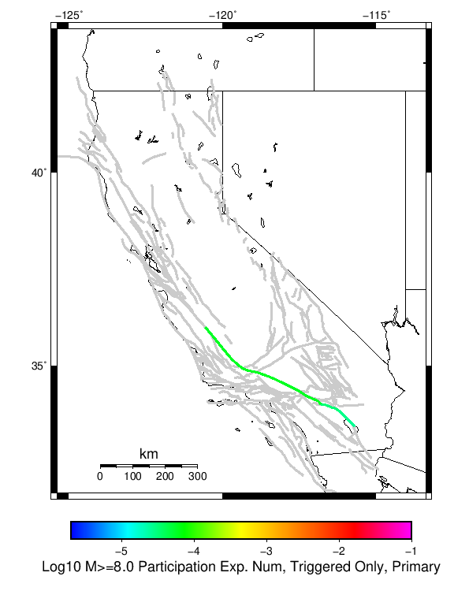 |

### Supra-Seismogenic Parent Sections Table
*[(top)](#table-of-contents)*

*First 10 of 119 with matching ruptures shown*

| Parent Name | Triggered Mean Count | Triggered 10 Year Prob | Triggered Primary Mean Count |
|-----|-----|-----|-----|
| San Andreas (Cholame) rev | 0.012786 | 0.012704 | 0.00666 |
| San Andreas (Parkfield) | 0.011982 | 0.011912 | 0.006232 |
| San Andreas (Carrizo) rev | 0.00465 | 0.004646 | 0.002388 |
| San Andreas (Big Bend) | 0.003492 | 0.00349 | 0.00181 |
| San Andreas (Mojave N) | 0.0029 | 0.002894 | 0.001508 |
| San Andreas (Mojave S) | 0.001694 | 0.001686 | 8.42E-4 |
| San Andreas (Creeping Section) 2011 CFM | 0.001454 | 0.001454 | 6.8E-4 |
| Pleito | 0.001138 | 0.0011 | 0.0 |
| San Juan | 0.001112 | 0.0011 | 9.2E-5 |
| San Andreas (San Bernardino N) | 6.34E-4 | 6.32E-4 | 2.5E-4 |

### M≥6.5 Parent Sections Table
*[(top)](#table-of-contents)*

*First 10 of 112 with matching ruptures shown*

| Parent Name | Triggered Mean Count | Triggered 10 Year Prob | Triggered Primary Mean Count |
|-----|-----|-----|-----|
| San Andreas (Cholame) rev | 0.012786 | 0.012704 | 0.00666 |
| San Andreas (Parkfield) | 0.011968 | 0.011908 | 0.006228 |
| San Andreas (Carrizo) rev | 0.00465 | 0.004646 | 0.002388 |
| San Andreas (Big Bend) | 0.003492 | 0.00349 | 0.00181 |
| San Andreas (Mojave N) | 0.0029 | 0.002894 | 0.001508 |
| San Andreas (Mojave S) | 0.001694 | 0.001686 | 8.42E-4 |
| Pleito | 0.001138 | 0.0011 | 0.0 |
| San Juan | 0.001112 | 0.0011 | 9.2E-5 |
| San Andreas (San Bernardino N) | 6.34E-4 | 6.32E-4 | 2.5E-4 |
| Cucamonga | 4.2E-4 | 4.2E-4 | 0.0 |

### M≥7 Parent Sections Table
*[(top)](#table-of-contents)*

*First 10 of 64 with matching ruptures shown*

| Parent Name | Triggered Mean Count | Triggered 10 Year Prob | Triggered Primary Mean Count |
|-----|-----|-----|-----|
| San Andreas (Cholame) rev | 0.012586 | 0.01253 | 0.006566 |
| San Andreas (Parkfield) | 0.011816 | 0.011774 | 0.006152 |
| San Andreas (Carrizo) rev | 0.004644 | 0.00464 | 0.002388 |
| San Andreas (Big Bend) | 0.003492 | 0.00349 | 0.00181 |
| San Andreas (Mojave N) | 0.002896 | 0.00289 | 0.001508 |
| San Andreas (Mojave S) | 0.001694 | 0.001686 | 8.42E-4 |
| San Juan | 7.2E-4 | 7.2E-4 | 7.6E-5 |
| Pleito | 5.8E-4 | 5.8E-4 | 0.0 |
| San Andreas (San Bernardino N) | 5.8E-4 | 5.78E-4 | 2.5E-4 |
| San Andreas (San Bernardino S) | 2.38E-4 | 2.38E-4 | 8.0E-5 |

### M≥7.5 Parent Sections Table
*[(top)](#table-of-contents)*

*First 10 of 28 with matching ruptures shown*

| Parent Name | Triggered Mean Count | Triggered 10 Year Prob | Triggered Primary Mean Count |
|-----|-----|-----|-----|
| San Andreas (Big Bend) | 0.003484 | 0.003482 | 0.00181 |
| San Andreas (Carrizo) rev | 0.003476 | 0.003476 | 0.00181 |
| San Andreas (Cholame) rev | 0.003464 | 0.003464 | 0.001808 |
| San Andreas (Parkfield) | 0.003158 | 0.003158 | 0.001622 |
| San Andreas (Mojave N) | 0.00289 | 0.002886 | 0.001508 |
| San Andreas (Mojave S) | 0.001654 | 0.00165 | 8.42E-4 |
| San Andreas (San Bernardino N) | 5.26E-4 | 5.26E-4 | 2.5E-4 |
| San Andreas (San Bernardino S) | 2.02E-4 | 2.02E-4 | 8.0E-5 |
| San Andreas (San Gorgonio Pass-Garnet HIll) | 1.04E-4 | 1.04E-4 | 3.2E-5 |
| Garlock (Central) | 9.8E-5 | 9.8E-5 | 0.0 |

### M≥8 Parent Sections Table
*[(top)](#table-of-contents)*

| Parent Name | Triggered Mean Count | Triggered 10 Year Prob | Triggered Primary Mean Count |
|-----|-----|-----|-----|
| San Andreas (Big Bend) | 1.34E-4 | 1.34E-4 | 5.8E-5 |
| San Andreas (Carrizo) rev | 1.34E-4 | 1.34E-4 | 5.8E-5 |
| San Andreas (Mojave N) | 1.34E-4 | 1.34E-4 | 5.8E-5 |
| San Andreas (Mojave S) | 1.34E-4 | 1.34E-4 | 5.8E-5 |
| San Andreas (San Bernardino N) | 1.34E-4 | 1.34E-4 | 5.8E-5 |
| San Andreas (San Bernardino S) | 1.34E-4 | 1.34E-4 | 5.8E-5 |
| San Andreas (Cholame) rev | 1.32E-4 | 1.32E-4 | 5.8E-5 |
| San Andreas (Parkfield) | 1.3E-4 | 1.3E-4 | 5.6E-5 |
| San Andreas (San Gorgonio Pass-Garnet HIll) | 8.4E-5 | 8.4E-5 | 3.2E-5 |
| San Andreas (Coachella) rev | 6.2E-5 | 6.2E-5 | 2.8E-5 |
## Gridded Nucleation
*[(top)](#table-of-contents)*

| Min Mag | Triggered Ruptures (no spontaneous) | Triggered Ruptures (primary aftershocks only) |
|-----|-----|-----|
| **M&ge;5** | 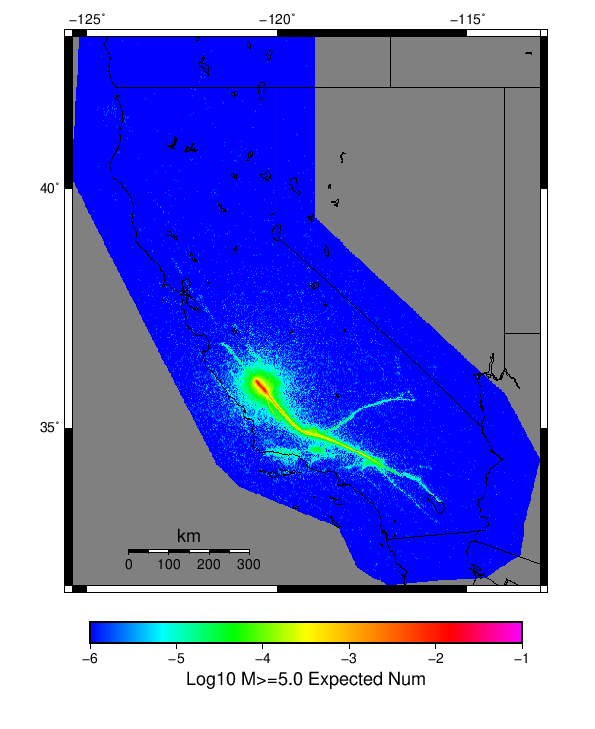 | 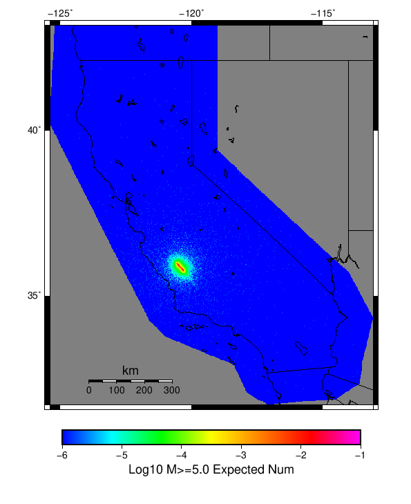 |
| **M&ge;6** | 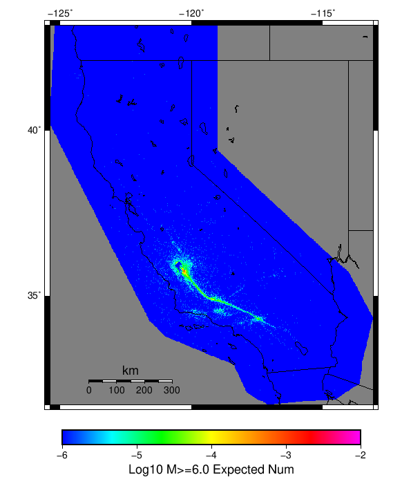 |  |
| **M&ge;7** |  | 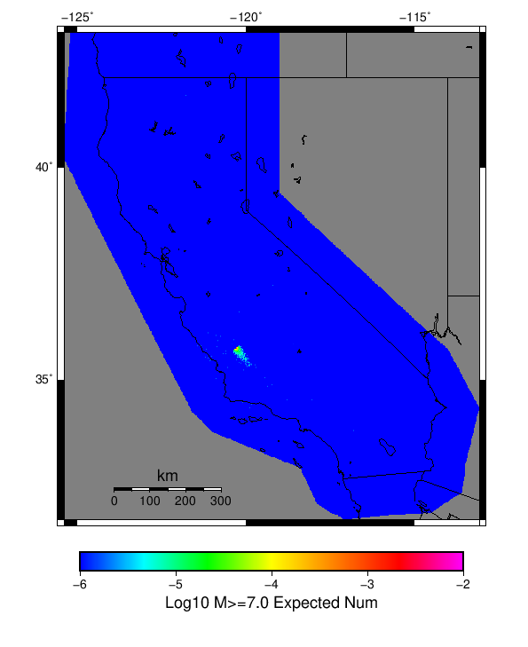 |

## JSON Input File
*[(top)](#table-of-contents)*

```
{
  "numSimulations": 500000,
  "duration": 10.0,
  "startYear": 2019,
  "includeSpontaneous": false,
  "randomSeed": 123456789,
  "binaryOutput": true,
  "binaryOutputFilters": [
    {
      "prefix": "results_complete",
      "descendantsOnly": false
    },
    {
      "prefix": "results_m5_preserve_chain",
      "minMag": 5.0,
      "preserveChainBelowMag": true,
      "descendantsOnly": false
    }
  ],
  "forceRecalc": false,
  "simulationName": "Parkfield M6",
  "numRetries": 3,
  "outputDir": "${ETAS_SIM_DIR}/2019_01_11-ParkfieldM6-u2mapped-noSpont-10yr-8threads",
  "triggerRuptures": [
    {
      "fssIndex": 30473,
      "mag": 6.0
    }
  ],
  "cacheDir": "${ETAS_LAUNCHER}/inputs/cache_u2_mapped_fm3p1",
  "fssFile": "${ETAS_LAUNCHER}/inputs/ucerf2_mapped_fm3p1.zip",
  "probModel": "FULL_TD",
  "applySubSeisForSupraNucl": true,
  "totRateScaleFactor": 1.14,
  "gridSeisCorr": true,
  "timeIndependentERF": false,
  "griddedOnly": false,
  "imposeGR": false,
  "includeIndirectTriggering": true,
  "gridSeisDiscr": 0.1,
  "catalogCompletenessModel": "RELAXED"
}
```

